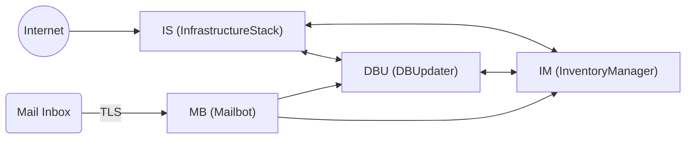
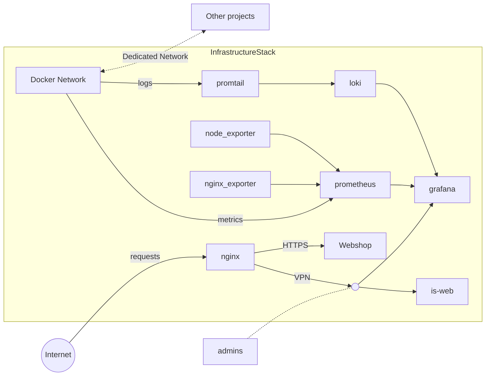
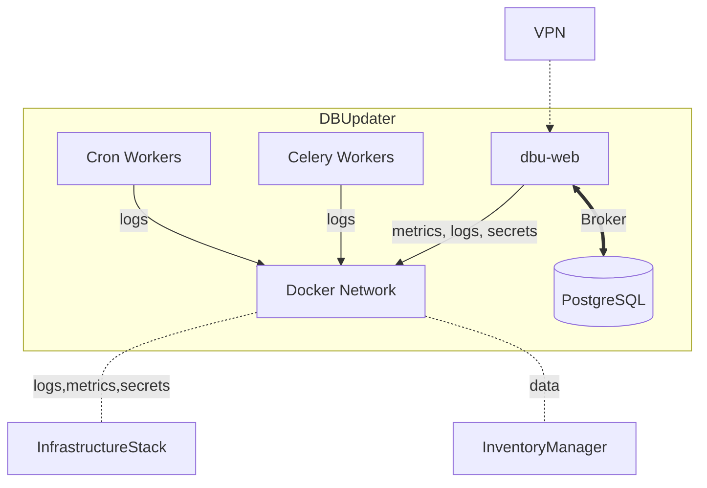
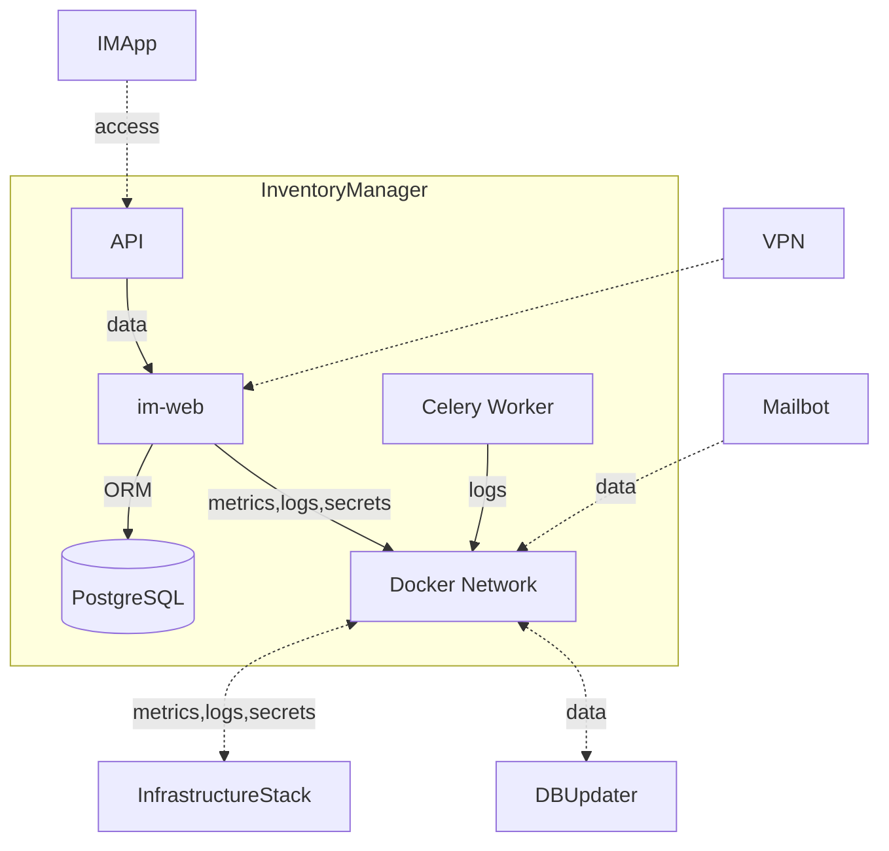
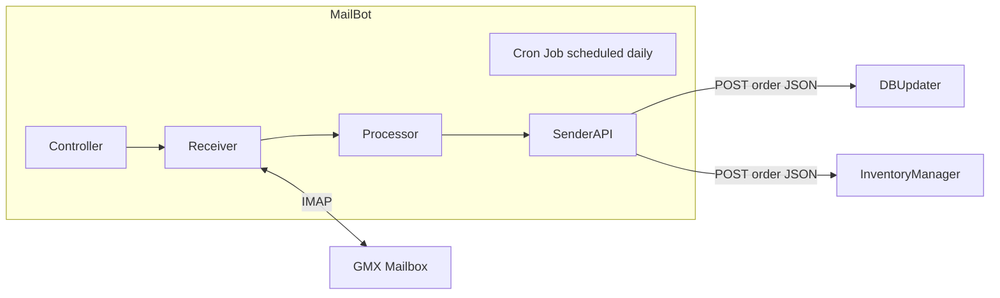

# SOFTWARE_ECOSYSTEM.md

## Overview

This document outlines the architecture and responsibilities of the PJS Collectables software ecosystem. It unifies context from:

- **InfrastructureStack [IS]** – shared infrastructure layer (monitoring, logging, secrets)
- **DBUpdater [DBU]** – single source of truth for product data
- **InventoryManager [IM]** – stock and order management system
- **MailBot [MB]** – automated email parser forwarding structured order data
- **pjs-ecosystem-docs** - SSOT for the whole ecosystem documentation for centralized scalability
- **Development Regulation Standards** - Centralized standard development audit reference
> **Legacy Note:** Vault references in the diagram are commented out because Vault is legacy (overkill: complex ops, unseal process, HA setups, storage backends). Docker secrets with strict host hygiene now satisfy secret management.


## Contents
- [InfrastructureStack](#infrastructurestack-context)
- [DBUpdater](#dbupdater-context)
- [InventoryManager](#inventorymanager-context)
- [MailBot](#mailbot-context)
- [PJsShopFront](#shop-front-context)
- [PJsShop](#shop-context)
- [Ecosystem Documentation](#Ecosystem-Docs)
- [Development Regulation Standards](#Development-Regulation-Standards)
---

# InfrastructureStack Context

## Summary

InfrastructureStack is a Docker&nbsp;Compose stack that packages logging, monitoring and secret management for every PJS Collectables project. Running this stack on a single VPS gives all other repositories a ready‑made infrastructure layer so individual projects can stay focused on their own containers.



## Purpose

<!-- InfrastructureStack supplies the observability and secret‑management foundation that every other project depends on. By attaching to the shared `monitoring-net` bridge, companion stacks gain access to centralised logging, metrics collection and (historically) Vault-managed secrets without recreating those services. This shared layer is mandatory for the ecosystem: without it, projects would lack a unified way to emit logs, scrape metrics and access credentials. -->
<!-- InfrastructureStack services also join the internal `is-net` for cross‑service traffic while exposing observability endpoints on `monitoring-net`. Grafana stays restricted to `is-net`, while only Nginx exposes ports 80/443 publicly. Promtail tails container logs from `/var/lib/docker/containers` and forwards them to Loki; Prometheus scrapes targets listed in `prometheus/prometheus.yml`; Vault uses AppRole authentication to distribute secrets. Resource limits in `docker-compose.yml` prevent a single service from exhausting system resources. Certbot's systemd timer renews certificates automatically, and a deploy hook reloads Nginx so refreshed certificates are served. -->
> **Legacy Note:** Vault-provided secrets were commented out because Vault is legacy (overkill: complex ops, unseal process, HA setups, storage backends). Continue relying on Docker secrets and strong host hygiene for credentials.

## Repository layout
- `IS/` – Minimal Django project providing the `/metrics` endpoint via the Prometheus client and helper management commands.
- `docker-compose.yml` – Base Docker Compose file wiring the shared infrastructure services, health checks, resource limits and named volumes.
- `docker-compose.override.yml` – Development overrides that mount the working tree, enable `DEBUG` and bind Grafana to `127.0.0.1:3000`.
- `docker-compose.prod.yml` – Production overlays that enable the public Nginx proxy, exporters, GeoIP refresh jobs and the host-level Prometheus Node Exporter.
- `grafana/` – Datasource and dashboard provisioning plus curated Grafana dashboards for infrastructure and host metrics.
- `prometheus/` – Prometheus configuration, alerting rules (including Node Exporter alerts) and files watched by the config reloader sidecar.
- `promtail/` – Promtail configuration used to forward container logs to Loki.
- `nginx/` – Reverse proxy configuration, TLS hooks and GeoIP bootstrap scripts consumed by the production stack.
- > **Legacy Note:** Vault-specific assets are commented out because Vault is legacy (overkill: complex ops, unseal process, HA setups, storage backends). Docker secrets plus careful permissions now cover those duties.
- `scripts/` – Helper scripts:
  - `setup_approle.sh` – create or update a Vault AppRole and policy.
  - <!-- `push_env_to_vault.sh` – upload environment variables to `secret/<project>/`. -->
  - `obtain_cert.sh` – request TLS certificates with Certbot and restart Nginx.
  - `reload_nginx.sh` – Certbot deploy hook to reload Nginx after renewal.
  - `check_env.sh` – verify required environment variables.
- `logs/` – Host directory where scripts store their output.
Persistent files here can be picked up by Promtail if you want script output in Loki.

## Integration with other Projects

> **Legacy Note:** Vault integration instructions are commented out because Vault is legacy (overkill: complex ops, unseal process, HA setups, storage backends). Docker secrets plus strict host hygiene now fill that role.
<!-- Projects deploy their own Docker Compose stacks on the same host and declare the shared `monitoring-net` as an external network. Containers can then reference service names such as `prometheus` and (legacy) `vault` directly. Each project previously received a dedicated Vault path and could run a Vault Agent sidecar to fetch secrets before starting. The provided scripts simplify creating AppRoles and uploading environment values so CI pipelines can push credentials without manual steps. -->
Add the following snippet to your compose file to use the shared network:
```yaml
networks:
  monitoring-net:
    external: true
```
<!-- Attach each service to that network under its `networks` key. After joining the network run `./scripts/setup_approle.sh <project>` and `./scripts/push_env_to_vault.sh <project>` to store your secrets. A Vault Agent sidecar can then render an env file for your containers at runtime. -->

Once connected, your containers can reach InfrastructureStack services by
hostname. Examples:

- `prometheus:9090` to scrape metrics
- <!-- `vault:8200` to retrieve secrets -->
- `is-web:8000/status` for overall health

Isolated networks ensure containers from other projects are hidden from view, so
only the infrastructure components are accessible. External stacks attach to the
shared `monitoring-net`, while InfrastructureStack keeps its own traffic on
`is-net` and publishes observability endpoints on the shared bridge.


## Core services

### is-web

Minimal Django application located in the `IS/` directory. Built from `Dockerfile` and run with Gunicorn. It mounts volumes for static and media data and exposes port 8000 for Prometheus scraping via `/metrics`. The app offers a basic `/health` endpoint and aggregates other services under `/status`.

### is-db

PostgreSQL database that persists InfrastructureStack’s own Django state. Secrets for the superuser and password are injected via Docker secrets so credentials never land in container environment variables. The service attaches to every project bridge so other stacks can reuse the database during shared local development, while production deployments rely on the same container for `/metrics` checks that validate database connectivity.

### nginx
Reverse proxy that serves static files, proxies the optional shop backend and exposes HTTPS endpoints using certificates from `/etc/letsencrypt`. Configuration lives in `nginx/` and the service waits for `is-web` before starting.
It resolves backend hostnames through Docker's embedded DNS service with a short
timeout to fail quickly if a container is unreachable.

### promtail
Log collector configured via `promtail/promtail.yaml`. It reads container log files from `/var/lib/docker/containers`, forwards them to `loki` over HTTP, and exposes readiness/metrics on port 9080 for health checks and Prometheus scraping. The pipeline also filters out Promtail's own container logs to avoid Loki feedback loops.

### loki
Stores aggregated logs queried by Grafana. Data persists in the `loki_data` volume and the service listens on port 3100 on every project network so each project can reach it over its own segment.

### prometheus
Scrapes `/metrics` endpoints every 15s as defined in `prometheus/prometheus.yml`. The service listens on 9090, joins the internal `is-net`, and also participates in the shared `monitoring-net` used for observability sidecars so metrics exchange remains private without exposing a public port.

#### Docker label-based discovery

Prometheus consumes targets directly from the Docker daemon (`docker_sd_configs`). Containers must opt in explicitly by setting:

- `prometheus.scrape="true"` to allow scraping.
- `prometheus.port="<port>"` so the relabeling step can rewrite the discovered IP to the metrics port.
- Optional `prometheus.job="<name>"` to project a friendly job label into dashboards and alerts.

The relabeling phase drops all other Docker metadata after applying the labels so the rendered targets remain clean and predictable. Remember to mirror the scrape labels across every compose variant (base, override, production) that defines the service so discovery behaves the same in each environment.

### prometheus-config-reloader

Sidecar sourced from the Prometheus Operator utilities that watches the mounted `prometheus/` directory for rule or scrape target edits. When files change it POSTs to `http://prometheus:9090/-/reload`, keeping the metrics store live while new dashboards and alerts roll out.

### grafana
Dashboard UI connected to Prometheus and Loki. Admin credentials come from `.env` and data persists in the `grafana_data` volume. Port 3000 is bound via the override files. Grafana remains on `is-net` and reaches Prometheus without joining `monitoring-net`, keeping observability attachments limited to background services and external consumers.

> **Legacy Note:** Vault service description is commented because Vault is legacy (overkill: complex ops, unseal process, HA setups, storage backends). Depend on Docker secrets with careful host hygiene instead.
<!--
### vault
Runs with configuration from `vault/vault.hcl` (or the dev variant) and stores data in the `vault_data` volume. Port 8200 is internal only and the container uses IPC_LOCK for mlock.
-->

### shop_backend (placeholder)
Example Nginx stub demonstrating how a public backend could be routed. Replace with your real service in production.

### nginx-exporter *(production overlay)*

Sidecar that reuses the Nginx network namespace to scrape stub status metrics and expose them on port 9113 inside `monitoring-net`. It keeps TLS-bound hosts private while still surfacing connection counts, response codes and upstream health to Prometheus.

### node-exporter *(production overlay)*

Host-level Prometheus exporter scheduled with the production stack. Read-only mounts of `/`, `/proc` and `/sys` combined with `--path.*=/host/*` flags let Prometheus observe CPU, memory, filesystem, load and network saturation without sharing the host PID namespace. Alert rules under `prometheus/rules/node-exporter-alerts.yml` trigger when saturation exceeds agreed thresholds.

### geoip2-updater *(production overlay)*

Refresh job based on the official MaxMind updater image. It keeps the shared `geoip2-data` volume current every 720 hours so the production proxy serves accurate GeoIP lookups without manual downloads.

Metrics from all services are exposed at `/metrics` using `django-prometheus`.
Observability components (Prometheus, its config reloader, the production-only NGINX exporter and the host-level Node Exporter) additionally share the `monitoring-net` bridge, which acts as the monitoring spine other systems attach to, so telemetry traffic stays scoped to infrastructure services while remaining available to external stacks that join the shared network. Infrastructure containers keep service-to-service chatter on `is-net`, while Grafana attaches solely to `is-net`. <!-- Prometheus, Loki and Vault do not publish ports externally; applications reach them by name within their respective network. -->

This project forms the backbone for the wider PJS Collectables ecosystem. By providing monitoring, logging and secret management out of the box it allows other repositories to remain focused on domain logic while relying on a consistent, secure infrastructure layer.

---

# DBUpdater Context

## Summary
This document explains how the **DBUpdater** project fits into the PJS Collectables ecosystem. The application acts as the single source of truth for all product data and exposes a REST API for other internal services.



## Purpose
DBUpdater maintains a normalized catalogue imported from the wholesaler and guarantees that every application in the ecosystem reads the same dataset. Imports are validated, stored indefinitely and processed asynchronously. The service exposes authenticated endpoints so downstream projects can look up products, categories and licenses without needing their own copy of the data.

## Repository layout
- `DBU/` – Django project with settings, URLs and Celery configuration.
- `databaseAPI/` – main application containing models, views and serializers.
  - `management/commands/` – import, scraping and cleanup tasks.
  - `services/` – implementation modules for data ingestion.
  - `tasks.py` – Celery task definitions.
- `cleanup-cron/` – cron configuration used by the `cleanup` container.
- <!-- `vault-agent/` – template and config for the Vault Agent sidecar used in production. -->
- `tests/` – pytest suite.
- Compose, Docker and supporting configuration files live at the project root.

## Integration with other Projects
Projects join the dedicated `dbu-net` Docker bridge so they can reach the `web` service by name. Authentication tokens are obtained from `/api-token-auth/` (see `AUTH.md`) and attached to requests. Common endpoints include `/api/products/`, `/api/categories/` and `/api/licenses/`. Systems may also connect directly to the PostgreSQL container when running on the same host. After each successful import the worker optionally pings the URL defined in `SIGNAL_URL`, allowing external services to trigger follow-up jobs.
Discount notifications parsed from incoming emails can be forwarded to `/api/email-data/`. The JSON body must contain an `order_number` and a list of `items` with `item_no` and `discount` fields. Invalid rows are ignored but recorded in the logs.

## Core services
The provided Docker Compose stack builds several containers that cooperate closely.

### Web
Hosts the Django application. In production it runs via Gunicorn behind InfrastructureStack’s Nginx reverse proxy. All API and admin traffic flows through that proxy and is restricted using `INTERNAL_ALLOWED_IPS` and `ADMIN_ALLOWED_IPS`.

Key routes:
- `POST /api-token-auth/` – obtain a token for subsequent requests.
- `/api/products/` – CRUD operations for products.
- `/api/categories/` and `/api/licenses/` – read-only metadata.
- `POST /api/email-data/` – update individual product discounts. The body should include an `order_number` and `items` with `item_no` and `discount` values.
- `/metrics/` – Prometheus scrape endpoint.

### Worker
<!-- Processes long running jobs. `databaseAPI/tasks.py` triggers the management commands located in `management/commands/` to import new catalogues, normalize GPSR spreadsheets, scrape product photos and fetch categories from the wholesaler. After completing an import the worker may POST to the configured `SIGNAL_URL` so that other projects start their own updates. Workers run with the same environment variables as the web service and therefore reuse the database connection and Vault credentials. -->

### Cleanup
Runs cron inside a small container to execute `cleanup_catalog_uploads` daily. This removes outdated uploaded files from the `media/` folder and keeps storage usage reasonable.

### Database
A PostgreSQL container holding all historical catalogue entries. The application requires Postgres to be available in all environments and will fail fast if the database cannot be reached.

<!--
### Vault Agent
In production a lightweight Vault Agent container writes `DB.env` before the other containers start. Environment variables are stored under the project’s path in InfrastructureStack’s Vault and rendered to disk for the web, worker and cleanup containers.
-->

---

Centralising catalogue management in DBUpdater reduces duplicated logic across the ecosystem. Other projects simply read from the API or database and react to the `SIGNAL_URL` callback whenever new data arrives.


---

# InventoryManager Context

## Project Summary
InventoryManager is a Django-based service that manages orders and stock items while synchronising product metadata from an external DBU API. It exposes REST endpoints for CRUD operations on inventory, provides Celery tasks for background processing and offers chart visualisations of upcoming payments through the optional Analysis app.



## Purpose
InventoryManager acts as a centralised order and inventory tracker. Incoming orders are accepted via the REST API and persisted together with their products. CRUD endpoints allow the companion **IMApp** to adjust stock levels. The service also synchronises item metadata from the DBU API so that product information stays consistent across platforms. When enabled, the Analysis app can generate charts for upcoming payments, enabling further reporting.

## Repository layout
- `Inventory/` – models, views, tasks and API serializers
- `Analysis/` – optional charts and templates
- `InventoryManager/` – project settings and root URLs
- `core/` – shared code such as the DBU client and middleware
- `Dockerfile`, `docker-compose*.yml` – containerisation setup

## Integration with other Projects
<!-- Other applications communicate with InventoryManager primarily via its REST endpoints. To authenticate, obtain a token through `api/token/` then include it in the `Authorization: Token <token>` header. Environment variables (see `.env.example`) configure database access, rate limits and DBU credentials. Celery and RabbitMQ are used for asynchronous work so integrators may publish messages or let InventoryManager run its own worker. The containers join InfrastructureStack's dedicated `im-net` bridge to access Vault for secrets, Promtail/Loki for logs and Prometheus for metrics. Prometheus scrapes the `/metrics/` endpoint for monitoring. -->

## Core services
### 1. Inventory API

The API is available under the `/api/` prefix. Obtain a token by POSTing a
username and password to `/api/token/`:

```bash
curl -X POST -d "username=<user>&password=<pass>" \
     http://localhost:8000/api/token/
```

The response returns a JSON object containing the `token`. Pass this token in
an `Authorization: Token <token>` header when calling the endpoints described
below.

| Method | Path | Description | Permissions |
| ------ | ---- | ----------- | ----------- |
| POST | `/api/receive/` | Create an order and its items from posted data. | Authenticated |
| POST | `/api/signal/` | Queue background sync for items missing details. | Authenticated |
| GET | `/api/inventory/` | List visible inventory items and the summed total value. | Admin |
| POST | `/api/add-stock/` | Increase quantity of an item by a given `amount` (optional `order_id`). | Admin |
| POST | `/api/reduce-stock/` | Decrease quantity of an item by a given `amount` (optional `order_id`). | Admin |
| DELETE | `/api/delete-item/` | Soft-delete an item using its `item_no` (optional `order_id`). | Admin |
| POST | `/api/query-dbu-item/` | Search DBUpdater for products by title. | Admin |
| POST | `/api/confirm-item/` | Import product details from DBUpdater using `product_no`. | Admin |

#### Usage examples

```bash
# List current inventory
curl -H "Authorization: Token $TOKEN" \
     http://localhost:8000/api/inventory/
# Increase stock for an item
curl -X POST -H "Authorization: Token $TOKEN" \
     -H "Content-Type: application/json" \
     -d '{"item_no": "ABC-001", "amount": 5}' \
     http://localhost:8000/api/add-stock/
# Query DBUpdater for products containing "Widget"
curl -X POST -H "Authorization: Token $TOKEN" \
     -H "Content-Type: application/json" \
     -d '{"title": "Widget"}' \
     http://localhost:8000/api/query-dbu-item/
```
Example payload for `POST /api/receive/`:

```json
{
  "order_number": "1234",
  "items": [
    {
      "item_no": "ABC-001",
      "title": "Widget",
      "price": "12.50",
      "quantity": 2,
      "uom": "stk",
      "total": "25.00"
    }
  ]
}
```

The endpoint responds with `{ "status": "created" }` on success.

Outside the `/api/` namespace InventoryManager also exposes:

- `GET /health/` – basic health check
- `GET /metrics/` – Prometheus metrics endpoint

Responses are JSON. The DBU client automatically authenticates using environment variables as shown in `core/clients/dbu.py`.

### 2. DBU Synchronisation
The utilities in `Inventory/utils.py` fetch product details from the external DBU API and store them in `ItemDetails` models. The `sync_missing_details` Celery task iterates over items lacking metadata and updates them. Management commands are provided for manual syncing.

### 3. Analysis views
When the Analysis app is enabled, `/analysis/` serves a page with chart data for upcoming payments. It aggregates totals per release month using information from `ItemDetails`.

### Deployment with DBUpdater

<!-- DBUpdater is deployed as a separate Compose project but typically runs on the same VPS as InventoryManager. It uses its own `dbu-net` network while InventoryManager stays on `im-net`. To allow communication, expose the DBUpdater web container (usually named `dbu-web`) and set `DBU_BASE_URL` to that address. Configure the `DBU_*` variables in `.env` (or fetch them from Vault) and start each stack with `docker compose up -d`. This keeps the projects isolated while letting the `DBUClient` authenticate and retrieve product details. -->

# MailBot Context

## Summary

MailBot automates ingestion of order confirmation emails and forwards structured JSON payloads to downstream services. It runs as a headless service that orchestrates an IMAP `Receiver`, an HTML `Processor` and a resilient `SenderAPI` so the rest of the ecosystem can consume orders without manual data entry. Logs are emitted to stdout for collection by InfrastructureStack's Promtail service and are also written to a file for local inspection. Basic Prometheus metrics are exposed via `prometheus_client` on `/metrics` for scraping.



## Purpose

MailBot relieves other services from parsing vendor emails. By continuously polling a shared mailbox, extracting orders and pushing them to DBUpdater and InventoryManager, it ensures the catalogue and inventory remain synchronised with incoming quotes. Without this relay the ecosystem would require manual transfers, leaving gaps in product data and stock levels.

## Repository layout
- `MailBot/` – source package
  - `app.py` – command-line entry point
  - `controller.py` – starts and stops background workers
  - `receiver.py` – IMAP client fetching mails since `SINCE_DATE`
  - `processor.py` – HTML parser extracting `order_number` and `items`
  - `sender_api.py` – HTTP client with retry queues for DBU and IM
  - `logging_config.py` – shared logger configuration
  - `config.py` and `utils.py` – common helpers
- `Dockerfile` – container image for running MailBot
- `example.env` – template for `gmx.env` containing API URLs (mail credentials provided via Docker secrets)
 
Mail credentials are supplied through Docker secrets to keep them off disk and
out of `docker inspect` output. Create `gmx_email.secret` and
`gmx_password.secret` files beside `docker-compose.yml`; Compose mounts them at
`/run/secrets/...` where `config.py` reads the values.

## Integration with other Projects
Configure `gmx.env` with the endpoints of services that should receive data:

```dotenv
DBU_API_URL=https://dbu.example.com/api/email-data/
IM_API_URL=https://inventory.example.com/api/receive/
```

The `SenderAPI` issues `POST` requests with the body:

```json
{
  "order_number": "1234",
  "items": [
    {
      "item_no": "ABC-001",
      "title": "Widget",
      "price": "12.50",
      "discount": "5%",
      "quantity": "2",
      "uom": "stk",
      "total": "25.00"
    }
  ]
}
```

DBUpdater consumes this payload at `/api/email-data/` to adjust product discounts while InventoryManager stores the same structure via `/api/receive/`. Both endpoints must be reachable from the MailBot host. Failed transmissions are written to `failed_dbu_orders.json` or `failed_im_orders.json` for later retry.

When running MailBot inside Docker, use the provided `docker-compose.yml`
which attaches the container to the `dbu-net`, `im-net` and `is-net` networks so
it can contact DBUpdater and InventoryManager and expose logs and metrics to the
InfrastructureStack services.

## Core services

### Receiver
Connects to the IMAP server defined by `GMX_EMAIL` and `GMX_PASSWORD`. It scans messages since `SINCE_DATE`, then advances the date to the current day after each run so subsequent invocations only fetch newer mail. Polling runs in a dedicated thread so it can stop the loop gracefully.

### Processor
Parses HTML bodies with BeautifulSoup. It extracts the order number and item rows from a specific table layout, then assembles the JSON document and forwards it to the `SenderAPI` for delivery.

### SenderAPI
Posts JSON to the configured endpoints. On errors it persists the payload to a local file and exposes `retry_dbu_orders` and `retry_im_orders` functions that flush the queues.

### Controller
`Controller` wraps the receiver loop and exposes `start` and `stop` methods used by the command-line entry point.

# Ecosystem Docs

## Purpose
When updating the documentation for the whole ecosystem it became apparent that having multiple duplicate files in different repos is redundant and tedious. When changed at one place it has to be manually changed in the others. This poses a huge manual workload. The answer: <span style="color:red">*A centralized SSOT for docs*</span>.

This has been accomplished through setting up workflows that monitor changes and push or pull changes. The centralized repo notices changes and sends out dispatch to all registered repos. These not only can push to main in the SSOT with a PAT, but also retrieve changes.

Benefits include:
- Centralization reduces redundancy
- Also ensures easy scalability, readability and monitoring
- Reduces workload and ensures up-to-date files

# Development Regulation Standards
The software ecosystem is designed in alignment with **ISO/IEC 25010**, the _de facto international standard_ for defining software quality categories — ensuring that attributes are systematically applied across all projects.  Assessment becomes **python-specific, static read-only, standards-informed audit**.

---
## 🧮 Universal Scoring Rubric

### 🎚️ Scoring Scale (applies to all sub-characteristics)

|Score|Definition|
|---|---|
|**1**|Absent / violates basic principle (anti-pattern, no evidence)|
|**2**|Major gaps — barely partially implemented, or unstable|
|**3**|Minimal compliance — implemented ad-hoc or inconsistently|
|**4**|Partial — visible intent but lacks structure or completeness|
|**5**|Basic compliance — meets minimum industry norm, not automated|
|**6**|Reasonable — consistent and traceable but not enforced|
|**7**|Solid — good practice evident, minor improvement areas|
|**8**|Mature — standards clearly implemented and verified|
|**9**|Exemplary — fully automated enforcement and documentation|
|**10**|Benchmark — formalized, continuously validated, measurable quality gates|

> Sub-characteristics are **rounded to the nearest integer (1–10)** after evaluation. The mean of a category is a **decimal**.

---

### ⚖️ Category Weighting (in % of total quality score)

| Top-Level Characteristic  | Weight   | Rationale (industry convention)                                 |
| ------------------------- | -------- | --------------------------------------------------------------- |
| 🧠 Functional Suitability | **20 %** | Core correctness and completeness                               |
| ⚡ Performance Efficiency  | **15 %** | Speed + resource control are major but secondary to correctness |
| 🔗 Compatibility          | **5 %**  | Important for integration, lower standalone impact              |
| 🎨 Developer Usability    | **10 %** | Human interaction quality; varies by product type               |
| 🛡️ Reliability           | **10 %** | Stability and fault tolerance                                   |
| 🔒 Security               | **20 %** | Universal criticality (OWASP + ISO 27001 alignment)             |
| ⚙️ Maintainability        | **15 %** | Determines long-term cost and agility                           |
| 🚀 Portability            | **5 %**  | Valuable but rarely decisive for Python systems                 |
## 1. 🧠 Functional Suitability

Evaluate whether the software **fulfills its intended purpose** by providing all required functions, producing correct results, and supporting user goals effectively.

---

### ✅ **Functional Completeness**

Extent to which all necessary capabilities are implemented.

**Assessment Questions:**

- Verify that every intended user or system requirement has a corresponding implementation.
    
- Detect missing, redundant, or partially implemented features through static code analysis and test coverage mapping.
    
- Confirm that each functional area is represented by at least one automated or manual test case.
    

**Supporting standards & practices:**

- **ISO/IEC/IEEE 29148** – Requirements specification and traceability
    
- **ISO/IEC 25023** – Metrics for functional completeness and coverage
    
- **Presence of coverage reports** – Feature-to-test verification
    

---

### 🎯 **Functional Correctness**

Degree to which the software produces accurate and consistent results under defined conditions.

**Assessment Questions:**

- **Static presence of test cases** matching functions.
    
- Analyze logic paths and data validation for potential functional errors.
    
- Track and categorize functional defects to measure stability and reliability.
    

**Supporting standards & practices:**

- **ISO/IEC/IEEE 29119** – Software testing processes and reporting
    
- **Unit and Integration Testing Frameworks** – (PyTest)
    

---

### ⚙️ **Functional Appropriateness**

Degree to which functions support specific user tasks and achieve intended goals efficiently.

**Assessment Questions:**

- Evaluate alignment of implemented features with actual user workflows and goals.
    
- Identify redundant or overly complex functions that hinder usability or task efficiency.
    
- Measure user-task completion rates and performance within typical usage scenarios.
    

**Supporting standards & practices:**

- **ISO 9241-210** – Human-centred design for interactive systems
    
- **Design Thinking Frameworks** – Goal-oriented functional validation
    

---

## 2. ⚡ Performance Efficiency

Optimize response and resource use under defined conditions.

### ⏱️ Time Behaviour

Measure and control response time, throughput, and latency.  
**Supporting standards & practices:**

- **ACM SIGPLAN Performance Guidelines** – software timing optimization
    
- **ISO/IEC 29155** – performance efficiency measurement
    
- **Presence of load-test scripts/configs**
    

### 🧮 Resource Utilization

Assess how efficiently the software **uses CPU, memory, storage, and I/O resources** based on code structure, algorithm design, and configuration evidence.

**Assessment Questions:**

- Detect inefficient algorithms (e.g., nested loops, unbounded recursion).
    
- Identify excessive in-memory data or unbounded caching.
    
- Check for repeated database or file I/O inside loops.
    
- Review configuration limits (thread pools, connection pools, worker counts).
    
- Verify cleanup of resources (closing files, joining threads, releasing memory).
    
- **Static pattern detection** (e.g., nested loops, unbounded recursion, repeated I/O in loops)
    

**Supporting standards & practices:**

- **ISO/IEC 29155 / 25023** – define performance-efficiency and utilization measurement goals.
    
- **ACM SIGPLAN Efficiency Guidelines** – algorithmic and computational optimization principles.

### 📈 Capacity (Scalability)

Evaluate whether the system’s **architecture and implementation** can sustain performance as load, users, or data volumes increase.

**Assessment Questions:**

- Detect _stateless_ design patterns that enable horizontal scaling.
    
- Check for externalized session/data storage (e.g., Redis, database, S3) instead of in-memory state.
    
- Identify load-balancer or worker configuration parameters (thread pools, queue sizes, auto-scale settings).
    
- Verify that components use asynchronous or distributed processing when appropriate.
    
- Review database and cache design for sharding, pagination, or partitioning readiness.
    
- Ensure API endpoints and background jobs handle concurrency safely (no shared mutable state).
    

**Supporting standards & practices:**

- **ISO/IEC 29155 / 25023** – define scalability and capacity efficiency metrics.
    
- **CNCF Cloud-Native Best Practices** – stateless, containerized, horizontally scalable design principles.
    
- **Stateless Service Design** – promotes independent scale-out instances.
    
- **Infrastructure as Code Conventions** – Terraform, Kubernetes manifests defining replica/auto-scale logic.
## 3. 🔗 Compatibility

Ensure interoperability and coexistence with other systems.

### ⚖️ Co-existence

Assess whether the software can **operate correctly in shared environments**—such as multi-tenant systems, container clusters, or composite deployments—**without interfering** with other applications or services.

**Assessment Questions:**

- Verify adherence to **container and runtime standards** (e.g., OCI, Dockerfile compliance).
    
- Check for **hard-coded ports, paths, or environment assumptions** that may cause conflicts.
    
- Ensure **resource limits** (CPU, memory, network) are defined to prevent contention.
    
- Confirm that **logging, temporary files, and caches** use isolated directories or namespaces.
    
- Inspect configuration for **environment variable injection** instead of static credentials.
    
- Detect **shared resource dependencies** (e.g., same DB schema, file paths) that may break isolation.
    
- Evaluate service discovery and networking configs for **namespace or label separation**.
    

**Supporting standards & practices:**

- **ISO/IEC 25010 → Compatibility / Co-existence** – conceptual definition.
    
- **OCI / Docker Specification** – portable, isolated container execution.
    
- **POSIX Compliance** – predictable file and process behavior across systems.
    
- **CNCF Service Mesh Patterns (Istio, Linkerd)** – declarative inter-service coexistence (used as architectural reference, not runtime check).
    
- **Kubernetes Best Practices** – resource quotas, namespaces, and environment isolation.

### 🔄 Interoperability

Exchange and process information between systems effectively.  
**Supporting standards & practices:**

- **OpenAPI / REST / GraphQL** – interface definition standards
    
- **ISO/IEC 19510 (BPMN)** – process interoperability
    
- **JSON Schema / Protocol Buffers** – standardized data formats
---

## 4. 🎨 Usability (or Developer Usability)

If a **user interface (UI)** is present, evaluate traditional UX quality (learnability, operability, satisfaction).  
If **no UI is present**, evaluate **developer usability** — how easily the code can be understood, configured, and safely operated in an editor or terminal.

---

### 👁️ Appropriateness Recognizability

Users or developers can easily understand the **purpose and usage** of the software.

**Audit questions:**

- Are file, class, and function names self-descriptive and consistent?
    
- Does the project layout clearly expose its main entry points (`main.py`, CLI, module root)?
    
- Is there a `README.md` or equivalent that explains intent and usage?
    
- For UI projects: are labels, menus, and actions named consistently and clearly?
    

**Supporting standards & practices:**

- **ISO 9241-210** – human-centered design lifecycle
    
- **PEP 8 / PEP 257** – naming and docstring conventions
    
- **PyPA Layout Guidelines** – discoverable module structure
    

---

### 📚 Learnability

Ease with which a new user or developer can learn to use or contribute.

**Audit questions:**

- Is there a quick-start or setup guide that runs without guesswork?
    
- Are docstrings and type hints present to explain expected input/output?
    
- Are functions and modules short and conceptually focused?
    
- For UI projects: is the flow predictable and consistent between screens?
    

**Supporting standards & practices:**

- **Nielsen Heuristics** – simplicity and consistency
    
- **ISO 9241-110** – dialogue principles
    
- **PEP 484** – explicit type annotations
    

---

### 🕹️ Operability

Ease of controlling or executing the system.

**Audit questions:**

- Can the program be run with one clear command (`python -m`, `make run`, CLI help)?
    
- Are configurations centralized and environment-driven (`.env.example`, defaults)?
    
- Do logs and errors use readable, actionable messages?
    
- For UI: are controls responsive and consistent with expectations?
    

**Supporting standards & practices:**

- **ISO 9241-110** – feedback and operability
    
- **argparse / click** – Python CLI standards
    
- **Twelve-Factor App Principle III** – configuration via environment
    

---

### 🚫 User / Developer Error Protection

Prevent or reduce the impact of incorrect usage.

**Audit questions:**

- Does the code validate external input before processing?
    
- Are exceptions handled and reported with clear context (no silent fails)?
    
- Are destructive actions guarded by confirmation or dry-run options?
    
- For UI: are error messages specific and recoverable?
    

**Supporting standards & practices:**

- **ISO/TR 16982** – usability evaluation methods
    
- **PEP 3134** – clear exception chaining
    
- **Bandit / Ruff** – static safety enforcement
    

---

### 💅 Interface Aesthetics (UI or Code)

Maintain clarity and stylistic consistency.

**Audit questions:**

- Is formatting uniform (indentation, imports, naming)?
    
- Are linting/formatting configs present (`pyproject.toml`, `.ruff.toml`, etc.)?
    
- Are comments concise and aligned with code intent?
    
- For UI: is visual layout consistent and uncluttered?
    

**Supporting standards & practices:**

- **PEP 8** – Python style guide
    
- **Black / Ruff / isort** – automated enforcement
    
- **Material / Fluent Design** – if UI present
    

---

### ♿ Accessibility

Ensure usability for diverse users or accessibility of documentation.

**Audit questions:**

- Are docs provided in readable plain-text or markdown (not only images)?
    
- Are CLI tools keyboard-navigable with meaningful output for screen readers?
    
- Are accessibility or localization configs present when UI exists?
    

**Supporting standards & practices:**

- **EN 301 549 / WCAG 2.1** – accessibility compliance (UI)
    
- **PEP 12 / reStructuredText** – accessible text documentation
## 5. 🛡️ Reliability

Ensure consistent performance and fault tolerance under all conditions.

### 🧱 Maturity

Minimize failure frequency under normal conditions.  
**Supporting standards & practices:**

- **IEEE 1633** – reliability program standard
    
- **MTBF/MTTR Metrics** – reliability measurement
    

### 🌐 Availability

Ensure uptime and readiness of service.  

**Assessment Questions**:

- **Review of monitoring or alerting config files** (Prometheus rules, health endpoint docs)

- **Operational Health Signaling Requirement** (Every long-running service in the ecosystem **MUST expose** a `/health` endpoint that returns **HTTP 200 OK** when the service is operational.  )  

**Supporting standards & practices:**

- **SRE Principles(Google Site Reliability Engineering)** – availability engineering
    
- **ISO/IEC 20000** – IT service management
    
- **SLAs and Monitoring Alerts** – uptime enforcement
    

### 🧩 Fault Tolerance

Continue operation during faults or partial failures.  
**Supporting standards & practices:**

- **Redundancy & Failover Patterns** – resilience design
    
- **Chaos Engineering (Netflix Principles)** – fault injection testing simulation
    
- **Circuit Breaker / Retry Logic** – graceful degradation
    

### ♻️ Recoverability

Restore state and data after incidents.  
**Supporting standards & practices:**

- **ISO/IEC 27040** – backup and data recovery
    
- **NIST SP 800-34** – disaster recovery planning
    

---

## 6. 🔒 Security

Protect systems and data from unauthorized access and modification.

### 🔐 Confidentiality

Ensure that **information is accessible only to authorized entities** and protected against accidental or deliberate disclosure.

**Assessment Questions (AI-applicable):**

- Detect exposure of **secrets or credentials** in code, configs, or logs.
    
- Check for use of **secure transmission** (HTTPS/TLS, SSH) and encryption libraries.
    
- Verify presence of **access-control logic** (role checks, token validation, ACLs).
    
- Inspect API endpoints for **over-exposed data fields** or unfiltered responses.
    
- Confirm proper **logging and masking** of sensitive data (no passwords, tokens, PII).
    
- Scan of dependency files for pinned versions and presence of security scan config.
    
- Ensure configuration and environment variables isolate sensitive keys from source control.
    

**Supporting standards & practices:**

- **ISO/IEC 27001 / NIST SP 800-53** – formal information-security control frameworks.
    
- **OWASP Top 10** – open web-security baseline for identifying common exposure risks.
    
- **CWE / CVE Databases** – reference for known vulnerability classes and identifiers.
    
- **ISO/IEC 27002** – detailed security control catalogue (data protection, access management).
    
- **OWASP ASVS (Level 1–3)** – concrete application-security verification requirements.

### 🧾 Integrity

Protect against unauthorized data changes.  
**Supporting standards & practices:**

- **Hashing / Checksumming (SHA, CRC)** – data validation
    
- **Digital Signature Algorithms (FIPS 186-4)** – verification of integrity
    

### 🧭 Non-repudiation

Provide proof of actions or transactions.  
**Supporting standards & practices:**

- **Audit Logging / Blockchain Systems** – event traceability
    
- **PKI Standards (X.509)** – cryptographic signing
    

### 🧑‍💼 Accountability

Trace and attribute actions to responsible entities.  
**Supporting standards & practices:**

- **ISO/IEC 27002** – logging and audit control
    
- **SIEM Systems** – centralized accountability management
    

### 🪪 Authenticity

Verify identity of users and systems.  
**Supporting standards & practices:**

- **OAuth 2.0 / OpenID Connect** – authentication protocols
    
- **FIDO2 / WebAuthn** – hardware-backed authentication
---

## 7. ⚙️Maintainability

Keep modules loosely coupled and well-encapsulated. Avoid unnecessary complexity.

### 🧩 Modularity

Design systems with independent, interchangeable components.  
**Supporting standards & practices:**

- **SOLID (SRP, DIP, ISP)** – foundational OO design principles for module separation
    
- **Clean Architecture / Hexagonal Architecture** – enforces modular, layered systems
    
- **IEEE 1471 / ISO/IEC 42010** – _Architecture description standard_ for documenting system modules and interfaces
    
- **Python Packaging Authority (PyPA) Guidelines** – standardized module structure and isolation
    

---

### 🔁 Reusability

Promote reuse of components and logic through abstraction and interfaces.  
**Supporting standards & practices:**

- **DRY (Don’t Repeat Yourself)** – eliminate duplication for higher reuse
    
- **OCP (Open/Closed Principle)** – modules reusable without modification
    
- **Design Patterns (GoF)** – canonical reusable design templates
    
- **IEEE 1517** – _Software reuse processes standard_ (formal ISO/IEEE standard)
    

---

### 🔍 Analysability(Readability)

Ease of understanding, diagnosing, and assessing software.  

**Assessment Questions:**

- **Observability Metrics Requirement**(Every long-running service **MUST expose** a `/metrics` endpoint in **Prometheus text format** to provide internal runtime state.)  

**Supporting standards & practices:**

- **PEP 8** – Python style and readability conventions
    
- **Static analysis tools** (e.g., pylint, flake8, mypy) – enforce analyzable code
    
- **ISO/IEC 24765** – _Software engineering vocabulary_ (standardized terminology)
    
- **Code Review Guidelines (Google, NASA/JPL)** – structured human analysis frameworks

- **SRE Principles(Google Site Reliability Engineering)** – availability engineering

---

### 🔧 Modifiability

Ease of adapting software with minimal side effects. Favor straightforward, minimal solutions; remove unneeded abstraction.
**Supporting standards & practices:**

- **SOLID (OCP, DIP)** – enables safe extension and modification
    
- **Clean Architecture** – decouples layers to support evolution
    
- **Refactoring catalog (Fowler, 1999)** – structured modification patterns
    
- **Version Control Best Practices (GitFlow, trunk-based)** – controlled modification workflow
    

---

### 🧪 Testability

Ease of verifying code correctness and behavior.  
**Supporting standards & practices:**

- **ISO/IEC/IEEE 29119** – _Software testing_ international standard
    
- **ISTQB** – global framework for structured testing methodology
    
- **PyTest / unittest** – Python testing frameworks
    
- **Dependency Injection / Mocking** – improves unit isolation and test coverage
    

---

## 8. 🚀 Portability

Ensure software runs reliably across multiple platforms and environments.

### 🔄 Adaptability

Easily adjust to new or changing environments.  
**Supporting standards & practices:**

- **Twelve-Factor App** – environment-agnostic design
    
- **Cross-platform Frameworks (Qt, Flutter)** – portable UI systems
    
- **Environment Configuration via Env Vars** – runtime flexibility
    

### 📦 Installability

Simple deployment and configuration.  
**Supporting standards & practices:**

- **OCI / Docker Specification** – standardized container builds
    
- **Package Management (PyPI, npm)** – reproducible installation
    
- **Infrastructure as Code (Terraform, Ansible)** – automated setup
    

### 🔁 Replaceability

Ability to swap or upgrade components seamlessly.  
**Supporting standards & practices:**

- **API Versioning & Contracts** – backward-compatible replacement
    
- **Interface Abstraction Patterns** – decoupled component design
    
- **Microservice Architecture** – independent module replacement


