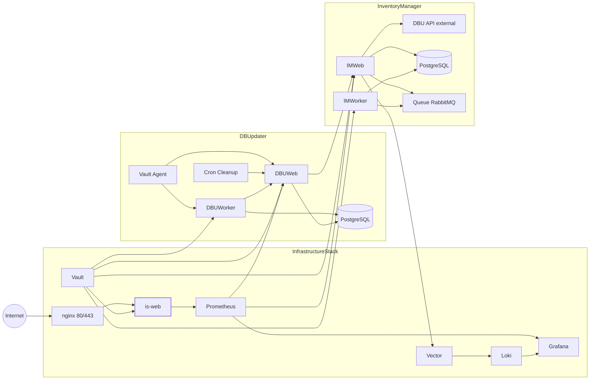
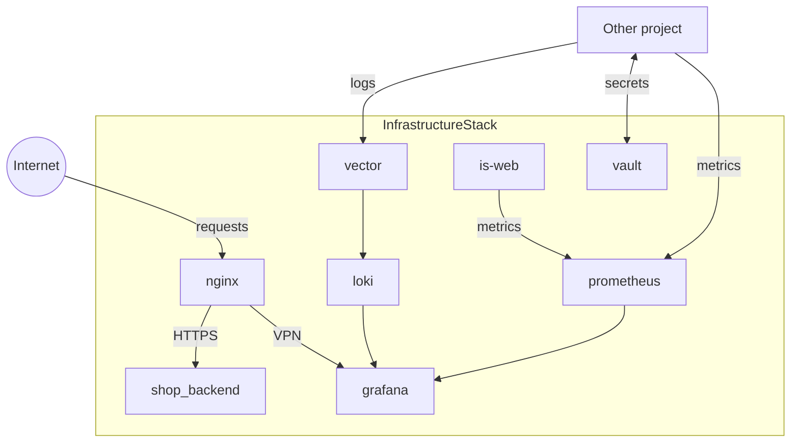
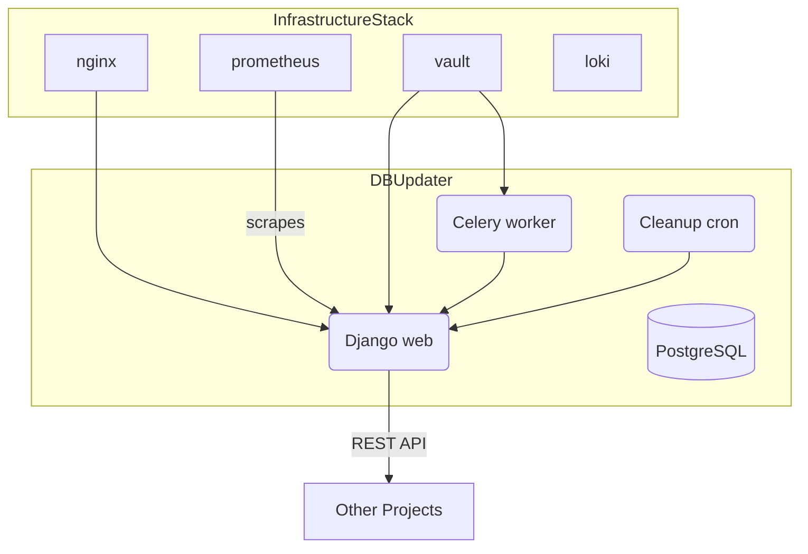
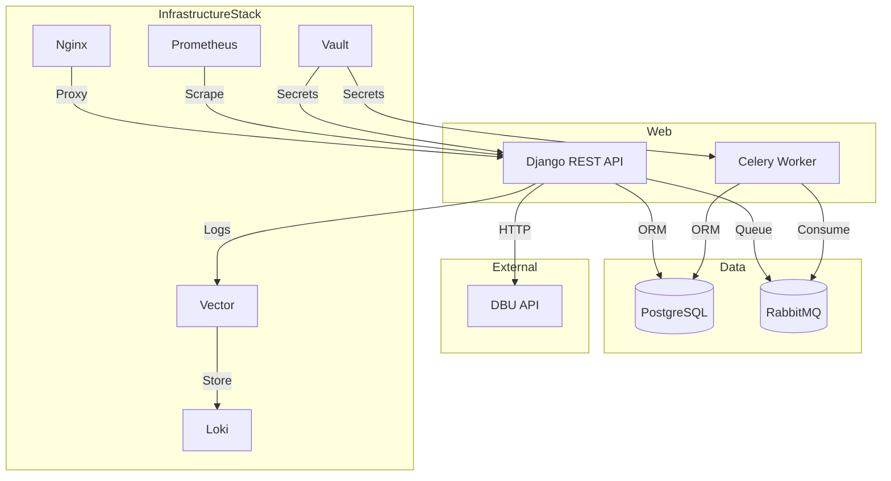

# SOFTWARE_ECOSYSTEM.md

## Overview

This document outlines the architecture and responsibilities of the PJS Collectables software ecosystem. It unifies context from:

- **InfrastructureStack** – shared infrastructure layer (monitoring, logging, secrets)
- **DBUpdater** – single source of truth for product data
- **InventoryManager** – stock and order management system
- **pjs-ecosystem-docs** - SSOT for the whole ecosystem documentation for centralized scalability.


## Contents
- [InfrastructureStack](#infrastructurestack-context)
- [DBUpdater](#dbupdater-context)
- [InventoryManager](#inventorymanager-context)
- [Ecosystem Documentation](#Ecosystem-Docs)

---

# InfrastructureStack Context

## Summary

InfrastructureStack is a Docker&nbsp;Compose stack that packages logging, monitoring and secret management for every PJS Collectables project. Running this stack on a single VPS gives all other repositories a ready‑made infrastructure layer so individual projects can stay focused on their own containers.



## Purpose

InfrastructureStack supplies the observability and secret‑management foundation that every other project depends on. By attaching to project‑specific networks like `im-net`, `dbu-net` or `shop-net`, it delivers centralised logging, metrics collection and Vault‑managed secrets so individual applications do not need to reimplement these critical capabilities. This shared layer is mandatory for the ecosystem: without it, projects would lack a unified way to emit logs, scrape metrics and access credentials.
InfrastructureStack services also join the internal `is-net` for cross‑service traffic. Grafana stays restricted to `is-net`, while only Nginx exposes ports 80/443 publicly. Vector tails container logs from `/var/lib/docker/containers` and forwards them to Loki; Prometheus scrapes targets listed in `prometheus/prometheus.yml`; Vault uses AppRole authentication to distribute secrets. Resource limits in `docker-compose.yml` prevent a single service from exhausting system resources. Certbot's systemd timer renews certificates automatically, and a deploy hook reloads Nginx so refreshed certificates are served.

## Repository layout
- `IS/` – Minimal Django project providing the `/metrics` endpoint via the Prometheus client and helper management commands.
- `docker-compose.base.yml` – Core Docker Compose file with health checks, resource limits and named volumes for all services.
- `docker-compose.yml` – Core Docker Compose file with health checks, resource limits and named volumes for all services.
- `docker-compose.override.yml` / `docker-compose.prod.yml` – Environment-specific overrides that expose ports and switch Vault configs.
- `vault/` – Vault production and development configs with TLS support.
- `scripts/` – Helper scripts:
  - `setup_approle.sh` – create or update a Vault AppRole and policy.
  - `push_env_to_vault.sh` – upload environment variables to `secret/<project>/`.
  - `obtain_cert.sh` – request TLS certificates with Certbot and restart Nginx.
  - `reload_nginx.sh` – Certbot deploy hook to reload Nginx after renewal.
  - `check_env.sh` – verify required environment variables.
- `logs/` – Host directory where scripts store their output.
Persistent files here can be picked up by Vector if you want script output in Loki.

## Integration with other Projects

Projects deploy their own Docker Compose stacks on the same host and declare the appropriate project network (`im-net`, `dbu-net` or `shop-net`) as an external network. Containers can then reference service names such as `prometheus` and `vault` directly. Each project receives a dedicated Vault path and should run a Vault Agent sidecar to fetch secrets before starting. The provided scripts simplify creating AppRoles and uploading environment values so CI pipelines can push credentials without manual steps.
Add the following snippet to your compose file to use the shared network (replace `im-net` with your project's network):
```yaml
networks:
  im-net:
    external: true
```
Attach each service to that network under its `networks` key. After joining the network run `./scripts/setup_approle.sh <project>` and `./scripts/push_env_to_vault.sh <project>` to store your secrets. A Vault Agent sidecar can then render an env file for your containers at runtime.

Once connected, your containers can reach InfrastructureStack services by
hostname. Examples:

- `prometheus:9090` to scrape metrics
- `vault:8200` to retrieve secrets
- `is-web:8000/status` for overall health

Isolated networks ensure containers from other projects are hidden from view, so
only the infrastructure components are accessible.


## Core services

### is-web

Minimal Django application located in the `IS/` directory. Built from `Dockerfile` and run with Gunicorn. It mounts volumes for static and media data and exposes port 8000 for Prometheus scraping via `/metrics`. The app offers a basic `/health` endpoint and aggregates other services under `/status`.

### nginx
Reverse proxy that serves static files, proxies the optional shop backend and exposes HTTPS endpoints using certificates from `/etc/letsencrypt`. Configuration lives in `nginx/` and the service waits for `is-web` before starting.
It resolves backend hostnames through Docker's embedded DNS service with a short
timeout to fail quickly if a container is unreachable.

### vector
Log collector configured via `vector/vector.toml`. It reads container log files from `/var/lib/docker/containers` and forwards them to `loki` over HTTP. The API on port 8686 is used for health checks.

### loki
Stores aggregated logs queried by Grafana. Data persists in the `loki_data` volume and the service listens on port 3100 on every project network so each project can reach it over its own segment.

### prometheus
Scrapes `/metrics` endpoints every 15s as defined in `prometheus/prometheus.yml`. The service listens on 9090 and is reachable from each project network without exposing a public port.

### grafana
Dashboard UI connected to Prometheus and Loki. Admin credentials come from `.env` and data persists in the `grafana_data` volume. Port 3000 is bound via the override files.

### vault
Runs with configuration from `vault/vault.hcl` (or the dev variant) and stores data in the `vault_data` volume. Port 8200 is internal only and the container uses IPC_LOCK for mlock.

### shop_backend (placeholder)
Example Nginx stub demonstrating how a public backend could be routed. Replace with your real service in production.


Metrics from all services are exposed at `/metrics` using `django-prometheus`.
All infrastructure containers join each project network as well as `is-net`. Grafana attaches solely to `is-net`. Prometheus, Loki and Vault do not publish ports externally; applications reach them by name within their respective network.

This project forms the backbone for the wider PJS Collectables ecosystem. By providing monitoring, logging and secret management out of the box it allows other repositories to remain focused on domain logic while relying on a consistent, secure infrastructure layer.

</div>
---

# DBUpdater Context

## Summary
This document explains how the **DBUpdater** project fits into the PJS Collectables ecosystem. The application acts as the single source of truth for all product data and exposes a REST API for other internal services.



## Purpose
DBUpdater maintains a normalized catalogue imported from the wholesaler and guarantees that every application in the ecosystem reads the same dataset. Imports are validated, stored indefinitely and processed asynchronously. The service exposes authenticated endpoints so downstream projects can look up products, categories and licenses without needing their own copy of the data.

## Repository layout
- `DBU/` – Django project with settings, URLs and Celery configuration.
- `databaseAPI/` – main application containing models, views and serializers.
  - `management/commands/` – import, scraping and cleanup tasks.
  - `services/` – implementation modules for data ingestion.
  - `tasks.py` – Celery task definitions.
- `cleanup-cron/` – cron configuration used by the `cleanup` container.
- `vault-agent/` – template and config for the Vault Agent sidecar used in production.
- `tests/` – pytest suite.
- Compose, Docker and supporting configuration files live at the project root.

## Integration with other Projects
Projects join the dedicated `dbu-net` Docker bridge so they can reach the `web` service by name. Authentication tokens are obtained from `/api-token-auth/` (see `AUTH.md`) and attached to requests. Common endpoints include `/api/products/`, `/api/categories/` and `/api/licenses/`. Systems may also connect directly to the PostgreSQL container when running on the same host. After each successful import the worker optionally pings the URL defined in `SIGNAL_URL`, allowing external services to trigger follow-up jobs.
Discount notifications parsed from incoming emails can be forwarded to `/api/email-data/`. The JSON body must contain an `order_number` and a list of `items` with `item_no` and `discount` fields. Invalid rows are ignored but recorded in the logs.

## Core services
The provided Docker Compose stack builds several containers that cooperate closely.

### Web
Hosts the Django application. In production it runs via Gunicorn behind InfrastructureStack’s Nginx reverse proxy. All API and admin traffic flows through that proxy and is restricted using `INTERNAL_ALLOWED_IPS` and `ADMIN_ALLOWED_IPS`.

Key routes:
- `POST /api-token-auth/` – obtain a token for subsequent requests.
- `/api/products/` – CRUD operations for products.
- `/api/categories/` and `/api/licenses/` – read-only metadata.
- `POST /api/email-data/` – update individual product discounts. The body should include an `order_number` and `items` with `item_no` and `discount` values.
- `/metrics/` – Prometheus scrape endpoint.

### Worker
Processes long running jobs. `databaseAPI/tasks.py` triggers the management commands located in `management/commands/` to import new catalogues, normalize GPSR spreadsheets, scrape product photos and fetch categories from the wholesaler. After completing an import the worker may POST to the configured `SIGNAL_URL` so that other projects start their own updates. Workers run with the same environment variables as the web service and therefore reuse the database connection and Vault credentials.

### Cleanup
Runs cron inside a small container to execute `cleanup_catalog_uploads` daily. This removes outdated uploaded files from the `media/` folder and keeps storage usage reasonable.

### Database
A PostgreSQL container holding all historical catalogue entries. The application requires Postgres to be available in all environments and will fail fast if the database cannot be reached.

### Vault Agent
In production a lightweight Vault Agent container writes `DB.env` before the other containers start. Environment variables are stored under the project’s path in InfrastructureStack’s Vault and rendered to disk for the web, worker and cleanup containers.

---

Centralising catalogue management in DBUpdater reduces duplicated logic across the ecosystem. Other projects simply read from the API or database and react to the `SIGNAL_URL` callback whenever new data arrives.


---

# InventoryManager Context

## Project Summary
InventoryManager is a Django-based service that manages orders and stock items while synchronising product metadata from an external DBU API. It exposes REST endpoints for CRUD operations on inventory, provides Celery tasks for background processing and offers chart visualisations of upcoming payments through the optional Analysis app.



## Purpose
InventoryManager acts as a centralised order and inventory tracker. Incoming orders are accepted via the REST API and persisted together with their products. CRUD endpoints allow the companion **IMApp** to adjust stock levels. The service also synchronises item metadata from the DBU API so that product information stays consistent across platforms. When enabled, the Analysis app can generate charts for upcoming payments, enabling further reporting.

## Repository layout
- `Inventory/` – models, views, tasks and API serializers
- `Analysis/` – optional charts and templates
- `InventoryManager/` – project settings and root URLs
- `core/` – shared code such as the DBU client and middleware
- `Dockerfile`, `docker-compose*.yml` – containerisation setup

## Integration with other Projects
Other applications communicate with InventoryManager primarily via its REST endpoints. To authenticate, obtain a token through `api/token/` then include it in the `Authorization: Token <token>` header. Environment variables (see `.env.example`) configure database access, rate limits and DBU credentials. Celery and RabbitMQ are used for asynchronous work so integrators may publish messages or let InventoryManager run its own worker. The containers join InfrastructureStack's dedicated `im-net` bridge to access Vault for secrets, Vector/Loki for logs and Prometheus for metrics. Prometheus scrapes the `/metrics/` endpoint for monitoring.

## Core services
### 1. Inventory API
Endpoints are defined under `Inventory/urls.py`:
- `receive/` – POST order and line item data
- `add-stock/` and `reduce-stock/` – update quantities
- `delete-item/` – soft delete an item
- `inventory/` – list current items with totals
- `query-dbu-item/` and `confirm-item/` – search the DBU API and create entries
- `signal/` – trigger a sync task
- `metrics/` – Prometheus scrape endpoint

Responses are JSON. The DBU client automatically authenticates using environment variables as shown in `core/clients/dbu.py`.

### 2. DBU Synchronisation
The utilities in `Inventory/utils.py` fetch product details from the external DBU API and store them in `ItemDetails` models. The `sync_missing_details` Celery task iterates over items lacking metadata and updates them. Management commands are provided for manual syncing.

### 3. Analysis views
When the Analysis app is enabled, `/analysis/` serves a page with chart data for upcoming payments. It aggregates totals per release month using information from `ItemDetails`.

### Deployment with DBUpdater

DBUpdater is deployed as a separate Compose project but typically runs on the same VPS as InventoryManager. It uses its own `dbu-net` network while InventoryManager stays on `im-net`. To allow communication, expose the DBUpdater web container (usually named `dbu-web`) and set `DBU_BASE_URL` to that address. Configure the `DBU_*` variables in `.env` (or fetch them from Vault) and start each stack with `docker compose up -d`. This keeps the projects isolated while letting the `DBUClient` authenticate and retrieve product details.

