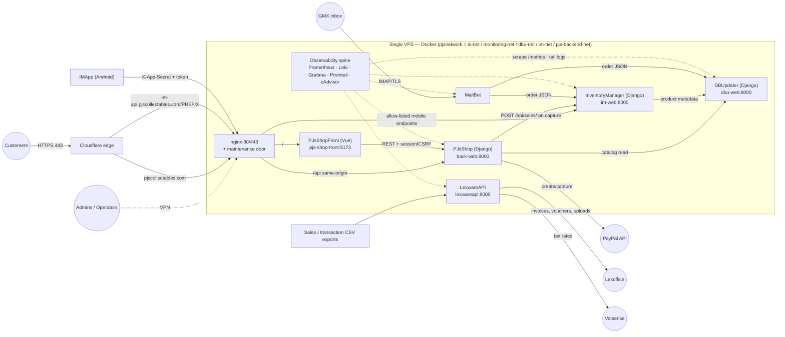
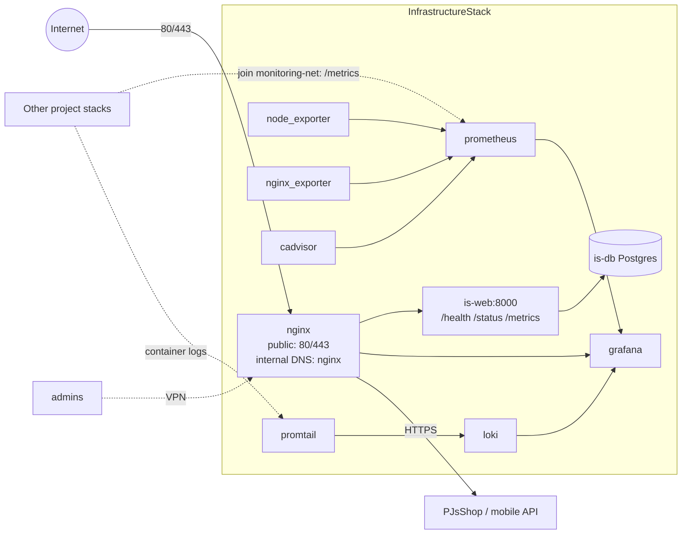
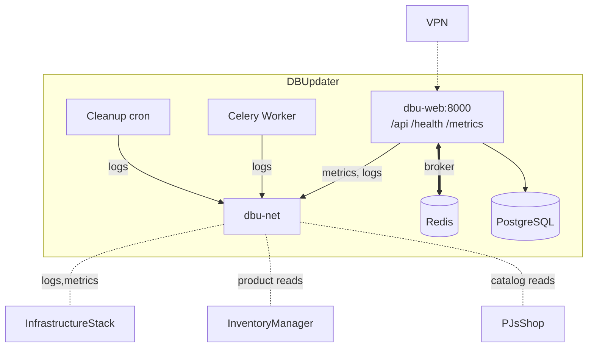
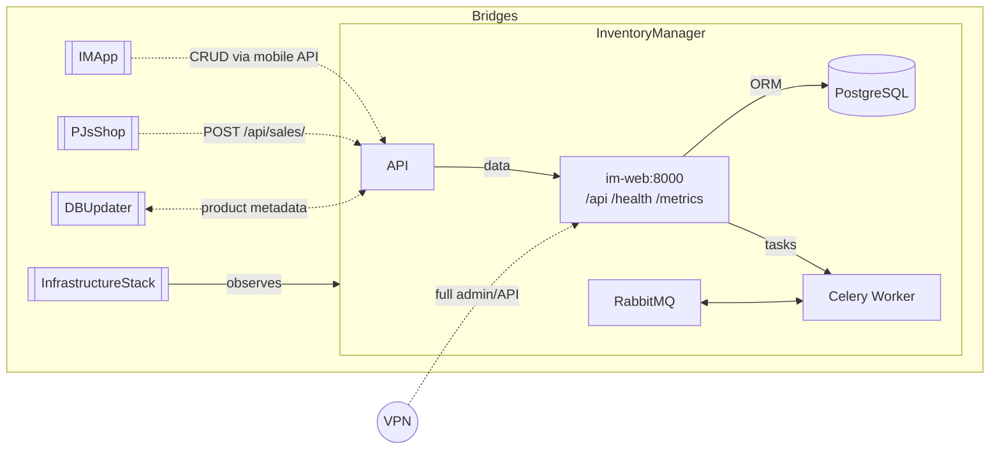
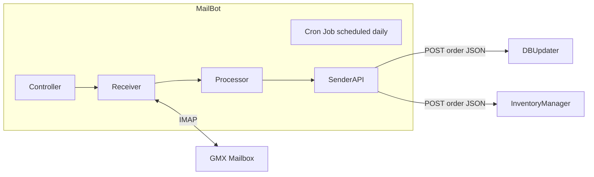
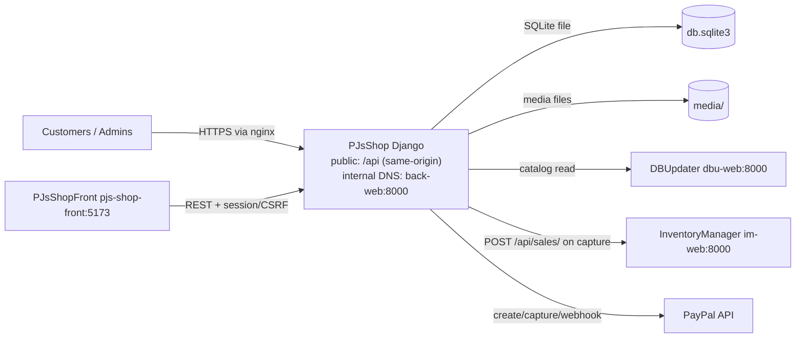
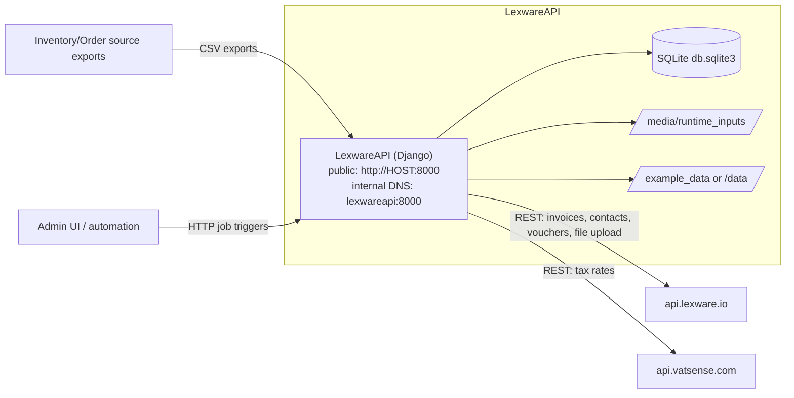
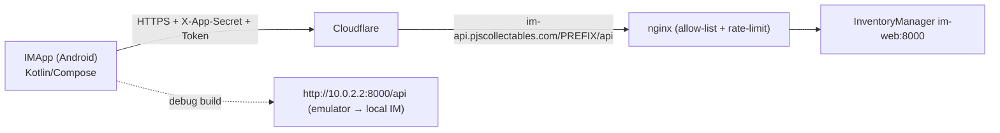

# SOFTWARE_ECOSYSTEM.md

## At a Glance

PJS Collectables is a small online business that sells popculture collectables  like trading-card, merch and figures etc. products. This ecosystem is the set of cooperating services that runs that business end to end: it ingests the wholesaler catalogue, keeps a single authoritative product dataset, tracks stock and orders, sells to customers through a public web shop, automates order-email ingestion and bookkeeping, and gives staff a mobile app for inventory work. The problem it solves is consistency at low operational cost — every surface (shop, mobile app, accounting) reads from the same trusted data and runs on one small VPS with shared monitoring, logging and a hardened public edge, so a one-person operation can run like a multi-service platform without duplicated logic or manual data shuffling.

| Project | Role | Tech | Status |
| --- | --- | --- | --- |
| [InfrastructureStack](#infrastructurestack-context) | Shared infra: observability, secrets, public edge (nginx), maintenance door | Django · Docker Compose · Prometheus · Loki · Grafana · nginx | Active — Production |
| [DBUpdater](#dbupdater-context) | Single source of truth for product/catalogue data | Django · DRF · Celery · PostgreSQL · Redis | Active — Production |
| [InventoryManager](#inventorymanager-context) | Operational stock & order ledger | Django · DRF · Celery · PostgreSQL · RabbitMQ | Active — Production |
| [MailBot](#mailbot-context) | Email-to-order relay (IMAP → DBU/IM) | Python · IMAP · BeautifulSoup | Active — Production |
| [PJsShop](#pjsshop-context) | Customer-facing commerce backend (catalog, cart, orders, payments) | Django · DRF · SQLite · PayPal | Active — Production |
| [LexwareAPI](#lexwareapi-context) | Bookkeeping automation bridge (CSV → Lexoffice invoices, tax, payout matching) | Django · SQLite · Lexoffice · Vatsense | Active — Production |
| [PJsShopFront](#pjsshopfront-context) | Storefront UI (browser entrypoint) | Vue 3 · Vite · Tailwind | Active — Production |
| [IMApp](#imapp-context) | Internal Android client for InventoryManager | Kotlin · Jetpack Compose · OkHttp | Active — Internal sideload |


```mermaid
flowchart LR
    Internet(("Customers")) -->|HTTPS 443| CF["Cloudflare edge"]
    Admins(("Admins / Operators")) -.->|VPN| NGINX

    subgraph VPS["Single VPS — Docker (pjsnetwork = is-net / monitoring-net / dbu-net / im-net / pjs-backend-net)"]
        NGINX["nginx 80/443<br/>+ maintenance door"]
        OBS["Observability spine<br/>Prometheus · Loki · Grafana · Promtail · cAdvisor"]
        FRONT["PJsShopFront (Vue)<br/>pjs-shop-front:5173"]
        SHOP["PJsShop (Django)<br/>back-web:8000"]
        DBU["DBUpdater (Django)<br/>dbu-web:8000"]
        IM["InventoryManager (Django)<br/>im-web:8000"]
        MAIL["MailBot"]
        LEX["LexwareAPI<br/>lexwareapi:8000"]
    end

    CF -->|pjscollectables.com| NGINX
    CF -->|im-api.pjscollectables.com/PREFIX| NGINX
    NGINX -->|/| FRONT
    NGINX -->|/api same-origin| SHOP
    NGINX -->|allow-listed mobile endpoints| IM

    FRONT -->|REST + session/CSRF| SHOP
    SHOP -->|catalog read| DBU
    SHOP -->|POST /api/sales/ on capture| IM
    SHOP -->|create/capture| PayPal(("PayPal API"))
    IM -->|product metadata| DBU
    IMAPP["IMApp (Android)"] -->|X-App-Secret + token| NGINX
    Inbox(("GMX inbox")) -->|IMAP/TLS| MAIL
    MAIL -->|order JSON| DBU
    MAIL -->|order JSON| IM
    Exports["Sales / transaction CSV exports"] --> LEX
    LEX -->|invoices, vouchers, uploads| Lexoffice(("Lexoffice"))
    LEX -->|tax rates| Vatsense(("Vatsense"))

    OBS -.->|scrape /metrics · tail logs| DBU
    OBS -.-> IM
    OBS -.-> SHOP
    OBS -.-> MAIL
    OBS -.-> LEX
```

### Contents
- [Infrastructure & Distribution](#infrastructure--distribution)
- [InfrastructureStack](#infrastructurestack-context)
- [DBUpdater](#dbupdater-context)
- [InventoryManager](#inventorymanager-context)
- [MailBot](#mailbot-context)
- [PJsShop](#pjsshop-context)
- [LexwareAPI](#lexwareapi-context)
- [PJsShopFront](#pjsshopfront-context)
- [IMApp](#imapp-context)
- [Development Regulation Standards](#development-regulation-standards)

---

## Infrastructure & Distribution

This section describes the global, ecosystem-wide concerns that are not specific to any one project: where everything runs, how the public edge is structured, how this document is distributed, and which quality/security standards apply across all repositories.

### Hosting model

The entire ecosystem runs on a **single VPS** under **Docker Compose**. Each project ships its own Compose stack and joins the shared Docker bridge networks that InfrastructureStack defines, rather than everything living in one stack. The bridges segment traffic by concern:

- `is-net` — InfrastructureStack's internal service-to-service traffic (Grafana attaches here only).
- `monitoring-net` — the **observability spine**: Prometheus, its config reloader, cAdvisor and (production) the nginx exporter attach here, and external project stacks join it so their `/metrics` can be scraped and their logs collected without exposing public ports.
- `dbu-net`, `im-net`, `pjs-backend-net` — per-project bridges (owned by DBUpdater, InventoryManager and the PJsShop stack respectively). A consumer joins another project's bridge only when it needs to reach that project by container DNS name (e.g. InventoryManager joins `dbu-net` to reach `dbu-web`; nginx joins `pjs-backend-net` to reach `back-web`/`pjs-shop-front`).

> **Network naming note:** "`pjsnetwork`" is used loosely as the umbrella term for these bridges; the concrete network names are `is-net`, `monitoring-net`, `dbu-net`, `im-net` and `pjs-backend-net`. Container isolation is the default: a container can only resolve and reach services on bridges it has explicitly joined, so a project's database and internal services stay invisible to unrelated stacks.

All services run on the VPS; there is currently **no Raspberry-Pi-hosted tier** — the "VPS vs Pi split" some earlier drafts referenced is not part of the deployed topology. (See [HANDBOOK.md](HANDBOOK.md) §2 for the authoritative VPS layout and deploy order.)

### Nginx & the public edge

InfrastructureStack's **nginx** is the only component that publishes ports `80`/`443` to the internet; everything else is reachable only over the internal bridges or the admin VPN. The edge sits behind **Cloudflare** (Full-strict TLS, WAF, rate-limiting, origin-IP hiding, Authenticated Origin Pulls/mTLS so only Cloudflare can complete the origin handshake). nginx exposes exactly two public surfaces and protects everything else:

- **Storefront** — `pjscollectables.com`/`www` is served to customers: `/` proxies to the Vue container `pjs-shop-front:5173` and `/api/` is same-origin to the shop backend `back-web:8000`. A **maintenance door** marker (a file on the `control_data` volume, mounted read-only into nginx) lets an operator serve a maintenance page for the whole shop by "closing the door".
- **Mobile Stock API** — `im-api.pjscollectables.com/<PREFIX>/api/…` exposes a deliberately-obscured, hardened subset of InventoryManager for the [IMApp](#imapp-context) Android client (secret URL prefix + `X-App-Secret` header + endpoint allow-list + rate limits; see [nginx/MOBILE_API.md](nginx/MOBILE_API.md)).
- **Protected** — the full InventoryManager admin/API, DBUpdater, Grafana and all observability endpoints are **not** public; they are reachable only over the VPN or internal bridges.

### Documentation distribution (this file)

`SOFTWARE_ECOSYSTEM.md` is the master technical reference. **InfrastructureStack is the authoring master** for it. Distribution is handled by GitHub Actions, with a public **single-source-of-truth (SSOT) repository** acting as the hub:

- The reusable workflow [`.github/workflows/reusable-sync-docs.yml`](.github/workflows/reusable-sync-docs.yml) is the one place the sync logic lives. On a push to a repo's `main`, its **Push to SSOT** step copies that repo's `SOFTWARE_ECOSYSTEM.md` into the SSOT repo **`MKRO-JWL/pjs-ecosystem-docs`** and commits it.
- On a `repository_dispatch` of type `sync_requested`, the **Fetch from SSOT** step pulls the canonical file from the SSOT raw URL and commits it into the receiving child repo.
- Each repo wires this up with a thin caller, [`.github/workflows/sync_ecos_doc.yml`](.github/workflows/sync_ecos_doc.yml), that `uses:` the reusable workflow (children reference `MKRO-JWL/InfrastructureStack/.github/workflows/reusable-sync-docs.yml@main`).

In practice: edit this file in InfrastructureStack → merge to `main` → the push propagates to the SSOT → the SSOT fans the update out to every connected child repo, keeping all copies identical without manual editing.

> **Operational caveat (validated):** the `reusable-*` workflow files must be committed on InfrastructureStack `main` for the children's `uses: …@main` references to resolve, and the `sync_requested` dispatch that triggers children to pull is fired from the SSOT repo (`pjs-ecosystem-docs`), not from this repo. Because every repo's push-to-`main` also pushes *its* copy up, the SSOT is last-writer-wins; treat InfrastructureStack as the only place this file should be edited to avoid divergence.

### Quality & security standards

Every repository is built and audited against shared standards rather than ad-hoc rules:

- **ISO/IEC 25010** — the product-quality model used as the scoring rubric for audits. The full rubric is kept embedded at the end of this document, under [Development Regulation Standards](#development-regulation-standards); the latest applied audit report lives in [QUALITY_ASSURANCE.md](QUALITY_ASSURANCE.md).
- **OWASP** — web-application security guidance (input validation, authn/session handling, transport security, secret management) informs the security posture across the Django services and the public edge.

These standards are referenced here, not duplicated per project; each project section's *Operations & Lifecycle* segment documents the concrete controls it implements.

---

# InfrastructureStack Context

## Summary

InfrastructureStack (IS) is the Docker Compose stack that packages logging, monitoring, secret management and the public edge for every PJS Collectables project. Running it on the VPS gives all other repositories a ready-made infrastructure layer so they can stay focused on their own domain containers. **Status: Active — Production.**


```mermaid
graph LR
    Internet((Internet)) -->|80/443| nginx
    admins -.->|VPN| nginx
    subgraph InfrastructureStack
        nginx["nginx<br/>public: 80/443<br/>internal DNS: nginx"]
        is-web["is-web:8000<br/>/health /status /metrics"]
        is-db[(is-db Postgres)]
        nginx --> is-web
        nginx --> grafana
        is-web --> is-db
        node_exporter --> prometheus
        nginx_exporter --> prometheus
        cadvisor --> prometheus
        promtail --> loki --> grafana
        prometheus --> grafana
    end
    other["Other project stacks"]
    other -.->|join monitoring-net: /metrics| prometheus
    other -.->|container logs| promtail
    nginx -->|HTTPS| Webshop["PJsShop / mobile API"]
```

## Purpose

InfrastructureStack supplies the observability, secret-management and public-ingress foundation that every other project depends on. By attaching to the shared `monitoring-net` bridge, companion stacks gain centralised logging (Promtail → Loki), metrics collection (Prometheus → Grafana) and per-container health (cAdvisor) without recreating those services; by routing through its nginx, the shop and mobile API get one hardened TLS edge with a maintenance door. It **owns** the shared bridges, the reverse proxy/TLS termination, the metrics/log stores, and the maintenance-door control marker; it **depends on** nothing inside the ecosystem (it is the foundation) but does rely on Cloudflare and Let's Encrypt at the edge. Data flow is one-directional at the platform layer: telemetry flows **into** IS from every other project, and public requests flow **through** IS to the shop and mobile API.

**Non-goals / boundary:** IS holds no business data — product data is owned by [DBUpdater](#dbupdater-context), stock/orders by [InventoryManager](#inventorymanager-context), and commerce state by [PJsShop](#pjsshop-context). IS does not implement application logic, does not store secrets for other projects (each stack supplies its own Docker secrets), and is not a service mesh — it provides shared networks and observability, not request routing between internal services.

> **Legacy Note:** Vault references are commented out across this repo because Vault is legacy (overkill: complex ops, unseal process, HA setups, storage backends). Docker secrets with strict host hygiene now satisfy secret management.

## Repository layout
- `IS/` – Minimal Django project providing `/health`, `/status` and the `/metrics` endpoint (Prometheus client) plus the maintenance-door management commands and signals.
- `docker-compose.yml` – Base stack: is-web, is-db, promtail, loki, prometheus, prometheus-config-reloader, grafana, cadvisor; health checks, resource limits, named volumes and the shared networks.
- `docker-compose.override.yml` – Development overrides (mount working tree, `DEBUG`, bind Grafana to localhost).
- `docker-compose.prod.yml` – Production overlays: public nginx proxy, nginx-exporter, host node-exporter.
- `grafana/` – Datasource/dashboard provisioning and curated dashboards (incl. `ecosystem-health.json`).
- `prometheus/` – Prometheus config, alerting rules (node-exporter alerts) and files watched by the config-reloader sidecar.
- `promtail/` – Promtail config forwarding container logs to Loki.
- `nginx/` – Reverse proxy config, TLS hooks, Cloudflare origin-pull CA, the mobile-API server block and maintenance assets (`MOBILE_API.md`, `cloudflare/`, `maintenance/`).
- `secrets/` – Docker-secret files (db user/password, web secret key, Grafana admin).
- `docs/` – Operator docs (`MAINTENANCE.md`); `HANDBOOK.md` and `QUALITY_ASSURANCE.md` live at the root.

## Integration with other Projects

### Exposes
- **Shared networks** — external stacks attach to `monitoring-net` (and join project bridges as needed) by declaring it external:
  ```yaml
  networks:
    monitoring-net:
      external: true
  ```
- **Observability endpoints** (by container DNS, no public port): `prometheus:9090` (metrics store), `loki:3100` (log ingestion/query), `grafana` (dashboards, VPN-only), `is-web:8000/status` (aggregated health), `is-web:8000/health` (liveness), `/metrics` (django-prometheus).
- **Label-based scrape opt-in** — a container is scraped when it sets Docker labels `prometheus.scrape="true"`, `prometheus.port="<port>"` and optional `prometheus.job="<name>"`.
- **Public edge** — nginx terminates TLS on 80/443 and routes `pjscollectables.com` → shop, `im-api.pjscollectables.com/<PREFIX>` → InventoryManager mobile subset.
- **Auth/contract:** observability endpoints are network-scoped (no token); access control is via network membership and the VPN. **Errors/behavior:** unreachable backends fail fast via short Docker DNS timeouts; nginx returns `444` for non-allow-listed mobile-API requests.

### Consumes
- **Container logs** — Promtail tails `/var/lib/docker/containers` (read-only) from every container on the host and ships them to Loki.
- **Metrics** — Prometheus scrapes the `/metrics` endpoint of every opted-in container (Docker `docker_sd` discovery via the Docker socket, read-only) every 15s; cAdvisor reads host/container stats.
- **Edge inputs** — Cloudflare supplies the `CF-IPCountry` / `CF-Connecting-IP` headers and origin-pull mTLS; Certbot supplies TLS certificates under `/etc/letsencrypt`.
- **If unavailable:** if a target project is down, IS simply records gaps in metrics/logs and (for the shop) nginx serves errors or the maintenance page — IS itself stays up. If IS is down, other projects keep running internally but lose centralised observability and public ingress.

## Core services

### is-web
Minimal Django app in `IS/`, built from `Dockerfile`, run with Gunicorn (3 workers × 2 threads). Exposes `:8000` for `/metrics` (Prometheus), a basic `/health` liveness probe, and `/status` which aggregates other services. Its container command runs `check_db`, `migrate`, `sync_maintenance_flag`, `collectstatic`, then Gunicorn — chained with `&&` so it fails fast and the restart policy retries until the DB is up.

### is-db
PostgreSQL 15 persisting IS's own Django state. Superuser/password are injected via Docker secrets (`/run/secrets/...`) so credentials never land in env vars.

### nginx
Reverse proxy serving static files, terminating HTTPS with Let's Encrypt certs, applying the maintenance door, and proxying the shop and the hardened mobile API. Resolves backend hostnames via Docker's embedded DNS with a short timeout to fail quickly when a container is unreachable. (Production overlay only.)

### promtail / loki
`promtail` reads container JSON logs from `/var/lib/docker/containers`, filters its own logs to avoid Loki feedback loops, and forwards to `loki` over HTTP (readiness/metrics on `:9080`). `loki` stores aggregated logs (volume `loki_data`, port `3100`) for Grafana.

### prometheus / prometheus-config-reloader
`prometheus` scrapes `/metrics` every 15s (config in `prometheus/prometheus.yml`, listens `:9090`, joins `is-net` + `monitoring-net`). It discovers targets via `docker_sd_configs` from the Docker socket, applying the `prometheus.*` labels and dropping all other Docker metadata. The `prometheus-config-reloader` sidecar watches the mounted `prometheus/` directory and POSTs to `…/-/reload` on change so rules/targets update without a restart.

### grafana
Dashboard UI wired to Prometheus and Loki; admin credentials via Docker secrets; data in `grafana_data`. Stays on `is-net` only (not `monitoring-net`) and is reachable over the VPN.

### cadvisor
Per-container CPU/memory/network/restart/liveness metrics for **every** container on the host (read-only host mounts, trimmed metric set), scraped by Prometheus via the static `cadvisor` job — giving whole-ecosystem visibility in dev and prod.

### Public shop routing *(production overlay)*
The production proxy serves the PJsShop storefront at `pjscollectables.com`/`www`, forwarding to the Vue container `pjs-shop-front:5173` with the shop API same-origin at `/api/` (`back-web:8000`). Both upstreams live on the external `pjs-backend-net` bridge (owned by the PJsShop compose project) and sit behind the maintenance door, so closing it serves a maintenance page for the whole shop.

### nginx-exporter / node-exporter *(production overlay)*
`nginx-exporter` reuses the nginx network namespace to scrape stub-status metrics on `:9113` inside `monitoring-net`. `node-exporter` is the host-level exporter (read-only `/`, `/proc`, `/sys` mounts with `--path.*=/host/*`) so Prometheus observes CPU/memory/filesystem/load/network without sharing the host PID namespace; alert rules live under `prometheus/rules/node-exporter-alerts.yml`.

### Geo data via Cloudflare
The production proxy sits behind Cloudflare, which supplies the free `CF-IPCountry` request header on every request. nginx records it (via `$http_cf_ipcountry`) in the JSON access log, so no MaxMind/GeoIP2 module, license key or updater container is needed.

## Operations & Lifecycle

### Runtime behavior
- **Startup dependencies & ordering:** `is-web` depends on `is-db`; its command chain (`check_db → migrate → sync_maintenance_flag → collectstatic → gunicorn`) fails fast and retries via `restart: unless-stopped` until the DB is healthy. `prometheus-config-reloader` waits for `prometheus`. Observability services have no hard ordering and self-heal.
- **Shutdown & cleanup:** services stop on SIGTERM; Gunicorn drains in-flight requests; named volumes (`postgres_data`, `loki_data`, `prometheus_data`, `grafana_data`, `promtail_positions`, `control_data`, `static_data`, `media_data`) persist across recreation.
- **Healthy / readiness vs liveness:** liveness = the process is up (e.g. `is-web` `/health`, Loki `/ready`, Prometheus `/-/ready`, Grafana `/api/health`); readiness = dependencies reachable (DB connectivity for `is-web` via `/status`). Compose health checks run every 30s.
- **Isolated volume mounts:** `control_data` (the maintenance-door marker) is mounted **read-only** into nginx and read-write only into `is-web`; `/var/lib/docker/containers` and the Docker socket are mounted **read-only** into Promtail/Prometheus/cAdvisor.

### Failure behavior
- **If IS is unavailable:** other projects keep functioning internally but lose centralised logs/metrics and public ingress; the shop and mobile API become unreachable from the internet.
- **Retry/backoff & idempotency:** observability is pull-based, so a scrape/tail gap self-heals on the next interval (no consumer retry needed). Migrations are idempotent; the maintenance marker is re-synced at boot via `sync_maintenance_flag`.
- **Partial failures:** a single down target only blanks its own panels; Grafana/Prometheus stay up. nginx fails a single unreachable upstream fast (short DNS timeout) rather than hanging the proxy.
- **Local mocking/stubbing:** the dev override runs the stack standalone (Grafana on localhost, no public nginx) so a developer can exercise observability without the production edge or Cloudflare.

### Environment contract
Application config is via `.env` (compose) + Docker secrets (files under `/run/secrets`).

| Variable | Type | Default | Secret-managed |
| --- | --- | --- | --- |
| `DEBUG` | bool | `False` | no |
| `ALLOWED_HOSTS` | csv | `localhost,127.0.0.1,10.8.0.1,is.pjscollectables.com` | no |
| `DB_NAME` | string | `pjsdb` | no |
| `DB_HOST` | string | `127.0.0.1` (`is-db` in compose) | no |
| `DB_PORT` | int | `5432` | no |
| `WEB_CONCURRENCY` | int | `3` | no |
| `GUNICORN_THREADS` | int | `2` | no |
| `DOCKER_GID` | int | `0` (set to host docker gid in prod) | no |
| `CONTROL_DIR` | path | `/control` (optional override) | no |
| `CSRF_TRUSTED_ORIGINS` | csv | unset (optional) | no |
| `SECRET_KEY` | string | — | **yes** (`secrets/is-web-secret-key.txt`) |
| `DB_USER` / `DB_PASSWORD` | string | — | **yes** (`secrets/is-db-user.txt`, `is-db-password.txt`) |
| `GRAFANA_USER` / `GRAFANA_PASSWORD` | string | — | **yes** (`secrets/grafana-admin-*.txt`) |

### Observability
- **Logs:** all containers use the Docker `json-file` driver (10 MB × 3 rotation); Promtail ships them to Loki. nginx writes a JSON access log including `$http_cf_ipcountry`.
- **Metrics:** every service exposes `/metrics` (django-prometheus on `is-web`); cAdvisor adds per-container metrics; nginx-exporter (prod) adds connection/response metrics. Prometheus scrapes via Docker label discovery.
- **Health endpoints:** `is-web` `/health` (liveness) and `/status` (aggregate readiness); per-service Compose health checks (Loki `/ready`, Prometheus `/-/ready`, Grafana `/api/health`).
- **Dashboards/correlation:** Grafana unifies metrics + logs; the `ecosystem-health.json` dashboard gives a cross-project view.

---

# DBUpdater Context

## Summary
DBUpdater (DBU) is the **single source of truth for all product data** in the ecosystem. It maintains a normalized catalogue imported from the wholesaler and exposes an authenticated REST API so every other service reads the same dataset rather than keeping its own copy. **Status: Active — Production.**


```mermaid
graph TD
    subgraph DBUpdater
        net[dbu-net]
        dbu-web["dbu-web:8000<br/>/api /health /metrics"] --> |metrics, logs| net
        celery[Celery Worker] --> |logs| net
        cron[Cleanup cron] --> |logs| net
        dbu-web <==> |broker| redis[(Redis)]
        dbu-web --> db[(PostgreSQL)]
    end
    im[InventoryManager]
    shop[PJsShop]
    is[InfrastructureStack]
    net -.- |logs,metrics| is
    net -.- |product reads| im
    net -.- |catalog reads| shop
    VPN -.-> dbu-web
```

## Purpose
DBUpdater guarantees that every application reads the same product dataset. Imports from the wholesaler are validated, stored indefinitely and processed asynchronously; downstream projects look up products, categories and licenses over the API without maintaining their own catalogue. It **owns** the canonical product/category/license data and the catalogue import pipeline; it **depends on** [InfrastructureStack](#infrastructurestack-context) for observability/secrets only. Data flow: catalogue data flows **out** of DBU to consumers; discount/order signals from [MailBot](#mailbot-context) flow **in**; after each import DBU may emit a `SIGNAL_URL` callback so consumers refresh.

**Non-goals / boundary:** DBU does not track stock levels or orders (that is [InventoryManager](#inventorymanager-context)), does not sell to customers (that is [PJsShop](#pjsshop-context)), and does not parse emails (that is [MailBot](#mailbot-context)). It is purely the authoritative catalogue and its API — the data spine the rest of the ecosystem reads from.

## Repository layout
- `DBU/` – Django project: settings, URLs and Celery configuration.
- `databaseAPI/` – main application (models, views, serializers, signals).
  - `management/commands/` – import, scraping and cleanup tasks.
  - `services/` – data-ingestion implementation modules (catalog update, category utilities).
  - `tasks.py` – Celery task definitions.
- `cleanup-cron/` – cron configuration for the `cleanup` container.
- `tests/` – pytest suite.
- Compose, Docker and supporting configuration at the project root.

## Integration with other Projects

### Exposes
- **Network:** consumers join the `dbu-net` bridge to reach `dbu-web:8000` by name.
- **Auth:** token auth — `POST /api-token-auth/` returns a token attached as `Authorization: Token <token>` (see `AUTH.md`). Web/admin traffic is additionally restricted by `INTERNAL_ALLOWED_IPS` / `ADMIN_ALLOWED_IPS`.
- **Endpoints:** `/api/products/` (CRUD), `/api/categories/` & `/api/licenses/` (read-only metadata), `POST /api/email-data/` (apply per-item discounts; body `{order_number, items:[{item_no, discount}]}`), `/metrics/`.
- **Callback:** after a successful import the worker optionally `POST`s to `SIGNAL_URL` so consumers trigger follow-up syncs.
- **Errors/behavior:** unauthenticated requests get `401/403`; invalid `email-data` rows are ignored but logged; direct PostgreSQL access is possible for co-located stacks.

### Consumes
- **InfrastructureStack** — `monitoring-net` for metrics/log shipping (observability only; no functional dependency).
- **MailBot** — receives discount/order payloads at `/api/email-data/`; if MailBot is down, no new discounts arrive but the catalogue is unaffected.
- **Wholesaler source files** — catalogue/GPSR spreadsheets ingested by management commands (operator/scheduled input).
- **If unavailable:** if DBU is down, consumers ([InventoryManager](#inventorymanager-context), [PJsShop](#pjsshop-context)) cannot refresh product metadata and should serve cached/last-known data and retry; the `SIGNAL_URL` callback simply does not fire.

## Core services
The Compose stack builds several cooperating containers.

### Web (`dbu-web`)
Hosts the Django app; in production runs via Gunicorn behind IS's nginx. Key routes: `POST /api-token-auth/`, `/api/products/`, `/api/categories/`, `/api/licenses/`, `POST /api/email-data/`, `/metrics/`. Depends on `db` and `redis` being healthy before start.

### Worker (`dbu-worker`)
Celery worker (`celery -A DBU worker`, concurrency `CELERY_WORKER_CONCURRENCY`) running the import/normalisation/scraping commands from `management/commands/`. After an import it may POST to `SIGNAL_URL` so other projects start their own updates. Shares the web service's environment and DB connection.

### Cleanup (`dbu-cron`)
Small cron container running `cleanup_catalog_uploads` daily to remove outdated uploads from `media/` and keep storage bounded.

### Database (`db`) & Broker (`redis`)
PostgreSQL 16 holds all historical catalogue entries (the app fails fast if it is unreachable). Redis 7 is the Celery broker. Both have Compose health checks gating `dbu-web`/`worker` startup.

## Operations & Lifecycle

### Runtime behavior
- **Startup dependencies & ordering:** `dbu-web` and `worker` `depends_on` `db` **and** `redis` with `condition: service_healthy`; `cleanup` depends on `db`. All use `restart: unless-stopped`.
- **Shutdown & cleanup:** Celery finishes in-flight tasks on SIGTERM; volumes `pgdata`, `media`, `static`, `data`, `logs` persist across recreation.
- **Healthy / readiness vs liveness:** `dbu-web` health check curls `/health/` (liveness+readiness, 30s, 20s start period); worker health = `pgrep celery`; cleanup health = `pgrep cron`; db = `pg_isready`; redis = `redis-cli ping`.
- **Isolated volume mounts:** the `media`/`data` volumes are import working areas; `pgdata` must remain a dedicated, non-shared volume.

### Failure behavior
- **If DBU is unavailable:** consumers lose catalogue refresh; they should cache and retry with backoff. Imports are **idempotent** (catalogue stored indefinitely, re-import overwrites cleanly).
- **Retry/backoff:** the `SIGNAL_URL` callback is best-effort; consumers should poll/retry rather than assume push delivery. `email-data` ingestion tolerates and logs invalid rows (partial-failure safe).
- **Resource limits:** per-service CPU/memory limits in compose prevent one container from starving the host.
- **Local mocking/stubbing:** run the stack standalone with a local Postgres + Redis; consumers can stub the DBU client against a fixture catalogue.

### Environment contract
Config via `.env` (compose `env_file`).

| Variable | Type | Default | Secret-managed |
| --- | --- | --- | --- |
| `SECRET_KEY` | string | — | yes (CI/host secret) |
| `DJANGO_MODE` | enum | `production` | no |
| `DEBUG` | bool | `False` | no |
| `ALLOWED_HOSTS` | csv | — | no |
| `USE_POSTGRES` | bool | `true` | no |
| `DB_NAME` / `DB_USER` / `DB_PASSWORD` | string | — | yes |
| `DB_HOST` / `DB_PORT` | string/int | `db` / `5432` | no |
| `CORS_ALLOWED_ORIGINS` | csv | — | no |
| `SECURE_SSL_REDIRECT` / `SECURE_HSTS_*` | bool/int | `True` / `63072000` | no |
| `LOG_LEVEL` | enum | `INFO` | no |
| `CELERY_BROKER_URL` | url | `redis://redis:6379/0` | no |
| `CELERY_WORKER_CONCURRENCY` | int | `1` | no |
| `SIGNAL_URL` | url | unset (optional callback) | no |
| `INTERNAL_ALLOWED_IPS` / `ADMIN_ALLOWED_IPS` | csv | — | no |

### Observability
- **Logs:** `json-file` driver (10 MB × 3); stdout shipped to Loki via Promtail; level set by `LOG_LEVEL`.
- **Metrics:** `/metrics/` (django-prometheus) scraped by Prometheus; worker/cron liveness via process checks.
- **Health endpoint:** `GET /health/`.
- **Correlation:** import runs and `SIGNAL_URL` callbacks are logged so a downstream refresh can be traced back to an import.

---

# InventoryManager Context

## Summary
InventoryManager (IM) is the central **Inventory Management System (IMS)** that holds stock state while synchronising product metadata with [DBUpdater](#dbupdater-context). It exposes REST endpoints for CRUD operations to [IMApp](#imapp-context) and sale/order endpoints to other applications, runs Celery tasks for background processing, and offers chart visualisations and data tracking through the Analysis app. **Status: Active — Production.**


```mermaid
flowchart LR
    subgraph InventoryManager
        api[API]
        im-web["im-web:8000<br/>/api /health /metrics"] --> |ORM| DB
        im-web --> |tasks| celery
        rabbit[RabbitMQ] <--> celery
        celery[Celery Worker]
        api -->|data| im-web
        DB[(PostgreSQL)]
    end
    subgraph Bridges
        dbu[[DBUpdater]]
        is[[InfrastructureStack]]
        shop[[PJsShop]]
        IMApp[[IMApp]] -.->|CRUD via mobile API| api
        shop -.->|POST /api/sales/| api
        is --> |observes| InventoryManager
        dbu <-.-> |product metadata| api
    end
    VPN((VPN)) -.-> |full admin/API| im-web
```

## Purpose
InventoryManager exists to provide the ecosystem's **operational inventory ledger**: the place where stock state is documented and used for business decisions, including regulatory procedures like stock-taking and planning of upcoming expenses. Architecturally it **depends on** [DBUpdater](#dbupdater-context) (upstream product metadata used to enrich/validate local items), upstream order/stock producers ([MailBot](#mailbot-context), [IMApp](#imapp-context), [PJsShop](#pjsshop-context) sales), and [InfrastructureStack](#infrastructurestack-context) (metrics/logs/secrets). It **owns** the downstream fulfilment decision surface: canonical orders and inventory state, business mutations (add/reduce/delete/confirm stock), and the API responses other services consume to decide what can be sold, shipped or analysed.

Data flow is intentionally directional: product definitions flow **into** DBU from IM after data upload; operational events flow **into** IM from IMApp, MailBot and PJsShop sales; sold-item data flows **out** of IM for analysis. This makes IM a required control point for ecosystem consistency, not an optional convenience layer.

**Non-goals / boundary:** IM is not the product catalogue authority (that is DBUpdater) and not a customer storefront (that is PJsShop/PJsShopFront). It does not render the mobile UI — it serves [IMApp](#imapp-context) over a hardened API. It is the inventory/orders system of record, nothing more.

## Repository layout
- `Inventory/` – models, views, tasks and API serializers; `utils.py` DBU-sync helpers.
- `Analysis/` – optional charts and templates.
- `InventoryManager/` – project settings and root URLs.
- `core/` – shared code such as the DBU client (`core/clients/dbu.py`) and middleware.
- `Dockerfile`, `docker-compose*.yml` – containerisation setup.

## Integration with other Projects

### Exposes
REST API under `/api/`. Token auth: `POST /api/token/` (or `/api/auth/token/` via the mobile gateway) returns `{token}`, sent as `Authorization: Token <token>`.

| Method | Path | Purpose | Auth |
| --- | --- | --- | --- |
| POST | `/api/receive/` | Create an order + items from posted data. | Authenticated |
| POST | `/api/sales/` | Register sold lines (channel/order_id/lines[]) for FIFO consumption + margin. | Authenticated |
| POST | `/api/signal/` | Queue background sync for items missing details. | Authenticated |
| GET | `/api/inventory/` | List visible inventory + summed total value. | Admin |
| POST | `/api/add-stock/` | Increase quantity by `amount` (optional `order_id`). | Admin |
| POST | `/api/reduce-stock/` | Decrease quantity by `amount`. | Admin |
| DELETE | `/api/delete-item/` | Soft-delete by `item_no`. | Admin |
| POST | `/api/query-dbu-item/` | Search DBUpdater for products by title. | Admin |
| POST | `/api/confirm-item/` | Import product details from DBUpdater by `product_no`. | Admin |

Outside `/api/`: `GET /health/` (health) and `GET /metrics/` (Prometheus). Responses are JSON; `/api/receive/` returns `{"status":"created"}`. The mobile subset (`auth/token`, `inventory`, `add-stock`, `reduce-stock`, `delete-item`, `query-dbu-item`, `confirm-item`) is published through nginx at `im-api.pjscollectables.com/<PREFIX>/api/` with `X-App-Secret`. **Errors:** `401/403` on auth failure; django-axes lockout after repeated failures; `429` on rate-limit at the edge.

### Consumes
- **DBUpdater** — `core/clients/dbu.py` authenticates with `DBU_*` env vars and fetches product details (`/api/products/`, query/confirm); on DBU outage, sync degrades and items stay un-enriched (retried by the `sync_missing_details` Celery task).
- **PJsShop** — receives `POST /api/sales/` on each captured shop order (best-effort from Shop; IM is the consumer of that event).
- **InfrastructureStack** — `monitoring-net` for metrics/logs; RabbitMQ broker for Celery.
- **If unavailable:** if IM is down, IMApp cannot manage stock, MailBot queues failed order pushes to `failed_im_orders.json`, and PJsShop's sale push fails silently (never breaks checkout).

## Core services
### 1. Inventory API
The `/api/` surface above. The DBU client auto-authenticates via environment variables (`core/clients/dbu.py`); example payload for `POST /api/receive/`:
```json
{ "order_number": "1234",
  "items": [ { "item_no": "ABC-001", "title": "Widget", "price": "12.50", "quantity": 2, "uom": "stk", "total": "25.00" } ] }
```

### 2. DBU Synchronisation
`Inventory/utils.py` fetches product details from the DBU API into `ItemDetails`. The `sync_missing_details` Celery task iterates items lacking metadata and updates them; management commands allow manual syncing.

### 3. Analysis views
When enabled, `/analysis/` serves chart data for upcoming payments, aggregating totals per release month from `ItemDetails`.

## Operations & Lifecycle

### Runtime behavior
- **Startup dependencies & ordering:** `im-web` and `celery` `depends_on` `db` and `rabbitmq`; `im-web` joins both `im-net` (internal) and the external `dbu-net` (to reach `dbu-web`). All `restart: unless-stopped`.
- **Shutdown & cleanup:** Celery drains tasks on SIGTERM; volumes `postgres_data`, `static_volume`, `media_volume` persist.
- **Healthy / readiness vs liveness:** `im-web` health check probes `/health/` (Python urllib, 30s, 30s start); celery health = `pgrep celery`; db = `pg_isready`; rabbitmq = `rabbitmq-diagnostics ping`.
- **Isolated volume mounts:** `postgres_data` dedicated; media/static shared only between `im-web` and `celery`.

### Failure behavior
- **If IM is unavailable:** stock mutations and the mobile app stop; producers queue/retry (MailBot → `failed_im_orders.json`; Shop sale push is fire-and-forget). Analysis is unavailable.
- **Retry/backoff & idempotency:** `sync_missing_details` retries enrichment; stock mutations carry optional `order_id` for traceability; treat write endpoints as **non-idempotent** and avoid blind retries.
- **Partial failures:** DBU enrichment can lag while core CRUD continues; the sale push from Shop is best-effort and logged on both sides.
- **Local mocking/stubbing:** run with SQLite (`USE_POSTGRE=False`) and stub the DBU client + RabbitMQ for standalone development.

### Environment contract
Config via `.env` (compose `env_file`).

| Variable | Type | Default | Secret-managed |
| --- | --- | --- | --- |
| `SECRET_KEY` | string | — | yes |
| `DEBUG` | bool | — | no |
| `ALLOWED_HOSTS` | csv | — (incl. `im.` & `im-api.pjscollectables.com` in prod) | no |
| `CSRF_TRUSTED_ORIGINS` | csv | — | no |
| `SECURE_SSL_REDIRECT` / `SESSION_COOKIE_SECURE` / `CSRF_COOKIE_SECURE` / `SECURE_HSTS_*` / `SECURE_REFERRER_POLICY` | bool/int | — | no |
| `ADMIN_ALLOWED_IPS` | csv | — | no |
| `USE_POSTGRE` | bool | — (False → SQLite) | no |
| `DB_NAME` / `DB_USER` / `DB_PASSWORD` / `DB_HOST` / `DB_PORT` | string | — | yes (creds) |
| `DJANGO_MODE` | enum | `production` | no |
| `GUNICORN_WORKERS` | int | — | no |
| `ANON_/USER_/LOGIN_THROTTLE_RATE` | string | — | no |
| `AXES_ENABLED` / `AXES_FAILURE_LIMIT` / `AXES_COOLOFF_TIME_HOURS` | bool/int | on / `5` / `1` | no |
| `PROMETHEUS_MULTIPROC_DIR` | path | — | no |
| `CELERY_BROKER_URL` / `CELERY_BROKER_CONNECTION_RETRY_ON_STARTUP` | url/bool | — | no |
| `DBU_USER` / `DBU_PASSWORD` / `DBU_TOKEN` | string | — | yes |
| `DBU_BASE_URL` / `DBU_AUTH_URL` / `DBU_TIMEOUT` | url/int | — | no |
| `IS_BASE_URL` | url | — | no |
| `MY_API_KEY` | string | — | yes |

### Observability
- **Logs:** `json-file` (10 MB × 3) → Promtail → Loki.
- **Metrics:** `/metrics/` (django-prometheus, multiprocess via `PROMETHEUS_MULTIPROC_DIR`) scraped by Prometheus; celery liveness via process check.
- **Health endpoint:** `GET /health/`.
- **Security signals:** django-axes lockouts and DRF throttling are logged; the mobile edge logs `444`/`429` for blocked requests.

---

# MailBot Context

## Summary

MailBot automates ingestion of order-confirmation emails and forwards structured JSON payloads to downstream services. It is a headless service orchestrating an IMAP `Receiver`, an HTML `Processor` and a resilient `SenderAPI` so the rest of the ecosystem consumes orders without manual data entry. Logs go to stdout (collected by Promtail) and to a file; basic Prometheus metrics are exposed via `prometheus_client` on `/metrics`. **Status: Active — Production.** *(Documented from existing ecosystem text; no local repo was available to re-verify against source.)*


```mermaid
flowchart LR
    subgraph MailBot
        Cron[Cron Job scheduled daily]
        Controller --> Receiver
        Receiver --> Processor
        Processor --> SenderAPI
    end
    Receiver <-->|IMAP| GMX["GMX Mailbox"]
    SenderAPI -->|POST order JSON| DBUpdater
    SenderAPI -->|POST order JSON| InventoryManager
```

## Purpose

MailBot relieves other services from parsing vendor emails. By continuously polling a shared mailbox, extracting orders and pushing them to DBUpdater and InventoryManager, it keeps the catalogue and inventory synchronised with incoming quotes. It **owns** the email-parsing logic and the retry queues for failed deliveries; it **depends on** the GMX mailbox (IMAP) and on [DBUpdater](#dbupdater-context) (`/api/email-data/`) and [InventoryManager](#inventorymanager-context) (`/api/receive/`) being reachable. Data flows one way: from the inbox **into** DBU and IM.

**Non-goals / boundary:** MailBot stores no business state of its own beyond transient retry files, does not expose a query API, and is not the system of record — it is a one-directional relay that turns emails into the order payloads DBU and IM already understand.

## Repository layout
- `MailBot/` – source package
  - `app.py` – command-line entry point
  - `controller.py` – starts/stops background workers
  - `receiver.py` – IMAP client fetching mails since `SINCE_DATE`
  - `processor.py` – HTML parser extracting `order_number` and `items`
  - `sender_api.py` – HTTP client with retry queues for DBU and IM
  - `logging_config.py` – shared logger configuration
  - `config.py`, `utils.py` – common helpers
- `Dockerfile` – container image
- `example.env` – template for `gmx.env` (API URLs; mail credentials via Docker secrets)

Mail credentials are supplied through Docker secrets (`gmx_email.secret`, `gmx_password.secret` mounted at `/run/secrets/...`) to keep them off disk and out of `docker inspect`.

## Integration with other Projects

### Exposes
- `/metrics` (prometheus_client) for scraping; otherwise MailBot exposes **no inbound API** — it is a producer, not a service others call.

### Consumes
- **GMX mailbox** — IMAP over TLS (`GMX_EMAIL`/`GMX_PASSWORD`); if unreachable, the receiver simply finds no new mail and retries on the next cycle.
- **DBUpdater** — `POST {DBU_API_URL}` (`/api/email-data/`) to adjust product discounts.
- **InventoryManager** — `POST {IM_API_URL}` (`/api/receive/`) to store orders.

Payload posted to both:
```json
{ "order_number": "1234",
  "items": [ { "item_no": "ABC-001", "title": "Widget", "price": "12.50", "discount": "5%", "quantity": "2", "uom": "stk", "total": "25.00" } ] }
```
**If a dependency is unavailable:** failed transmissions are written to `failed_dbu_orders.json` / `failed_im_orders.json` and retried via `retry_dbu_orders` / `retry_im_orders`. Both endpoints must be reachable from the MailBot host; in Docker it joins `dbu-net`, `im-net` and `is-net`.

## Core services

### Receiver
Connects to the IMAP server (`GMX_EMAIL`/`GMX_PASSWORD`), scans messages since `SINCE_DATE`, then advances the date so later runs only fetch newer mail. Polling runs in a dedicated thread for graceful stop.

### Processor
Parses HTML bodies with BeautifulSoup, extracts the order number and item rows from a specific table layout, assembles the JSON document and hands it to the `SenderAPI`.

### SenderAPI
Posts JSON to the configured endpoints; on error persists the payload locally and exposes `retry_dbu_orders` / `retry_im_orders` to flush the queues.

### Controller
Wraps the receiver loop and exposes `start`/`stop` used by the CLI entry point.

## Operations & Lifecycle

### Runtime behavior
- **Startup & ordering:** runs as a scheduled (daily cron) headless container joined to `dbu-net`/`im-net`/`is-net`; no hard boot ordering, but DBU/IM must be reachable for delivery to succeed.
- **Shutdown & cleanup:** the receiver loop runs in a thread and stops gracefully; pending undelivered payloads remain on disk in the retry files.
- **Healthy / readiness vs liveness:** liveness = the process/cron is running and `/metrics` responds; readiness for delivery = DBU and IM endpoints reachable.
- **Isolated volume mounts:** the `failed_*_orders.json` retry files must persist across restarts so undelivered orders are not lost.

### Failure behavior
- **If MailBot is unavailable:** no new email-derived orders/discounts reach DBU/IM until it runs again; nothing else breaks.
- **Retry/backoff & idempotency:** failed deliveries are queued and replayed; because payloads carry `order_number`, downstream endpoints should treat replays idempotently by order.
- **Partial failures:** DBU and IM are delivered independently — one can succeed while the other queues for retry.
- **Local mocking/stubbing:** point `DBU_API_URL`/`IM_API_URL` at local stubs and use a test mailbox to exercise parsing without the full ecosystem.

### Environment contract
Configured via `gmx.env` (non-secret) + Docker secrets (mail credentials).

| Variable | Type | Default | Secret-managed |
| --- | --- | --- | --- |
| `DBU_API_URL` | url | — (e.g. `…/api/email-data/`) | no |
| `IM_API_URL` | url | — (e.g. `…/api/receive/`) | no |
| `SINCE_DATE` | date | — | no |
| `GMX_EMAIL` / `GMX_PASSWORD` | string | — | **yes** (`gmx_email.secret`, `gmx_password.secret`) |

### Observability
- **Logs:** stdout (→ Promtail → Loki) plus a local file for inspection.
- **Metrics:** `/metrics` via `prometheus_client`.
- **Health/correlation:** delivery success/failure is logged per `order_number`, so an order can be traced from inbox to DBU/IM.

---

# PJsShop Context

## Summary

PJsShop is the Django commerce backend powering the storefront. It exposes a REST API for products, categories, carts, orders and user profiles, server-renders the homepage and admin analytics, owns the canonical shop data (catalog, carts, orders, user profiles, uploaded media) and integrates with PayPal for payment capture. It is the operational backend [PJsShopFront](#pjsshopfront-context) and other clients depend on to browse inventory and place orders. **Status: Active — Production.**


```mermaid
flowchart LR
    Browser["Customers / Admins"] -->|HTTPS via nginx| Web["PJsShop Django<br/>public: /api (same-origin)<br/>internal DNS: back-web:8000"]
    Web -->|SQLite file| DB[(db.sqlite3)]
    Web -->|media files| Media[(media/)]
    Web -->|catalog read| DBU["DBUpdater dbu-web:8000"]
    Web -->|POST /api/sales/ on capture| IM["InventoryManager im-web:8000"]
    Web -->|create/capture/webhook| PayPal["PayPal API"]
    Front["PJsShopFront pjs-shop-front:5173"] -->|REST + session/CSRF| Web
```

## Purpose

PJsShop is the transactional backend. It centralizes product catalog metadata, pricing, categories, carts, orders and user profile/address data so other services and frontends don't duplicate that domain logic. It **owns** the order lifecycle, cart state and user commerce profile; it **depends on** external payment processing (PayPal), [DBUpdater](#dbupdater-context) for catalog data, and a Django session store for user state. It **emits** captured-sale events to [InventoryManager](#inventorymanager-context) (`POST /api/sales/`) so stock is consumed FIFO and margin computed. Catalog content arrives via management commands that import Excel/DBU data; order/payment state is served to the frontend and admin.

**Non-goals / boundary:** PJsShop is not the UI (that is [PJsShopFront](#pjsshopfront-context)), not the catalogue authority (it reads from [DBUpdater](#dbupdater-context)), and not the inventory ledger (it notifies [InventoryManager](#inventorymanager-context) of sales but does not track on-hand stock). It is the only service that authenticates customers, persists carts and records orders for fulfilment.

## Repository layout
- `manage.py` – Django management entry point.
- `myshop/` – project configuration (settings, URL routing, WSGI/ASGI).
- `store/` – core app: models, serializers, API views, templates and management commands.
  - `management/commands/` – data import/update commands (products, photos, licenses/categories).
  - `services/` – integration services: `paypal.py` (PayPal OAuth/create/capture/webhook), `im_integration.py` (sale push to IM).
  - `templates/` – server-rendered pages incl. homepage and admin analytics.
- `data/` – Excel source files for bulk product import.
- `media/` – uploaded product images/media.
- `db.sqlite3` – local SQLite database.
- `requirements.txt` – Python dependencies.

## Integration with other Projects

### Exposes
DRF API with session authentication; treat the service as the authoritative catalog/order system.

| Interface | Location | Auth | Schema / Notes | Errors |
| --- | --- | --- | --- | --- |
| CSRF/session bootstrap | `POST /api/session/` | None | Sets CSRF cookie + session for browser clients. | 403 (CSRF), 405 |
| Product catalog | `GET/POST /api/products/` | Read: none, Write: session | Paginated product list; POST accepts product fields. | 400, 401/403 |
| Product detail | `GET/PUT/DELETE /api/products/{id}/` | Read: none, Write: session | Product detail. | 404, 401/403 |
| Category list | `GET /api/categories/` | None | Category list (filter by `parent`/`name`/`is_active`). | 200/404 |
| Cart | `GET/PUT/DELETE /api/cart/`, `POST /api/cart/add/`, `POST /api/cart/remove/` | Session | Cart with items + totals; mutations take `product_id` + `quantity`. | 400, 401/403 |
| Checkout | `GET /api/checkout/initiate/` | Session | Address defaults + cart state. | 401/403, 5xx |
| Order placement | `POST /api/orders/place/` | Session + CSRF | Creates order(s) from the cart for manual (bank transfer) payment. | 400, 401/403, 5xx |
| Order list/detail | `GET/POST /api/orders/`, `GET /api/orders/{id}/` | Session | List user orders or create. | 400, 401/403 |
| Profile & wishlist | `GET/PATCH /api/profile/`, `GET /api/profile/wishlist/`, `GET /api/profile/orders/` | Session | Profile, addresses, wishlist, order history. | 401/403 |
| Account auth | `POST /api/register/`, `POST /api/login/`, `POST /api/logout/`, `POST /api/profile/delete/` | Session + CSRF | Credentials / profile actions. | 400, 401 |
| PayPal | `GET /api/paypal/client-id/`, `POST /api/paypal/create-order/`, `POST /api/paypal/capture-order/`, `POST /api/paypal/webhook/` | Session+CSRF (create/capture); signature-verified (webhook) | Server-authoritative amounts + server-verified capture; sandbox↔live via `PAYPAL_ENV`. | 400, 402, 502 |
| Admin analytics | `GET /admin/analytics/` | Admin session | Server-rendered dashboard. | 302/403 |
| Metrics | `GET /metrics` | None (internal) | django-prometheus. | — |

**Data contracts**
- **Product**: `id`, `description`, `sell_price`, `category`, `release_date`, `preorder_deadline`, `item_description`, `is_on_sale`, `photo`, `language` (+ `blackfire_id` used in the IM sale push).
- **Order**: `id`, `user`, `status`, `order_items`, `total_price`.
- **Cart**: `id`, `user`, `items`, `total_cost`.

**Auth/sessions:** browser clients call `/api/session/` first to obtain CSRF + session cookies, then send `X-CSRFToken` on mutating requests. Errors surface as DRF validation payloads or simple JSON messages.

**PayPal capture (authoritative flow):** after approval the frontend makes a single call — `POST /api/paypal/capture-order/` with `{ orderId, terms_accepted }`. The backend captures, **re-verifies the amount against the server cart**, persists the order(s) from PayPal's own response, and returns `{ orders }`. Amounts are never taken from the client. A signature-verified `POST /api/paypal/webhook/` (`PAYMENT.CAPTURE.COMPLETED`/`DENIED`) is the idempotent backstop. The legacy `POST /api/orders/create/` (client-supplied transaction details) is **disabled (HTTP 410)**.

### Consumes
- **DBUpdater** — catalog data via `DBU_API_URL` (default `http://dbu-web:8000`); on outage, imports/enrichment stall but the existing catalog still serves.
- **InventoryManager** — `POST {INVENTORY_MANAGER_URL}/api/sales/` (default `http://im-web:8000`) on each captured order; **best-effort, never raises** — a failure is logged and checkout still completes.
- **PayPal** — OAuth + order create/capture + webhook (`api-m.sandbox.paypal.com` or live per `PAYPAL_ENV`); on outage, checkout returns `502/503` and the cart is preserved.
- **InfrastructureStack** — sits behind nginx on `pjs-backend-net`; observability via `monitoring-net`.

## Core services

### Catalog & category APIs
`ProductListCreateView`/`ProductDetailView` enforce product metadata (pricing, availability, category linkage) over a `Category` hierarchy; the catalog is authoritative for the storefront and drives the homepage listing.

### Cart lifecycle
`Cart`/`CartItem` with `AddToCartView`/`RemoveFromCartView`/`CartDetailView`. Totals are derived server-side, so clients must treat PJsShop as the single source for cart cost.

### Order orchestration
Orders are created via `OrderListCreateView`/order-placement views, binding cart contents to an order and tracking status (`Pending`, `Completed`, `Canceled`, `Shipped`) with `OrderItem` and billing/shipping addresses.

### User profiles & addresses
`UserProfile` (addresses, wishlist, preferred language) via `UserProfileView`/`WishlistView`/`OrdersView` — the authoritative address book for orders.

### Payment integration (PayPal) — `store/services/paypal.py`
Obtains an OAuth token with server-side credentials and creates/captures PayPal orders; client-id is served to the SDK via `/api/paypal/client-id/`. Capture re-verifies amounts server-side, persists orders from PayPal's response, and the webhook provides the idempotent backstop. All secrets stay server-side.

### Sale push to InventoryManager — `store/services/im_integration.py`
On capture, `push_sale_to_im(...)` POSTs sold lines `{channel:"shop", order_id, sold_at, currency, lines:[{blackfire_id, name, qty, unit_price}]}` to IM `/api/sales/` (10 s timeout). Best-effort: any failure is logged and swallowed so a hiccup in IM never breaks checkout.

### Data import & enrichment
Management commands (`update_products`, `update_licenses_and_categories`, `update_fotos_and_description`) ingest Excel data from `data/` and map licenses/categories. Primary bulk-update mechanism, owned by PJsShop.

## Operations & Lifecycle

### Runtime behavior
- **Startup dependencies & ordering:** requires Django migrations applied to `db.sqlite3` (or configured DB). No hard internal dependency at boot, but PayPal/DBU/IM calls fail if unreachable. Runs behind nginx on `pjs-backend-net` (`back-web:8000`).
- **Shutdown & cleanup:** Django completes in-flight requests; SQLite writes flush via ORM transactions.
- **Healthy / readiness vs liveness:** liveness = process up; readiness = DB connectivity + media storage. A probe can hit `/api/products/` or `/admin/` (200/302).
- **Isolated volume mounts:** mount `media/` as a writable persistent volume and preserve `db.sqlite3`; mount `data/` read-only for imports.

### Failure behavior
- **If PJsShop is unavailable:** the storefront cannot browse or order; PJsShopFront shows a maintenance state and retries.
- **Retry/backoff & idempotency:** consumers should back off on 5xx; PayPal capture re-verifies server-side and the webhook is the idempotent backstop, so a captured payment reconciles even if the synchronous response is lost. The IM sale push is fire-and-forget. Avoid double-submit on capture (single capture per order).
- **Partial failures:** PayPal capture can succeed while the IM sale push fails — the order is still recorded; IM reconciliation is best-effort and logged.
- **Local mocking/stubbing:** run PayPal in sandbox (bundled test credentials when blank), point `DBU_API_URL`/`INVENTORY_MANAGER_URL` at stubs, and use SQLite for offline work.

### Environment contract
Config via `.env`.

| Variable | Type | Default | Secret-managed |
| --- | --- | --- | --- |
| `DEBUG` | bool | `False` | no |
| `SECRET_KEY` | string | — | yes |
| `ALLOWED_HOSTS` | csv | — | no |
| `DBU_API_URL` | url | `http://dbu-web:8000` | no |
| `INVENTORY_MANAGER_URL` | url | `http://im-web:8000` | no |
| `PAYPAL_ENV` | enum | `sandbox` (`live` in prod) | no |
| `PAYPAL_CURRENCY` | string | `EUR` | no |
| `PAYPAL_CLIENT_ID` | string | — (sandbox falls back to test creds) | **yes** (live) |
| `PAYPAL_SECRET` | string | — | **yes** (live) |
| `PAYPAL_WEBHOOK_ID` | string | — (optional dev, required prod) | **yes** (live) |

### Observability
- **Logs:** `json-file` → Promtail → Loki; PayPal and IM-push outcomes logged per order.
- **Metrics:** `GET /metrics` via `django_prometheus` (wired in `myshop/urls.py`).
- **Health:** probe `/api/products/` or `/admin/`; webhook receipt and capture verification are logged for payment auditing.

---

# LexwareAPI Context

## Summary

LexwareAPI is the ecosystem's bookkeeping automation bridge. It converts exported commerce CSV data into Lexoffice invoices, assigns payouts back to pending invoice references, refreshes EU tax rates from Vatsense, and supports invoice-document upload workflows. It exposes job-oriented HTTP endpoints so other projects (or operators) can trigger accounting operations without embedding Lexoffice-specific logic in their own code. **Status: Active — Production.**


```mermaid
flowchart LR
    subgraph LexwareAPI
        LAPI["LexwareAPI (Django)<br/>public: http://HOST:8000<br/>internal DNS: lexwareapi:8000"]
        DB[(SQLite db.sqlite3)]
        Media[/media/runtime_inputs/]
        Data[/example_data or /data/]
        LAPI --> DB
        LAPI --> Media
        LAPI --> Data
    end
    IM["Inventory/Order source exports"] -->|CSV exports| LAPI
    LAPI -->|REST: invoices, contacts, vouchers, file upload| Lexoffice["api.lexware.io"]
    LAPI -->|REST: tax rates| Vatsense["api.vatsense.com"]
    Operators["Admin UI / automation"] -->|HTTP job triggers| LAPI
```

## Purpose

LexwareAPI isolates accounting-side complexity from the rest of the ecosystem. Other projects produce transactional data (sold orders, payout summaries, invoice PDFs); LexwareAPI **owns** the transformation of CSV inputs into Lexoffice invoice payloads, bookkeeping state (job history, pending references/names, withdrawal match buckets, tax rates), and the orchestration/logging around those workflows. This is critical rather than optional: without it, each producer would re-implement Lexoffice auth, tax logic (Germany/EU/third-country), contact creation, voucher lookup and payout matching, risking divergent accounting behavior.

**Dependencies and ownership (data-flow direction):**
- **Depends on:** upstream exported files (sold-orders and transaction-summary CSV), the Lexoffice API, the Vatsense API, and local Django persistence.
- **Owns:** `Job`/`JobLog` run history, the `TaxRate` cache, pending invoice/order matching entities, runtime configuration, and upload-validation behavior.
- **Direction:** producers provide files → LexwareAPI processes/enriches → it writes accounting side effects to Lexoffice and persists matching/tax metadata locally.

**Non-goals / boundary:** LexwareAPI is not a commerce backend ([PJsShop](#pjsshop-context)) or inventory ledger ([InventoryManager](#inventorymanager-context)); it does not own orders or stock. It consumes their **exports** and turns them into bookkeeping outcomes — a leaf-of-record on the accounting boundary.

## Repository layout

- `lexware_settings/` – Django project configuration and URL root.
  - `settings.py` – environment-driven runtime config (Lexoffice/Vatsense keys, input paths, upload limits, media/data paths).
  - `urls.py` – routing for admin, current API routes, and the legacy `/api/lexware/` compatibility prefix.
- `lexware_core/` – domain app implementing API, jobs and bookkeeping state.
  - `models.py` – runtime config, job/job logs, tax cache, pending references/names, withdrawal buckets.
  - `views.py` – HTTP endpoints for health, job creation, and file upload/validation.
  - `services/jobs.py` – orchestration: executes workflows, captures stdout/stderr into ordered `JobLog` rows, writes structured results.
  - `services/lexware.py` – Lexoffice/Vatsense integration and CSV-driven invoice/tax/assignment logic.
  - `services/upload.py` – upload contract/validation and per-file result modeling.
  - `management/commands/run_lexware.py` – CLI entrypoint for non-HTTP execution.
- `docker-compose.yml` – runtime (`lexwareapi` on port `8000`, mounted data volumes).
- `example_data/` – expected CSV/jsonl working data mount.
- `media/` – persisted uploaded runtime input files.

## Integration with other Projects

LexwareAPI exposes HTTP interfaces directly and through a legacy-compatible prefix: current routes at `/...`, also reachable via `/api/lexware/...`.

### Exposes

| Interface | Location | Auth | Request schema | Success | Error contract |
| --- | --- | --- | --- | --- | --- |
| Health probe | `GET /health/` | None | none | `{"status":"ok","service":"lexware-api"}` | 5xx on unhandled errors |
| Start invoice-create job | `POST /jobs/invoice-create` | None | optional JSON (`runtime_config_id`) | `202` + serialized `Job` | 5xx pre-response failure |
| Start invoice-assign job | `POST /jobs/invoice-assign` | None | optional JSON (`runtime_config_id`) | `202` + `Job` | 5xx pre-response |
| Start tax-refresh job | `POST /jobs/tax-refresh` | None | optional JSON | `202` + `Job` | 5xx pre-response |
| Start invoice-file-upload job | `POST /jobs/invoice-file-upload` | None | optional JSON | `202` + `Job` | 5xx pre-response |
| Job status | `GET /jobs/{id}` | None | path `id:int` | `200` + `Job` + nested `logs[]` | `404` `{"detail":"Job not found."}` |
| Validate file selection | `POST /upload/validate/` | None | `files[]`, optional `upload_type`, `max_file_size_bytes`, `strict_pdf` | `200` normalized list + count | `400` `{status,error_type,message}` |
| Upload files to Lexoffice | `POST /upload/` | None | `files[]`, optional `access_token`, `upload_type`, `timeout_seconds`, `max_file_size_bytes`, `base_url`, `endpoint` | `200` `{all_succeeded,successes[],failures[]}` | `400` validation/JSON; upstream failures per file in `failures[]` |
| Legacy command endpoint | `POST /run/` | None | none | `{"status":"completed"}` | 5xx if execution crashes |

**Service discovery:** local `http://localhost:8000` (compose publishes `8000:8000`); internal Docker DNS `lexwareapi:8000`; remote callers should use `LEXWARE_API_SERVICE_URL`. Endpoints are currently unauthenticated at the app layer — network placement (internal/VPN) is the access control.

### Consumes
- **Upstream CSV exports** — sold-orders and transaction-summary CSV from the sales/order side (operator- or pipeline-provided into the mounted data path); if missing, job preflight reports file-not-found and the job fails cleanly.
- **Lexoffice API** (`api.lexware.io`) — invoice/contact/voucher/upload operations; on outage, affected jobs fail or report per-file failures.
- **Vatsense API** (`api.vatsense.com`) — tax-rate refresh; non-strict mode falls back to a default rate (`19`), strict mode fails the job.

## Core services

### 1) Job orchestration and observability service
`run_job(...)` is the control plane: it persists a `Job` in running state, executes the selected workflow, captures stdout/stderr into ordered `JobLog` rows, then marks completion/failure with structured result metadata. Offers a trigger-and-poll contract (`POST /jobs/...` then `GET /jobs/{id}`), a deterministic audit trail, and a standardized outcome object. LexwareAPI is source-of-truth for run state and logs.

### 2) Invoice creation service (CSV → Lexoffice invoices)
`createMonthlyCMInvoices(...)` reads sold-orders CSV rows, derives country/tax/contact context, and posts invoices to Lexoffice. Inputs: sold-orders CSV + Lexoffice token + runtime flags (debug/finalization, OSS behavior). Outputs: invoices in Lexoffice, pending order references persisted for later payout matching, and job logs with preflight diagnostics. Producers only need to generate the expected CSV; LexwareAPI owns tax/contact branching and payload assembly.

### 3) Invoice assignment and payout matching service
`assignMonthlyCMInvoices(...)` correlates transaction-summary CSV records with Lexoffice voucher data: looks up open vouchers, matches order references to invoice line-item descriptions, stores unresolved/matched names and orders, and groups withdrawal events into `WithdrawalMatchBucket` entities — a persistent reconciliation layer.

### 4) Tax refresh service
`fetchAllTaxRates(...)` concurrently refreshes supported country rates from Vatsense into `TaxRate`. Parallel fetch, progress callbacks into job logs, strict failure mode (any country failure fails the job), and a single-country fallback to default rate `19` on non-strict errors.

### 5) File upload and validation service
Split into local validation (`/upload/validate/` — type, size, duplicates, optional strict-PDF) and Lexoffice upload execution (`/upload/` — per-file success/failure normalization). The primary interface for projects needing document ingestion into Lexoffice without implementing multipart handling.

## Operations & Lifecycle

### Runtime behavior
- **Startup dependencies & ordering:** requires a valid Django runtime; external credentials are needed only when corresponding jobs run (service boots without them, jobs fail/fallback at execution). No hard dependency on other internal services at boot.
- **Shutdown & cleanup:** no graceful worker queue — each HTTP-triggered job runs synchronously in-process, so an abrupt container stop can interrupt an active run.
- **Healthy / readiness vs liveness:** `/health/` returning `{"status":"ok"}` indicates process-level availability (liveness-like); per-workflow readiness is input/credential dependent and validated lazily in job preflight.
- **Isolated volume mounts:** compose mounts `./example_data:/data` and `./:/app`; media persists under `/app/media`. Avoid concurrent writes to the same input files during active jobs.

### Failure behavior
- **If LexwareAPI is unavailable:** no bookkeeping job triggers or status polling can occur; producers simply retain their exports.
- **Retry/backoff & idempotency:** `POST /jobs/...` are **non-idempotent** triggers — retry only on transport failure before a response; repeated triggers may duplicate Lexoffice side effects if upstream files are unchanged. Use `GET /jobs/{id}` before re-running.
- **Partial failures:** the upload API returns per-file failures; tax refresh aggregates per-country failures (batch-fails under strict mode).
- **Local mocking/stubbing:** supports standalone local execution with mounted sample data and the `run_lexware` management command, enabling integration testing without ecosystem coupling.

### Environment contract
Config via environment (consumed by `lexware_settings/settings.py`).

| Variable | Type | Default | Secret-managed |
| --- | --- | --- | --- |
| `LEXWARE_API_SERVICE_URL` | url | — (remote discovery) | no |
| Lexoffice API token | string | — | **yes** |
| Vatsense API key | string | — | **yes** |
| Input/data path | path | `./example_data` → `/data` | no |
| Media path | path | `/app/media` | no |
| Upload limits (`max_file_size_bytes`, `strict_pdf`) | int/bool | service defaults | no |

> Exact variable names live in `lexware_settings/settings.py`; credentials must be supplied via the host/CI secret mechanism, never committed.

### Observability
- **Logs:** every job captures stdout/stderr into ordered `JobLog` rows (sequence-ordered audit trail) in addition to container logs.
- **Metrics/health:** `GET /health/` for liveness; job records (`status`, `result`, `logs[]`) are the primary execution evidence for dashboards/automation.
- **Scaling & evolution:** stateful (local SQLite + media/data + mutable job tables); **not** safe for naive multi-replica scaling (replicas would not share SQLite/job state and could race on files or duplicate Lexoffice side effects). Keep `Job` shape (`id`, `job_type`, `status`, `result`, `logs`), job endpoint names and the upload error envelope stable; evolve internals behind those contracts; maintain the legacy `/api/lexware/` prefix during migrations and announce breaking changes via versioned endpoints/release notes.

---

# PJsShopFront Context

## Summary

PJsShopFront is the Vue 3 + Vite storefront UI for PJS Collectables. It renders the customer-facing catalog, cart, checkout and profile flows while delegating authoritative commerce data and payment orchestration to the [PJsShop](#pjsshop-context) backend. It is the ecosystem's browser entrypoint: it drives user sessions, fetches product/category data, and triggers order/payment flows through the backend APIs. **Status: Active — Production.**

```mermaid
flowchart LR
    Browser["Customers / Admins"] -->|HTTPS via nginx| Frontend["PJsShopFront (Vue)<br/>internal DNS: pjs-shop-front:5173"]
    Frontend -->|/api same-origin (REST + session cookies)| ShopAPI["PJsShop API<br/>internal DNS: back-web:8000"]
    Frontend -->|PayPal SDK (client id from backend)| ShopAPI
```

## Purpose

PJsShopFront delivers the interactive customer experience. It translates catalog and checkout flows into UI actions while relying on PJsShop as the canonical record for products, carts, orders and payment capture. It **owns** only client-side UI state and the browser session bootstrap; it **depends entirely on** PJsShop and holds no business data. This frontend is critical because it is the only project that turns the backend services into an accessible storefront and provides the authenticated session flow bridging browser users to the transactional backend.

**Non-goals / boundary:** PJsShopFront performs no authoritative computation — it never holds product truth, cart totals or payment secrets (all in [PJsShop](#pjsshop-context)), and it does not talk to [DBUpdater](#dbupdater-context) or [InventoryManager](#inventorymanager-context) directly. It is a pure presentation/consumer leaf.

## Repository layout
- `index.html` – Vite HTML entrypoint.
- `src/` – Vue application source.
  - `main.js` – app bootstrap (Vue + router).
  - `App.vue` – root layout.
  - `router/` – route definitions.
  - `views/` – page-level components (catalog, cart, profile, checkout).
  - `components/` – reusable UI building blocks.
  - `services/` – API client, global session/cart state, profile helper.
  - `assets/` – static images/styling.
- `public/` – static files served as-is.
- `package.json`, `vite.config.js`, `tailwind.config.js`, `postcss.config.js` – build/styling config.

## Integration with other Projects

### Exposes
- A browser SPA — it exposes **no inbound API** to other services. Its only "interface" is the rendered storefront for end users.

### Consumes
PJsShopFront consumes the [PJsShop](#pjsshop-context) REST API exclusively. In dev, Vite proxies `/api` to `VITE_API_PROXY_TARGET` (default `http://back-web:8000`); the app client base (`src/services/api.js`) is `http://127.0.0.1:8000/api/` for local work and same-origin `/api/` in production behind nginx. It assumes cookie-based sessions + CSRF from PJsShop and does not authenticate with DBUpdater/IM.

| Interface (PJsShop) | Location | Auth | Notes | Client-facing errors |
| --- | --- | --- | --- | --- |
| Session bootstrap | `GET/POST /api/session/` | None | `sessionid`, `csrftoken`, `is_authenticated`. | 403 (CSRF), 5xx |
| Categories | `GET /api/categories/` | None | Filter by `parent`/`name`/`is_active`. | 404/5xx |
| Products | `GET /api/products/` | None | Pagination + `category__name` filter. | 404/5xx |
| Cart | `GET/POST /api/cart/`, `/api/cart/add/`, `/api/cart/remove/` | Session + CSRF | Cart payload with items/totals. | 401/403, 5xx |
| Checkout | `GET /api/checkout/initiate/` | Session | Address defaults + cart state. | 401/403, 5xx |
| Orders | `POST /api/orders/place/` | Session + CSRF | Manual (bank-transfer) order placement. | 400, 401/403, 5xx |
| Auth | `POST /api/login/`, `/api/register/`, `/api/logout/`, `/api/profile/delete/` | Session + CSRF | Credentials / profile ops. | 400, 401/403 |
| Profile | `GET/PATCH /api/profile/` | Session + CSRF | User details, addresses, wishlist. | 401/403, 5xx |
| PayPal | `GET /api/paypal/client-id/`, `POST /api/paypal/create-order/`, `POST /api/paypal/capture-order/` | Server-side secrets | Init + capture proxied via PJsShop. | 400, 502/503 |

**Auth flow:** call `/api/session/` once per browser session and attach `X-CSRFToken` on mutating requests; cookies are stored by the browser and reused by Axios. **PayPal:** after approval the frontend makes the single `POST /api/paypal/capture-order/` call with `{ orderId, terms_accepted }`; the backend captures, re-verifies the amount, persists orders and returns `{ orders }` (amounts never come from the client). **If PJsShop is unavailable:** the UI shows a maintenance/error state and disables cart/checkout until `/api/session/` and catalog endpoints respond.

## Core services

### API client and session bootstrap
`src/services/api.js` defines a shared Axios client with `withCredentials: true`, initialises the session via `/api/session/`, stores CSRF/session identifiers, and injects `X-CSRFToken` on POST/PUT/PATCH/DELETE — the single integration point for authenticated browser flows.

### Catalog browsing
`fetchUpcoming`, `fetchProductsByCategoryNames`, `fetchCategoryAndSubcategories` orchestrate category/product queries (pagination, hierarchical categories), backing the catalog and upcoming-product views.

### Cart and checkout flows
Global cart state in `src/services/globals.js` (reactive Vue state) with `fetchCartDetails`/`addToCart`/`removeFromCart`; checkout via `fetchCheckoutInitiate`/order placement — PJsShop remains the source of truth for totals.

### Account and profile management
`loginUser`/`registerUser`/`logoutUser`/`deleteUser`/`fetchProfile`/`updateProfile`; `useProfile` wraps the profile API into a reactive object for view components.

### PayPal integration
Requests the client ID from `/api/paypal/client-id/`, initialises the SDK, and relays approval to the backend capture endpoint; all secrets remain server-side in PJsShop.

## Operations & Lifecycle

### Runtime behavior
- **Startup dependencies & ordering:** needs the PJsShop backend reachable at the configured base/proxy before dynamic data loads; static assets/routing load without it but catalog/cart/profile data will fail.
- **Shutdown & cleanup:** stateless — stopping the Vite dev server or static host terminates it with no cleanup.
- **Healthy / readiness vs liveness:** liveness = the static bundle is served; readiness = PJsShop reachable and `/api/session/` returns 200. Show a degraded/maintenance view when backend access fails.
- **Isolated volume mounts:** none; avoid mounting `node_modules`/build output into shared volumes.

### Failure behavior
- **If PJsShop is down:** show maintenance/error; disable cart and checkout until session + catalog endpoints recover.
- **Retry/backoff & idempotency:** minimal client retries with exponential backoff on 5xx for catalog reloads; **never** repeat order/capture POSTs without user confirmation (order capture is not idempotent client-side — disable submit, single PayPal capture per order).
- **Partial failures:** PayPal capture may succeed while a follow-up fails; surface the failure and instruct the user to retry or contact support.
- **Local mocking/stubbing:** mock API responses with static JSON or service-worker mocks for UI-only work; otherwise run PJsShop locally and keep the base/proxy on `back-web:8000` / `127.0.0.1:8000`.

### Environment contract
Build/runtime config via Vite env (`import.meta.env`).

| Variable | Type | Default | Secret-managed |
| --- | --- | --- | --- |
| `VITE_API_PROXY_TARGET` | url | `http://back-web:8000` | no |
| API base (`src/services/api.js`) | url | `http://127.0.0.1:8000/api/` (same-origin `/api/` in prod) | no |

No secrets live in the frontend — all PayPal/credentials stay server-side in PJsShop.

### Observability
- **Logs:** browser console / Vue DevTools in development; production observability is via the served-asset host and the backend it calls (frontend emits no server metrics).
- **Health/correlation:** readiness is inferred from successful `/api/session/` + catalog calls; backend correlation happens server-side in PJsShop.
- **Scaling & evolution:** stateless — scale via static hosting or multiple containers; the only constraint is backend capacity. Keep API routes, the session/CSRF flow and payload schemas stable; UI structure/styling can evolve freely; on backend contract changes, support both during a transition window and update the documented base URL once migrated.

---

# IMApp Context

## Summary

IMApp is the internal **Android client for [InventoryManager](#inventorymanager-context)** — a Kotlin + Jetpack Compose app (single-activity, Compose UI, OkHttp networking) that lets staff manage stock from a phone: log in, list inventory, add/reduce/delete stock, and query/confirm DBU items. It is distributed as a **signed APK installed directly on the device** (no Play Store) and talks only to the hardened public mobile API. **Status: Active — Internal sideload.**


```mermaid
flowchart LR
    Phone["IMApp (Android)<br/>Kotlin/Compose"] -->|HTTPS + X-App-Secret + Token| CF["Cloudflare"]
    CF -->|im-api.pjscollectables.com/PREFIX/api| NGINX["nginx (allow-list + rate-limit)"]
    NGINX --> IM["InventoryManager im-web:8000"]
    Phone -.->|debug build| Emu["http://10.0.2.2:8000/api (emulator → local IM)"]
```

## Purpose

IMApp exists to give operators a mobile control surface over the inventory ledger without exposing the full InventoryManager admin to the internet. It **depends entirely on** [InventoryManager](#inventorymanager-context) (via the hardened `im-api` gateway in [InfrastructureStack](#infrastructurestack-context)'s nginx) and **owns** nothing server-side — only an encrypted on-device DRF token and transient UI state. It is the human, mobile counterpart to the same API that [PJsShop](#pjsshop-context) and [MailBot](#mailbot-context) write to programmatically.

**Non-goals / boundary:** IMApp is not a customer app (that is [PJsShopFront](#pjsshopfront-context)), does not talk to [DBUpdater](#dbupdater-context) directly (DBU queries are proxied through IM's `query-dbu-item`/`confirm-item`), has no offline database, and exposes no inbound interface. It is a pure leaf client on the operations boundary.

## Repository layout
- `app/src/main/java/com/InventoryManager/imapp/`
  - `core/network/` – `ApiClient.kt` (shared OkHttp), `AuthInterceptor.kt` (adds token + `X-App-Secret`).
  - `core/auth/SessionManager.kt` – encrypted token storage (EncryptedSharedPreferences).
  - `core/model/` – DTOs such as `InventoryItem.kt`.
  - `core/navigation/`, `core/ui/`, `core/AppGraph.kt`, `core/IMApplication.kt` – app graph, navigation, UI events.
  - `feature/{login,register,inventory}/` – screens + ViewModels + state.
  - `theme/`, `MainActivity.kt`, `NavHost.kt` – Compose theme and host.
- `app/src/debug/.../network_security_config.xml` – cleartext allowed only for the emulator host in debug.
- `app/build.gradle.kts` – build types, signing, `BuildConfig` fields.
- `RELEASE.md` – signing keystore, Gradle-property secrets, build/sideload steps.

## Integration with other Projects

### Exposes
- Nothing. IMApp is a leaf client with **no inbound interface**; it only makes outbound calls.

### Consumes
The InventoryManager mobile API, via the hardened gateway:
- **Base URL:** release `https://im-api.pjscollectables.com/<PREFIX>/api/`; debug `http://10.0.2.2:8000/api/` (emulator → local IM), from `BuildConfig.API_BASE_URL`.
- **Headers:** `X-App-Secret: <APP_SECRET>` (release only) + `Authorization: Token <token>` (added by `AuthInterceptor`).
- **Endpoints used (allow-listed at nginx):** `auth/token`, `inventory`, `add-stock`, `reduce-stock`, `delete-item`, `query-dbu-item`, `confirm-item`.
- **Auth lifecycle:** log in with username/password → receive DRF token → store encrypted on-device; on any `401` the app clears the token and returns to login. "Log out" clears it manually.
- **If unavailable:** if IM or the gateway is unreachable (or the secret/prefix/allow-list/rate-limit rejects the request → `444`/`429`), the app surfaces an error; there is no offline mode and no local cache.

## Core services

### ApiClient (`core/network/ApiClient.kt`)
A single shared `OkHttpClient` initialised once from `IMApplication`, with connect/read/write timeouts of 15/30/30 s. The base URL and app secret come from `BuildConfig` so they differ per build type with no hardcoded values. `url(path)` resolves endpoint paths against the base URL.

### AuthInterceptor (`core/network/AuthInterceptor.kt`)
Attaches the stored DRF token and the `X-App-Secret` header to every outbound request.

### SessionManager (`core/auth/SessionManager.kt`)
Persists the token using `EncryptedSharedPreferences` (androidx.security-crypto) so the credential is encrypted at rest on the device.

### Feature ViewModels (`feature/login`, `feature/register`, `feature/inventory`)
Coroutine-based ViewModels (`viewModelScope`) drive login/register and the inventory list + stock mutations, exposing reactive state to the Compose screens.

## Operations & Lifecycle

### Runtime behavior
- **Build/install lifecycle (no container):** `./gradlew :app:assembleRelease` → signed `app-release.apk` → `adb install -r` or manual sideload ("install unknown apps"). Debug builds target the emulator loopback; release builds are HTTPS-only and carry `X-App-Secret`.
- **First run / "healthy":** healthy = the app can reach the gateway, obtain a token, and load `/inventory`. On launch it restores the encrypted token if present, else routes to login.
- **Readiness vs liveness:** liveness = the app process runs and renders; readiness = a valid token + reachable IM mobile API.
- **State:** the only persisted state is the encrypted token; clearing app data or logging out removes it.

### Failure behavior
- **If IM/gateway is unavailable or rejects:** errors are surfaced to the user; `401` triggers token clear + relogin; edge rate limits (login `5/min`, ops `2/s` burst 10; Cloudflare WAF) throttle abuse.
- **Retry/backoff & idempotency:** no automatic retry storms; stock mutations are user-initiated single actions — the user re-issues on failure rather than the app auto-retrying.
- **Partial failures:** a failed mutation leaves server state unchanged (mutations are discrete API calls); the UI reflects the last successful read.
- **Local mocking/stubbing:** run a debug build against a local IM at `http://10.0.2.2:8000/api/` (cleartext allowed only for that host) to develop without the public gateway.

### Environment contract
Secrets are supplied at build time via **non-committed Gradle properties** (`~/.gradle/gradle.properties` or a local untracked file); when absent, debug still builds and release builds unsigned.

| Property | Type | Default | Secret-managed |
| --- | --- | --- | --- |
| `imApiBaseUrl` | url | `https://im-api.pjscollectables.com/CHANGE_ME_PREFIX/api/` | **yes** (contains secret prefix) |
| `imAppSecret` | string | `""` | **yes** (`X-App-Secret`) |
| `imKeystoreFile` / `imKeystorePassword` / `imKeyAlias` / `imKeyPassword` | string/path | unset (unsigned release if absent) | **yes** (signing) |
| `BuildConfig.API_BASE_URL` / `BuildConfig.APP_SECRET` | derived | from the above per build type | n/a |

The prefix and app secret must match `nginx/nginx.conf` exactly (see [nginx/MOBILE_API.md](nginx/MOBILE_API.md)).

### Observability
- **Logs:** OkHttp `HttpLoggingInterceptor` at `BASIC` (method + URL + status) in debug, `NONE` in release — bodies/headers are **never** logged, so tokens/secrets don't leak to Logcat.
- **Metrics/health:** none server-side; the app has no metrics endpoint. Operational health is observed from the InventoryManager side (the `im-api` edge logs `444`/`429`/auth failures).
- **Build/version:** `versionCode`/`versionName` in `app/build.gradle.kts`; `compileSdk`/`targetSdk` 35, `minSdk` 24.

---

# Development Regulation Standards
The software ecosystem is designed in alignment with **ISO/IEC 25010**, the _de facto international standard_ for defining software quality categories — ensuring that attributes are systematically applied across all projects.  Assessment becomes **python-specific, static read-only, standards-informed audit**.

---
## 🧮 Universal Scoring Rubric

### 🎚️ Scoring Scale (applies to all sub-characteristics)

|Score|Definition|
|---|---|
|**1**|Absent / violates basic principle (anti-pattern, no evidence)|
|**2**|Major gaps — barely partially implemented, or unstable|
|**3**|Minimal compliance — implemented ad-hoc or inconsistently|
|**4**|Partial — visible intent but lacks structure or completeness|
|**5**|Basic compliance — meets minimum industry norm, not automated|
|**6**|Reasonable — consistent and traceable but not enforced|
|**7**|Solid — good practice evident, minor improvement areas|
|**8**|Mature — standards clearly implemented and verified|
|**9**|Exemplary — fully automated enforcement and documentation|
|**10**|Benchmark — formalized, continuously validated, measurable quality gates|

> Sub-characteristics are **rounded to the nearest integer (1–10)** after evaluation. The mean of a category is a **decimal**.

---

### ⚖️ Category Weighting (in % of total quality score)

| Top-Level Characteristic  | Weight   | Rationale (industry convention)                                 |
| ------------------------- | -------- | --------------------------------------------------------------- |
| 🧠 Functional Suitability | **20 %** | Core correctness and completeness                               |
| ⚡ Performance Efficiency  | **15 %** | Speed + resource control are major but secondary to correctness |
| 🔗 Compatibility          | **5 %**  | Important for integration, lower standalone impact              |
| 🎨 Developer Usability    | **10 %** | Human interaction quality; varies by product type               |
| 🛡️ Reliability           | **10 %** | Stability and fault tolerance                                   |
| 🔒 Security               | **20 %** | Universal criticality (OWASP + ISO 27001 alignment)             |
| ⚙️ Maintainability        | **15 %** | Determines long-term cost and agility                           |
| 🚀 Portability            | **5 %**  | Valuable but rarely decisive for Python systems                 |
## 1. 🧠 Functional Suitability

Evaluate whether the software **fulfills its intended purpose** by providing all required functions, producing correct results, and supporting user goals effectively.

---

### ✅ **Functional Completeness**

Extent to which all necessary capabilities are implemented.

**Assessment Questions:**

- Verify that every intended user or system requirement has a corresponding implementation.
    
- Detect missing, redundant, or partially implemented features through static code analysis and test coverage mapping.
    
- Confirm that each functional area is represented by at least one automated or manual test case.
    

**Supporting standards & practices:**

- **ISO/IEC/IEEE 29148** – Requirements specification and traceability
    
- **ISO/IEC 25023** – Metrics for functional completeness and coverage
    
- **Presence of coverage reports** – Feature-to-test verification
    

---

### 🎯 **Functional Correctness**

Degree to which the software produces accurate and consistent results under defined conditions.

**Assessment Questions:**

- **Static presence of test cases** matching functions.
    
- Analyze logic paths and data validation for potential functional errors.
    
- Track and categorize functional defects to measure stability and reliability.
    

**Supporting standards & practices:**

- **ISO/IEC/IEEE 29119** – Software testing processes and reporting
    
- **Unit and Integration Testing Frameworks** – (PyTest)
    

---

### ⚙️ **Functional Appropriateness**

Degree to which functions support specific user tasks and achieve intended goals efficiently.

**Assessment Questions:**

- Evaluate alignment of implemented features with actual user workflows and goals.
    
- Identify redundant or overly complex functions that hinder usability or task efficiency.
    
- Measure user-task completion rates and performance within typical usage scenarios.
    

**Supporting standards & practices:**

- **ISO 9241-210** – Human-centred design for interactive systems
    
- **Design Thinking Frameworks** – Goal-oriented functional validation
    

---

## 2. ⚡ Performance Efficiency

Optimize response and resource use under defined conditions.

### ⏱️ Time Behaviour

Measure and control response time, throughput, and latency.  
**Supporting standards & practices:**

- **ACM SIGPLAN Performance Guidelines** – software timing optimization
    
- **ISO/IEC 29155** – performance efficiency measurement
    
- **Presence of load-test scripts/configs**
    

### 🧮 Resource Utilization

Assess how efficiently the software **uses CPU, memory, storage, and I/O resources** based on code structure, algorithm design, and configuration evidence.

**Assessment Questions:**

- Detect inefficient algorithms (e.g., nested loops, unbounded recursion).
    
- Identify excessive in-memory data or unbounded caching.
    
- Check for repeated database or file I/O inside loops.
    
- Review configuration limits (thread pools, connection pools, worker counts).
    
- Verify cleanup of resources (closing files, joining threads, releasing memory).
    
- **Static pattern detection** (e.g., nested loops, unbounded recursion, repeated I/O in loops)
    

**Supporting standards & practices:**

- **ISO/IEC 29155 / 25023** – define performance-efficiency and utilization measurement goals.
    
- **ACM SIGPLAN Efficiency Guidelines** – algorithmic and computational optimization principles.

### 📈 Capacity (Scalability)

Evaluate whether the system’s **architecture and implementation** can sustain performance as load, users, or data volumes increase.

**Assessment Questions:**

- Detect _stateless_ design patterns that enable horizontal scaling.
    
- Check for externalized session/data storage (e.g., Redis, database, S3) instead of in-memory state.
    
- Identify load-balancer or worker configuration parameters (thread pools, queue sizes, auto-scale settings).
    
- Verify that components use asynchronous or distributed processing when appropriate.
    
- Review database and cache design for sharding, pagination, or partitioning readiness.
    
- Ensure API endpoints and background jobs handle concurrency safely (no shared mutable state).
    

**Supporting standards & practices:**

- **ISO/IEC 29155 / 25023** – define scalability and capacity efficiency metrics.
    
- **CNCF Cloud-Native Best Practices** – stateless, containerized, horizontally scalable design principles.
    
- **Stateless Service Design** – promotes independent scale-out instances.
    
- **Infrastructure as Code Conventions** – Terraform, Kubernetes manifests defining replica/auto-scale logic.
## 3. 🔗 Compatibility

Ensure interoperability and coexistence with other systems.

### ⚖️ Co-existence

Assess whether the software can **operate correctly in shared environments**—such as multi-tenant systems, container clusters, or composite deployments—**without interfering** with other applications or services.

**Assessment Questions:**

- Verify adherence to **container and runtime standards** (e.g., OCI, Dockerfile compliance).
    
- Check for **hard-coded ports, paths, or environment assumptions** that may cause conflicts.
    
- Ensure **resource limits** (CPU, memory, network) are defined to prevent contention.
    
- Confirm that **logging, temporary files, and caches** use isolated directories or namespaces.
    
- Inspect configuration for **environment variable injection** instead of static credentials.
    
- Detect **shared resource dependencies** (e.g., same DB schema, file paths) that may break isolation.
    
- Evaluate service discovery and networking configs for **namespace or label separation**.
    

**Supporting standards & practices:**

- **ISO/IEC 25010 → Compatibility / Co-existence** – conceptual definition.
    
- **OCI / Docker Specification** – portable, isolated container execution.
    
- **POSIX Compliance** – predictable file and process behavior across systems.
    
- **CNCF Service Mesh Patterns (Istio, Linkerd)** – declarative inter-service coexistence (used as architectural reference, not runtime check).
    
- **Kubernetes Best Practices** – resource quotas, namespaces, and environment isolation.

### 🔄 Interoperability

Exchange and process information between systems effectively.  
**Supporting standards & practices:**

- **OpenAPI / REST / GraphQL** – interface definition standards
    
- **ISO/IEC 19510 (BPMN)** – process interoperability
    
- **JSON Schema / Protocol Buffers** – standardized data formats
---

## 4. 🎨 Usability (or Developer Usability)

If a **user interface (UI)** is present, evaluate traditional UX quality (learnability, operability, satisfaction).  
If **no UI is present**, evaluate **developer usability** — how easily the code can be understood, configured, and safely operated in an editor or terminal.

---

### 👁️ Appropriateness Recognizability

Users or developers can easily understand the **purpose and usage** of the software.

**Audit questions:**

- Are file, class, and function names self-descriptive and consistent?
    
- Does the project layout clearly expose its main entry points (`main.py`, CLI, module root)?
    
- Is there a `README.md` or equivalent that explains intent and usage?
    
- For UI projects: are labels, menus, and actions named consistently and clearly?
    

**Supporting standards & practices:**

- **ISO 9241-210** – human-centered design lifecycle
    
- **PEP 8 / PEP 257** – naming and docstring conventions
    
- **PyPA Layout Guidelines** – discoverable module structure
    

---

### 📚 Learnability

Ease with which a new user or developer can learn to use or contribute.

**Audit questions:**

- Is there a quick-start or setup guide that runs without guesswork?
    
- Are docstrings and type hints present to explain expected input/output?
    
- Are functions and modules short and conceptually focused?
    
- For UI projects: is the flow predictable and consistent between screens?
    

**Supporting standards & practices:**

- **Nielsen Heuristics** – simplicity and consistency
    
- **ISO 9241-110** – dialogue principles
    
- **PEP 484** – explicit type annotations
    

---

### 🕹️ Operability

Ease of controlling or executing the system.

**Audit questions:**

- Can the program be run with one clear command (`python -m`, `make run`, CLI help)?
    
- Are configurations centralized and environment-driven (`.env.example`, defaults)?
    
- Do logs and errors use readable, actionable messages?
    
- For UI: are controls responsive and consistent with expectations?
    

**Supporting standards & practices:**

- **ISO 9241-110** – feedback and operability
    
- **argparse / click** – Python CLI standards
    
- **Twelve-Factor App Principle III** – configuration via environment
    

---

### 🚫 User / Developer Error Protection

Prevent or reduce the impact of incorrect usage.

**Audit questions:**

- Does the code validate external input before processing?
    
- Are exceptions handled and reported with clear context (no silent fails)?
    
- Are destructive actions guarded by confirmation or dry-run options?
    
- For UI: are error messages specific and recoverable?
    

**Supporting standards & practices:**

- **ISO/TR 16982** – usability evaluation methods
    
- **PEP 3134** – clear exception chaining
    
- **Bandit / Ruff** – static safety enforcement
    

---

### 💅 Interface Aesthetics (UI or Code)

Maintain clarity and stylistic consistency.

**Audit questions:**

- Is formatting uniform (indentation, imports, naming)?
    
- Are linting/formatting configs present (`pyproject.toml`, `.ruff.toml`, etc.)?
    
- Are comments concise and aligned with code intent?
    
- For UI: is visual layout consistent and uncluttered?
    

**Supporting standards & practices:**

- **PEP 8** – Python style guide
    
- **Black / Ruff / isort** – automated enforcement
    
- **Material / Fluent Design** – if UI present
    

---

### ♿ Accessibility

Ensure usability for diverse users or accessibility of documentation.

**Audit questions:**

- Are docs provided in readable plain-text or markdown (not only images)?
    
- Are CLI tools keyboard-navigable with meaningful output for screen readers?
    
- Are accessibility or localization configs present when UI exists?
    

**Supporting standards & practices:**

- **EN 301 549 / WCAG 2.1** – accessibility compliance (UI)
    
- **PEP 12 / reStructuredText** – accessible text documentation
## 5. 🛡️ Reliability

Ensure consistent performance and fault tolerance under all conditions.

### 🧱 Maturity

Minimize failure frequency under normal conditions.  
**Supporting standards & practices:**

- **IEEE 1633** – reliability program standard
    
- **MTBF/MTTR Metrics** – reliability measurement
    

### 🌐 Availability

Ensure uptime and readiness of service.  

**Assessment Questions**:

- **Review of monitoring or alerting config files** (Prometheus rules, health endpoint docs)

- **Operational Health Signaling Requirement** (Every long-running service in the ecosystem **MUST expose** a `/health` endpoint that returns **HTTP 200 OK** when the service is operational.  )  

**Supporting standards & practices:**

- **SRE Principles(Google Site Reliability Engineering)** – availability engineering
    
- **ISO/IEC 20000** – IT service management
    
- **SLAs and Monitoring Alerts** – uptime enforcement
    

### 🧩 Fault Tolerance

Continue operation during faults or partial failures.  
**Supporting standards & practices:**

- **Redundancy & Failover Patterns** – resilience design
    
- **Chaos Engineering (Netflix Principles)** – fault injection testing simulation
    
- **Circuit Breaker / Retry Logic** – graceful degradation
    

### ♻️ Recoverability

Restore state and data after incidents.  
**Supporting standards & practices:**

- **ISO/IEC 27040** – backup and data recovery
    
- **NIST SP 800-34** – disaster recovery planning
    

---

## 6. 🔒 Security

Protect systems and data from unauthorized access and modification.

### 🔐 Confidentiality

Ensure that **information is accessible only to authorized entities** and protected against accidental or deliberate disclosure.

**Assessment Questions (AI-applicable):**

- Detect exposure of **secrets or credentials** in code, configs, or logs.
    
- Check for use of **secure transmission** (HTTPS/TLS, SSH) and encryption libraries.
    
- Verify presence of **access-control logic** (role checks, token validation, ACLs).
    
- Inspect API endpoints for **over-exposed data fields** or unfiltered responses.
    
- Confirm proper **logging and masking** of sensitive data (no passwords, tokens, PII).
    
- Scan of dependency files for pinned versions and presence of security scan config.
    
- Ensure configuration and environment variables isolate sensitive keys from source control.
    

**Supporting standards & practices:**

- **ISO/IEC 27001 / NIST SP 800-53** – formal information-security control frameworks.
    
- **OWASP Top 10** – open web-security baseline for identifying common exposure risks.
    
- **CWE / CVE Databases** – reference for known vulnerability classes and identifiers.
    
- **ISO/IEC 27002** – detailed security control catalogue (data protection, access management).
    
- **OWASP ASVS (Level 1–3)** – concrete application-security verification requirements.

### 🧾 Integrity

Protect against unauthorized data changes.  
**Supporting standards & practices:**

- **Hashing / Checksumming (SHA, CRC)** – data validation
    
- **Digital Signature Algorithms (FIPS 186-4)** – verification of integrity
    

### 🧭 Non-repudiation

Provide proof of actions or transactions.  
**Supporting standards & practices:**

- **Audit Logging / Blockchain Systems** – event traceability
    
- **PKI Standards (X.509)** – cryptographic signing
    

### 🧑‍💼 Accountability

Trace and attribute actions to responsible entities.  
**Supporting standards & practices:**

- **ISO/IEC 27002** – logging and audit control
    
- **SIEM Systems** – centralized accountability management
    

### 🪪 Authenticity

Verify identity of users and systems.  
**Supporting standards & practices:**

- **OAuth 2.0 / OpenID Connect** – authentication protocols
    
- **FIDO2 / WebAuthn** – hardware-backed authentication
---

## 7. ⚙️Maintainability

Keep modules loosely coupled and well-encapsulated. Avoid unnecessary complexity.

### 🧩 Modularity

Design systems with independent, interchangeable components.  
**Supporting standards & practices:**

- **SOLID (SRP, DIP, ISP)** – foundational OO design principles for module separation
    
- **Clean Architecture / Hexagonal Architecture** – enforces modular, layered systems
    
- **IEEE 1471 / ISO/IEC 42010** – _Architecture description standard_ for documenting system modules and interfaces
    
- **Python Packaging Authority (PyPA) Guidelines** – standardized module structure and isolation
    

---

### 🔁 Reusability

Promote reuse of components and logic through abstraction and interfaces.  
**Supporting standards & practices:**

- **DRY (Don’t Repeat Yourself)** – eliminate duplication for higher reuse
    
- **OCP (Open/Closed Principle)** – modules reusable without modification
    
- **Design Patterns (GoF)** – canonical reusable design templates
    
- **IEEE 1517** – _Software reuse processes standard_ (formal ISO/IEEE standard)
    

---

### 🔍 Analysability(Readability)

Ease of understanding, diagnosing, and assessing software.  

**Assessment Questions:**

- **Observability Metrics Requirement**(Every long-running service **MUST expose** a `/metrics` endpoint in **Prometheus text format** to provide internal runtime state.)  

**Supporting standards & practices:**

- **PEP 8** – Python style and readability conventions
    
- **Static analysis tools** (e.g., pylint, flake8, mypy) – enforce analyzable code
    
- **ISO/IEC 24765** – _Software engineering vocabulary_ (standardized terminology)
    
- **Code Review Guidelines (Google, NASA/JPL)** – structured human analysis frameworks

- **SRE Principles(Google Site Reliability Engineering)** – availability engineering

---

### 🔧 Modifiability

Ease of adapting software with minimal side effects. Favor straightforward, minimal solutions; remove unneeded abstraction.
**Supporting standards & practices:**

- **SOLID (OCP, DIP)** – enables safe extension and modification
    
- **Clean Architecture** – decouples layers to support evolution
    
- **Refactoring catalog (Fowler, 1999)** – structured modification patterns
    
- **Version Control Best Practices (GitFlow, trunk-based)** – controlled modification workflow
    

---

### 🧪 Testability

Ease of verifying code correctness and behavior.  
**Supporting standards & practices:**

- **ISO/IEC/IEEE 29119** – _Software testing_ international standard
    
- **ISTQB** – global framework for structured testing methodology
    
- **PyTest / unittest** – Python testing frameworks
    
- **Dependency Injection / Mocking** – improves unit isolation and test coverage
    

---

## 8. 🚀 Portability

Ensure software runs reliably across multiple platforms and environments.

### 🔄 Adaptability

Easily adjust to new or changing environments.  
**Supporting standards & practices:**

- **Twelve-Factor App** – environment-agnostic design
    
- **Cross-platform Frameworks (Qt, Flutter)** – portable UI systems
    
- **Environment Configuration via Env Vars** – runtime flexibility
    

### 📦 Installability

Simple deployment and configuration.  
**Supporting standards & practices:**

- **OCI / Docker Specification** – standardized container builds
    
- **Package Management (PyPI, npm)** – reproducible installation
    
- **Infrastructure as Code (Terraform, Ansible)** – automated setup
    

### 🔁 Replaceability

Ability to swap or upgrade components seamlessly.  
**Supporting standards & practices:**

- **API Versioning & Contracts** – backward-compatible replacement
    
- **Interface Abstraction Patterns** – decoupled component design
    
- **Microservice Architecture** – independent module replacement
