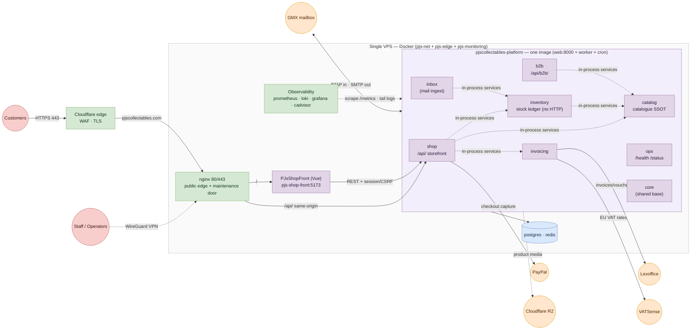
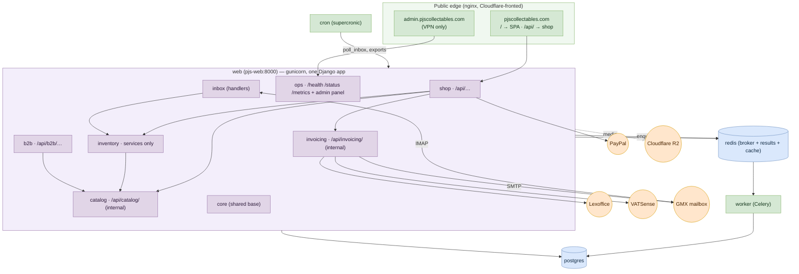
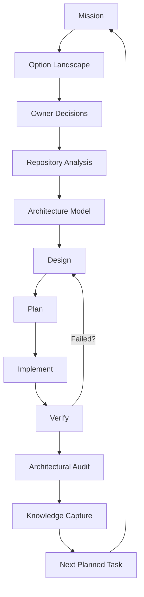

# SOFTWARE_ECOSYSTEM.md

<p align="center">
  
  
  
  
  
  
</p>

## At a Glance

PJS Collectables is a small online business that sells popculture collectables — trading cards, merch, figures and the like. This ecosystem is the set of cooperating services that runs that business end to end: it ingests the wholesaler catalogue, keeps a single authoritative product dataset, tracks stock and orders, sells to customers through a public web shop, and automates order-email ingestion and bookkeeping. The problem it solves is consistency at low operational cost — every surface (shop, accounting) reads from the same trusted data and runs on one small VPS with shared monitoring, logging and a hardened public edge, so a one-person operation can run like a multi-service platform without duplicated logic or manual data shuffling.

What used to be six separate backend services — DBUpdater, InventoryManager, LexwareAPI, PJsShop `back-web`, MailBot and the InfrastructureStack `is-web` — is now **one Django modular monolith**, `pjscollectables-platform`: one image, one pipeline, one Postgres, one Redis. Those services did not change what they do; their code was **moved into apps of the monolith** (`catalog`, `inventory`, `invoicing`, `shop`, `inbox`, `ops`), and the HTTP calls they used to make to each other became **in-process calls across import-linter-enforced module boundaries**. What remains are **two actively deployed projects**: the backend platform and the storefront SPA. A third, the internal Android stock app [IMApp](#imapp-context), was retired on 2026-07-10 when the business moved from owned storage to third-party storage.

| Project | Role | Tech | Status |
| --- | --- | --- | --- |
| [pjscollectables-platform](#pjscollectables-platform-context) | Backend modular monolith: catalogue SSOT, stock/FIFO, storefront API + checkout, invoicing, mail ingest, B2B, ops/observability | Django · DRF · Celery · PostgreSQL · Redis · Docker · nginx | Active — Production |
| [PJsShopFront](#pjsshopfront-context) | Customer-facing storefront UI (browser entrypoint) | Vue 3 · Vite · Tailwind | Active — Production |
| [IMApp](#imapp-context) | Internal Android client for the stock (inventory) API | Kotlin · Jetpack Compose · OkHttp | **Retired 2026-07-10** — client and its server-side gateway both removed |


```mermaid
flowchart LR
    Customers(("Customers")) -->|HTTPS 443| CF["Cloudflare edge<br/>WAF · TLS"]
    Operators(("Staff / Operators")) -.->|WireGuard VPN| NGINX

    CF -->|pjscollectables.com| NGINX

    subgraph VPS["Single VPS — Docker (pjs-net + pjs-edge + pjs-monitoring)"]
        NGINX["nginx 80/443<br/>public edge + maintenance door"]
        FRONT["PJsShopFront (Vue)<br/>pjs-shop-front:5173"]

        subgraph MONO["pjscollectables-platform — one image (web:8000 + worker + cron)"]
            SHOP["shop<br/>/api/ storefront"]
            CAT["catalog<br/>catalogue SSOT"]
            INV["inventory<br/>stock ledger (no HTTP)"]
            INVOICE["invoicing"]
            INBOX["inbox<br/>(mail ingest)"]
            B2B["b2b<br/>/api/b2b/"]
            OPS["ops<br/>/health /status"]
            CORE["core<br/>(shared base)"]
        end

        DATA[("postgres · redis")]
        OBS["Observability<br/>prometheus · loki · grafana · cadvisor"]
    end

    NGINX -->|/| FRONT
    NGINX -->|/api/ same-origin| SHOP
    FRONT -->|REST + session/CSRF| SHOP

    SHOP -.->|in-process services| CAT
    SHOP -.->|in-process services| INV
    SHOP -.->|in-process services| INVOICE
    INV -.->|in-process services| CAT
    INBOX -.->|in-process services| INV
    B2B -.->|in-process services| CAT
    MONO --> DATA

    SHOP -->|checkout capture| PayPal(("PayPal"))
    INVOICE -->|invoices/vouchers| Lexoffice(("Lexoffice"))
    INVOICE -->|EU VAT rates| Vatsense(("VATSense"))
    Mailbox(("GMX mailbox")) <-->|IMAP in · SMTP out| MONO
    MONO -.->|product media| R2(("Cloudflare R2"))
    OBS -.->|scrape /metrics · tail logs| MONO

    classDef nStore fill:#dae8fc,stroke:#6c8ebf,color:#102a43;
    classDef nExt fill:#ffe6cc,stroke:#d79b00,color:#4a2500;
    classDef nInfra fill:#d5e8d4,stroke:#82b366,color:#12351a;
    classDef nApp fill:#e1d5e7,stroke:#9673a6,color:#2d1b3a;
    classDef nActor fill:#f8cecc,stroke:#b85450,color:#3a1414;
    class Customers,Operators nActor;
    class CF,NGINX,OBS nInfra;
    class FRONT,SHOP,CAT,INV,INVOICE,INBOX,B2B,OPS,CORE nApp;
    class DATA nStore;
    class PayPal,Lexoffice,Vatsense,Mailbox,R2 nExt;
    style VPS fill:#fafafa,stroke:#bbbbbb,color:#333333;
    style MONO fill:#f3eefb,stroke:#9673a6,color:#333333;
```

### Contents
- [Infrastructure & Distribution](#infrastructure--distribution)
- [pjscollectables-platform](#pjscollectables-platform-context)
  - [catalog (former DBUpdater)](#catalog-former-dbupdater)
  - [inventory (former InventoryManager)](#inventory-former-inventorymanager)
  - [inbox (former MailBot)](#inbox-former-mailbot)
  - [shop (former PJsShop)](#shop-former-pjsshop)
  - [invoicing (former LexwareAPI)](#invoicing-former-lexwareapi)
  - [b2b](#b2b)
  - [ops (former InfrastructureStack is-web)](#ops-former-infrastructurestack-is-web)
  - [core](#core)
- [PJsShopFront](#pjsshopfront-context)
- [IMApp](#imapp-context)
- [Engineering Operating System (EOS)](#engineering-operating-system-eos)
- [Development Regulation Standards](#development-regulation-standards)

---

## Infrastructure & Distribution

This section describes the global, ecosystem-wide concerns that are not specific to any one project: where everything runs, how the public edge is structured, how this document is distributed, and which quality/security standards apply across all repositories.

### Hosting model

The entire ecosystem runs on a **single VPS** under **Docker Compose**. Each independently-deployed project ships its own Compose stack and joins the shared Docker bridge networks the **monolith** defines, rather than everything living in one stack. The consolidation collapsed the old per-service bridges to three, segmented by concern:

- `pjs-net` — the main application bridge, joined **only by the monolith's own services** (`web`, `worker`, `cron`, `postgres`, `redis`, `nginx`, `certbot`). All internal service-to-service traffic and the datastores live here. Redis additionally requires a password (`REDIS_PASSWORD`, the same fail-loud `${VAR:?}` pattern as the Postgres credentials), so bridge placement alone is not the auth model.
- `pjs-edge` — the **edge-only bridge** (arch-audit D13): nginx plus the separately-deployed storefront SPA stack ([PJsShopFront](#pjsshopfront-context)), which joins it as an *external* network so nginx can reach `pjs-shop-front:5173` by container DNS. The SPA joins **only** this bridge, so a compromised frontend container (npm supply-chain exposure) has no line-of-sight to `pjs-net` or the datastores.
- `pjs-monitoring` — the **observability spine**: Prometheus, Alertmanager, Loki, Promtail, Grafana and cAdvisor attach here, and the `web` and `nginx` containers join it too so their `/metrics` can be scraped and their logs collected without exposing public ports.

> [!NOTE]
> **What changed:** the former per-service bridges (`is-net`, `dbu-net`, `im-net`, `pjs-backend-net`) are gone — with one application there are no cross-service hops left to segment. Container isolation is still the default: the datastores (`postgres`/`redis`) are reachable only on `pjs-net`, both are password-gated, and neither is ever published to the host, so they stay invisible outside the stack.

All services run on the VPS; there is **no Raspberry-Pi-hosted tier**. (See the monolith's `DEPLOY.md` for the authoritative VPS layout, deploy order and the one-command deploy.)

**Audit verdict (2026-07): the deploy mechanism is right-sized infrastructure.** GitHub Actions → fail-fast env-contract validation (against `.env.example`, before the host is ever touched) → rsync → `docker compose up -d`, with SHA-pinned images and the `.env` regenerated every run — genuinely idempotent and self-bootstrapping on a bare VPS. Kubernetes-class orchestration would add operational surface with zero benefit at one host. The known gaps are the absent staging tier and the missing post-deploy health gate / automatic rollback (open TODO in `reusable-deploy.yml`: a bootable-but-broken image currently stays down until a human re-pins the previous SHA).

### Nginx & the public edge

The monolith's **nginx** is the only component that publishes ports `80`/`443` to the internet; everything else is reachable only over the internal bridges (`pjs-net`/`pjs-edge`) or the admin VPN. The edge sits behind **Cloudflare** (Full-strict TLS, WAF, rate-limiting, origin-IP hiding). TLS certificates are issued and auto-renewed **in-stack** by a `certbot` sidecar (ACME DNS-01 against the Cloudflare DNS API, into a shared `pjs-letsencrypt` volume nginx reads) — no manual host-side cert step. Cloudflare **Authenticated Origin Pulls** (mTLS) is wired but currently enforced on no vhost: its only user was the retired `im-api` block, and enabling it on the apex is a standing `TODO(arch-audit)` (see `infra/nginx/cloudflare/README.md`). nginx exposes one public surface and keeps everything else VPN-only:

- **Storefront** — `pjscollectables.com`/`www` is served to customers: `/` proxies to the Vue container `pjs-shop-front:5173` (the [PJsShopFront](#pjsshopfront-context) stack) and `/api/` is same-origin to the monolith `web:8000`. A **maintenance door** marker (the `shop_open` file on the shared `pjs-control` volume, mounted read-only into nginx and toggled from the ops admin control panel) lets an operator serve a maintenance page for the whole shop by "closing the door"; it is also the fail-safe default, so a missing or down frontend degrades to the maintenance page instead of a 502.
- **Protected (VPN-only)** — the unified Django admin (`admin.pjscollectables.com`), Grafana (`grafana.pjscollectables.com`) and the internal API namespaces (`/api/catalog/`, `/api/invoicing/`, `/api/b2b/` — incl. their `/api/v1/` aliases — plus `/api/schema/`, `/admin`, `/metrics`, `/analysis`, `/status`) are **not** public — they return `404` on the public host and are reachable only over the WireGuard VPN (`10.8.0.0/24`). The five former per-service admin vhosts collapse to this one Django admin.

The `im-api.pjscollectables.com` vhost was a second public surface until 2026-07-10; it served [IMApp](#imapp-context) alone and was removed with it. The `inventory` module now has **no HTTP surface at all**.

### Documentation distribution (this file)

`SOFTWARE_ECOSYSTEM.md` is the master technical reference, kept in sync across every repo by GitHub Actions with a public **single-source-of-truth (SSOT) repository** as the hub:

- The reusable workflow `reusable-sync-docs.yml` — now held centrally in the **monolith** (`MKRO-JWL/pjscollectables-platform`), alongside the ecosystem's other shared reusable workflows — is the one place the sync logic lives. On a push to a repo's `main`, its **Push to SSOT** step copies that repo's `SOFTWARE_ECOSYSTEM.md` into the SSOT repo **`MKRO-JWL/pjs-ecosystem-docs`** and commits it.
- On a `repository_dispatch` of type `sync_requested`, the **Fetch from SSOT** step pulls the canonical file from the SSOT raw URL and commits it into the receiving child repo.
- Each repo wires a thin caller (`sync_ecos_doc.yml`) that `uses:` the reusable workflow: the monolith references it locally (`./.github/workflows/reusable-sync-docs.yml`), and child repos reference it at `MKRO-JWL/pjscollectables-platform/.github/workflows/reusable-sync-docs.yml@main`.

In practice: edit this file once in the monolith → merge to `main` → the push propagates to the SSOT → a `sync_requested` dispatch fans the update out to every connected child repo, keeping all copies identical without manual editing.

> [!IMPORTANT]
> **Operational notes:** the reusable workflow must be committed on the monolith's `main` for children's `uses: …@main` references to resolve (and, if the monolith repo is private, its **Settings → Actions → Access** must allow the other `MKRO-JWL` repos). Because every repo's push-to-`main` also pushes *its* copy up, the SSOT is last-writer-wins; treat the monolith as the single canonical place this file is edited to avoid divergence. **InfrastructureStack — the former holder of these workflows — is retired; do not point any caller back at it.**

### Quality & security standards

Every repository is built and audited against shared standards rather than ad-hoc rules:

- **ISO/IEC 25010** — the product-quality model used as the scoring rubric for audits. The full rubric is kept embedded at the end of this document, under [Development Regulation Standards](#development-regulation-standards).
- **OWASP** — web-application security guidance (input validation, authn/session handling, transport security, secret management) informs the security posture across the Django app and the public edge.
- **Architectural boundaries** — module isolation in the monolith is enforced in CI by **import-linter** (`.importlinter`, the `contracts` gate): `core` may not depend on any domain app, and a domain app's internals are private (cross-app access only through `<app>.services`). This keeps the consolidated codebase from sliding back into a tangle of cross-imports.
- **Owner design decisions** — deliberate rulings about how the system is built, above all on **data pipelines and data structure**, are recorded **inline in the code they govern** (never in a central decision log, which drifts away from what it describes). They do two jobs at once. They are *documentation*: the reason the code has the shape it has, which the code alone cannot show. And they are **tripwires**: a change that would cross one is meant to notice it and stop, so the decision gets re-ruled deliberately rather than quietly re-implemented. This is the human counterpart to import-linter's mechanical gate — it exists because a later iteration, seeing only the local picture, will otherwise omit or delete code it mistakes for dead weight when that code was load-bearing for reasons visible only from the whole pipeline. The intent is to **enforce consistent building on top of the codebase** instead of shortsighted removal. Such decisions may be criticised freely, and must never be changed, bypassed or reverted without the owner's explicit consent; where one conflicts with a new instruction, the conflict is surfaced for the owner to rule on.

These standards are referenced here, not duplicated per project; each project section's *Operations & Lifecycle* segment documents the concrete controls it implements. Where a section summarises an owner design decision, the code file it cites holds the full text — that inline note, not this document, is the authority.

---

# pjscollectables-platform Context

## Summary

`pjscollectables-platform` is the **backend modular monolith** for PJS Collectables: a single Django project, built into a single image and run as a small set of containers (`web`, `worker`, `cron` + Postgres/Redis + nginx + the observability stack). It consolidates the five former backend microservices — DBUpdater, InventoryManager, LexwareAPI, PJsShop `back-web` and the InfrastructureStack `is-web` — into one project with one Postgres and one Redis (Celery broker + result backend + cache), plus a new `inbox` mail-ingress app (the old MailBot) and a `b2b` business storefront. Each former service is now a Django **app** with its domain logic intact; cross-domain access goes only through each app's `services.py` seam, enforced by import-linter. It owns every piece of business data in the ecosystem and exposes two external HTTP surfaces — the storefront API and the B2B API — behind a Cloudflare-fronted nginx edge. (A third, the hardened mobile stock API, was removed with IMApp on 2026-07-10.) **Status: Active — Production.**


```mermaid
flowchart TB
    subgraph edge["Public edge (nginx, Cloudflare-fronted)"]
        pub["pjscollectables.com<br/>/ → SPA · /api/ → shop"]
        adm["admin.pjscollectables.com<br/>(VPN only)"]
    end

    subgraph web["web (pjs-web:8000) — gunicorn, one Django app"]
        shop["shop · /api/…"]
        inventory["inventory · services only"]
        b2b["b2b · /api/b2b/…"]
        catalog["catalog · /api/catalog/ (internal)"]
        invoicing["invoicing · /api/invoicing/ (internal)"]
        ops["ops · /health /status /metrics + admin panel"]
        core["core (shared base)"]
        inbox["inbox (handlers)"]
    end

    worker["worker (Celery)"]
    cron["cron (supercronic)"]
    pg[("postgres")]
    redis[("redis (broker + results + cache)")]

    pub --> shop
    adm --> ops

    shop --> catalog
    shop --> inventory
    shop --> invoicing
    inventory --> catalog
    b2b --> catalog
    inbox --> inventory

    web --> pg
    web --> redis
    web -->|enqueue| redis
    redis --> worker
    worker --> pg
    cron -->|poll_inbox, exports| web

    shop --> PayPal(("PayPal"))
    invoicing --> Lexoffice(("Lexoffice"))
    invoicing --> Vatsense(("VATSense"))
    inbox <-->|IMAP| GMX(("GMX mailbox"))
    invoicing -->|SMTP| GMX
    web -.->|media| R2(("Cloudflare R2"))

    classDef nStore fill:#dae8fc,stroke:#6c8ebf,color:#102a43;
    classDef nExt fill:#ffe6cc,stroke:#d79b00,color:#4a2500;
    classDef nInfra fill:#d5e8d4,stroke:#82b366,color:#12351a;
    classDef nApp fill:#e1d5e7,stroke:#9673a6,color:#2d1b3a;
    class pub,adm nInfra;
    class shop,inventory,b2b,catalog,invoicing,ops,core,inbox nApp;
    class worker,cron nInfra;
    class pg,redis nStore;
    class PayPal,Lexoffice,Vatsense,GMX,R2 nExt;
    style edge fill:#f0f8f0,stroke:#82b366,color:#333333;
    style web fill:#f3eefb,stroke:#9673a6,color:#333333;
```

## Purpose

The platform is the **single system of record** for the whole business: it is where product truth, stock, orders, customers, payments, invoices and ingested mail all live. Everything else in the ecosystem is a thin client of it — the [PJsShopFront](#pjsshopfront-context) SPA renders its storefront API — so the platform is where consistency is enforced once and read everywhere.

Consolidating the former services into one deployable was the point of the migration: the integrations that used to be fragile network hops (DBUpdater ↔ InventoryManager ↔ PJsShop ↔ LexwareAPI ↔ MailBot) are now **in-process function calls** across module boundaries, removing inter-service auth, retries, partial-failure handling and version skew for those paths. What the platform still depends on are genuinely external systems: **PayPal** (payment capture), **Lexoffice** (bookkeeping), **VATSense** (EU VAT rates), the **GMX mailbox** (IMAP order-email ingress + SMTP transactional mail), **Cloudflare R2** (product media), and the **wholesaler** (catalogue spreadsheets + order-confirmation emails). Data ownership is therefore total and inward: business data flows out of the platform to its clients, and only operator inputs and third-party API results flow in.

> [!NOTE]
> **Audit verdict (2026-07) — consolidation confirmed correct.** The modular monolith is the right architecture for this scale, and the former microservice topology was the textbook case of the wrong one: one operator, one dataset, no independent scaling needs. The consolidation eliminated the dominant failure class of the service era — partial network failure between services — in favour of single-database ACID transactions. The accepted trade-off (one bug can take the storefront and admin down together) is acceptable because the old topology had no meaningful fault isolation either: everything already shared one VPS and one chain of data dependencies.

**Boundary & non-goals.** The platform is not the UI — the browser storefront is [PJsShopFront](#pjsshopfront-context); it serves it data and holds none of its client state. It is not a service mesh: the modules are isolated by import-linter contracts, not by network segmentation, so "integration between modules" means a typed Python call into `<app>.services`, never an HTTP round-trip. The only first-class internal seams other modules may cross are the `services.py` packages; a module's `models`, `views`, `serializers`, `admin`, `tasks` and `urls` are private.

### Module map

| App (module) | Domain | Migrated from | External HTTP surface |
| --- | --- | --- | --- |
| `core` | Shared models/utils/config, tracing, image helpers | — (new shared base) | none (internal only) |
| `catalog` | Catalogue SSOT (categories, products, licenses), wholesaler import | DBUpdater | `/api/catalog/` — internal/admin only |
| `inventory` | Stock ledger, FIFO consumption, sales, analysis | InventoryManager | `/analysis/` (admin) only — **no API surface** |
| `invoicing` | Lexoffice invoices, VATSense tax, payout matching, PDF upload | LexwareAPI | `/api/invoicing/` — internal/admin only |
| `shop` | Storefront API, cart, orders, PayPal checkout, accounts | PJsShop `back-web` | `/api/…` (public storefront) |
| `inbox` | Mail ingress: IMAP poll, sender-rule routing, handlers | MailBot | none (producer; admin-managed) |
| `b2b` | Business-only storefront (gated on verified business accounts) | — (new) | `/api/b2b/…` |
| `ops` | Liveness/status, `/metrics`, maintenance-door control panel | InfrastructureStack `is-web` | `/health/`, `/status/`, `/metrics`, admin panel |
| `config` | Django project package (settings, urls, wsgi/asgi, celery) | — | — |

## Repository layout

- `config/` – Django project package: `settings.py`, `urls.py` (root URLconf that mounts every app), `wsgi.py`/`asgi.py`, `celery.py`.
- `core/` – shared base: cross-cutting `models`, `utils`, `services`, `middleware`, `trace.py` (correlation IDs), `images.py`. **Must not import any domain app** (import-linter rule #1).
- `catalog/` – catalogue SSOT (former DBUpdater): `models`, `serializers`, `views`, `signals`, `tasks`, `urls`, and `services/` (`products`, `product_query`, `catalog_update`, `category_utils`, `gpsr_normalizer`, `exports`, `close_out`).
- `inventory/` – stock ledger (former InventoryManager): `models`, `views`, `serializers`, `auth.py`, `urls`, `tasks`, `dbu_sync.py`, `sold_order_parser.py`, `analytics.py`, `analysis_views.py`/`analysis_urls.py`, and `services.py` (the cross-app seam: `receive_order`, `record_sale`, `receive_files`).
- `invoicing/` – bookkeeping bridge (former LexwareAPI): `models` (Job/JobLog, TaxRate, pending refs, withdrawal buckets), `views`, `urls`, and `services/` (`lexware`, `jobs`, `orders`, `upload`, `mailer`).
- `shop/` – storefront backend (former PJsShop): `models`, `views`, `serializers`, `urls`, `auth_backends`, `forms`, `tasks`, `signals`, and `services/` (`paypal`, `im_integration`, `lexware_integration`, `mail`).
- `inbox/` – mail ingress (former MailBot): `models` (`SenderRule`, `IngestedMessage`), `tasks`, and `services/` (`client` IMAP, `ingest`, `handlers` registry, `order_ingest` handler).
- `b2b/` – business storefront: `models` (`BusinessProfile`), `views`, `serializers`, `permissions`, `urls`.
- `ops/` – platform ops (former InfrastructureStack `is-web`): `status.py` (`/health`, `/status`), `maintenance.py`, `views`, `services`, `tasks`, `signals`.
- `infra/` – deployment assets (not Python): `nginx/` (dev + `nginx.prod.conf.template`, `cloudflare/`), `prometheus/`, `alertmanager/`, `loki`/`promtail/`, `grafana/`, `certbot/`, `cron/crontab`.
- `ops/` (scripts), `docker-compose.yml` (+ `.override.yml` dev, `.prod.yml` prod), `Dockerfile`, `entrypoint.sh`, `gunicorn.conf.py`, `.env.example`, `.importlinter`, `DEPLOY.md`, `requirements*.txt`.

## Integration with other Projects

The platform's external contract surface is small and deliberate. Internally, modules integrate **in-process** through `services.py` seams (documented per module under [Core services](#core-services)); externally, the platform exposes two application APIs plus the admin and ops endpoints, and consumes only third-party systems and operator inputs.

### Exposes

All app APIs are served by the single `web` container (`web:8000`, Docker DNS) and routed by nginx. Which surface is reachable from where is enforced at the edge: the public shop host serves only the storefront; the admin and internal namespaces are VPN-only.

**1. Storefront REST API (`/api/…`)** — consumed by [PJsShopFront](#pjsshopfront-context). DRF with cookie session + CSRF; the SPA calls `/api/session/` once to obtain the CSRF/session cookies, then sends `X-CSRFToken` on mutating requests.

| Interface | Location | Auth | Notes | Errors |
| --- | --- | --- | --- | --- |
| Session/CSRF bootstrap | `GET/POST /api/session/` | None | Sets CSRF + session for browser clients. | 403 (CSRF) |
| Products | `GET/POST /api/products/`, `GET /api/products/facets/`, `GET/PUT/DELETE /api/products/{id}/` | Read: none; Write: session | Paginated list + `category__name` filter; faceted filters. | 400, 401/403, 404 |
| Categories | `GET /api/categories/`, `GET /api/categories/nav/` | None | Flat list (filter by `parent`/`slug`/`name`/`is_active`) + nested nav tree. | 404 |
| Cart | `GET/POST /api/cart/`, `POST /api/cart/add/`, `POST /api/cart/remove/`, `POST /api/cart/update/` | Session + CSRF | Cart with items + server-derived totals. | 400, 401/403 |
| Checkout | `GET /api/checkout/initiate/` | Session | Address defaults + cart state. | 401/403, 5xx |
| Orders | `POST /api/orders/place/` (manual/bank transfer), `GET/POST /api/orders/`, `GET /api/orders/{id}/` | Session (+ CSRF on place) | Order list/detail/placement. `POST /api/orders/create/` is **disabled (HTTP 410)**. | 400, 401/403, 410 |
| Accounts | `POST /api/login/`, `/api/logout/`, `/api/register/`, `/api/register-after-order/`, `/api/profile/delete/`, `/api/password-reset/`, `/api/password-reset/confirm/` | Session + CSRF | Credentials/profile actions; reset links use `FRONTEND_BASE_URL`. | 400, 401 |
| Profile | `GET/PATCH /api/profile/`, `GET /api/profile/wishlist/`, `GET /api/profile/orders/` | Session | Profile, addresses, wishlist, order history. | 401/403 |
| PayPal | `GET /api/paypal/client-id/`, `POST /api/paypal/create-order/`, `POST /api/paypal/capture-order/`, `POST /api/paypal/webhook/` | Session+CSRF (create/capture); signature-verified (webhook) | Server-authoritative amounts; capture re-verifies against the server cart; webhook is the idempotent backstop. | 400, 402, 502 |

> **Removed 2026-07-10 — the mobile stock API (`/api/inventory/…`).** It was the platform's second external surface, reached through the hardened `im-api.pjscollectables.com/<PREFIX>/…` gateway with DRF token auth, and it served [IMApp](#imapp-context) alone. Both went when owned storage moved to third-party storage: the ten routes, the `im-api` vhost, the `IM_*` secrets and `rest_framework.authtoken` are all gone. **The `inventory` module now has no HTTP surface** — cross-app callers use `inventory.services` in-process. Do not re-add one for a 3PL integration without an owner decision.

**2. B2B API (`/api/b2b/…`)** — designed for browser/SPA B2B customers (Session/Basic auth), but **not yet public**: the production edge 404s it until B2B launches (owner ruling, recorded in `b2b/views.py` and the nginx template).

| Method | Path | Purpose | Auth |
| --- | --- | --- | --- |
| POST | `/api/b2b/register/` | A logged-in customer applies for B2B access (created PENDING approval). | Authenticated |
| GET | `/api/b2b/profile/` | The caller's own `BusinessProfile` + verification status. | Authenticated |
| GET | `/api/b2b/catalogue/` | B2B-only catalogue (id, blackfire_id, name, buy/sell price). | Verified business |

**3. Admin & ops** — `GET /admin/` (unified Django admin; the former im/dbu/is/back admin sites collapse to one) plus the admin utility routes `/admin/sync-dbu/` and `/admin/analytics/`, and the inventory `/analysis/` dashboard — all **VPN-only**. `GET /health/` (liveness), `GET /status/` (aggregated service health, see [ops](#ops-former-infrastructurestack-is-web)), `GET /metrics` (django-prometheus, whole app). Internal app namespaces `/api/catalog/` and `/api/invoicing/` exist for admin/diagnostic use and return **404 on the public host**.

**Service discovery / auth summary.** Internal Docker DNS `web:8000` on `pjs-net`; public hosts terminate TLS at nginx. Storefront = session+CSRF; B2B = session/basic + verified-business gate; admin/ops and the internal `catalog`/`invoicing` APIs = VPN network placement **plus** an owner-admin session gate at the app layer (single-superuser model). There is no global DRF authentication default — it is `[]`, so every view declares its own and a view that forgets fails closed.

### Consumes

The platform has **no in-ecosystem upstream** — PJsShopFront and IMApp consume it, not the other way around. It consumes only external systems and operator inputs:

- **PayPal** — OAuth + order create/capture + webhook (`api-m.sandbox.paypal.com` or live per `PAYPAL_ENV`). On outage, checkout returns `502/503` and the cart is preserved.
- **Lexoffice** (`api.lexware.io`) — invoice/contact/voucher/file-upload operations (invoicing). Empty key disables the feature (fail-soft); on outage, affected jobs fail or report per-file failures.
- **VATSense** (`api.vatsense.com`) — EU VAT-rate refresh (invoicing). Non-strict mode falls back to a default rate (`19`); strict mode fails the job.
- **GMX mailbox** — **IMAP ingress** (inbox polls `imap.gmx.net:993` for order-confirmation emails) and **SMTP egress** (invoicing/shop send invoice PDFs, password-reset and supplier-reorder mail). With no mail password the console email backend is used (safe in dev/CI); IMAP unreachable simply means the next poll finds nothing.
- **Cloudflare R2** — product/media object storage via django-storages when all four `R2_*` vars are set; otherwise local `FileSystemStorage` (valid for dev/CI/tests).
- **Wholesaler (Blackfire)** — catalogue/GPSR spreadsheets ingested by `catalog` management commands, and order-confirmation emails ingested by `inbox`. Operator/scheduled inputs; if absent, imports simply don't run.
- **Cloudflare DNS / edge** — the certbot sidecar issues+renews the apex+wildcard TLS cert via the ACME DNS-01 challenge against the Cloudflare DNS API; the public edge sits behind Cloudflare WAF + Authenticated Origin Pulls.

## Core services

This segment is the heart of the platform: it documents the modular-monolith contract and then each module — what it owns, the in-process seam other modules call, and the data-flow direction. Every former microservice integration is now one of these seams.

### Architecture: the modular-monolith contract & service seams

The platform is one Django project whose apps are kept honest by **import-linter** (`.importlinter`, run as the `contracts` CI gate via `lint-imports`). Two rules hold:

1. **`core` is the shared base** and must not depend on any domain app (directly or transitively).
2. **Each domain app's internals are private** — `models`, `views`, `serializers`, `admin`, `tasks`, `urls` may not be imported across apps. Cross-domain access goes **only** through `<app>.services` (deliberately absent from the forbidden list). The contracts set `allow_indirect_imports = True`, so a service legitimately importing its own app's models is fine; only a *direct* import of another app's internals is a violation.

This is what replaced the old network integrations. The canonical seams are:

- `catalog.services` — `query_products(...)`, catalogue read/update helpers. Called in-process by `shop`, `inventory` and `b2b` instead of HTTP to the old DBUpdater `/api/products/`.
- `inventory.services` — `receive_order(...)`, `record_sale(...)`, `receive_files(...)`, `import_sold_articles(...)`. Called by `inbox` (parsed order emails), `shop` (captured sales), and `invoicing` (invoice-PDF forwarding + the sold-articles sales-import job) instead of HTTP POSTs to the old InventoryManager `/api/receive/`, `/api/sales/`, `/api/receive/`.
- `shop.services` — `paypal`, `im_integration` (→ `inventory.services`), `lexware_integration` (→ `invoicing.services`), `mail`.
- `invoicing.services` — `lexware`, `jobs`, `orders`, `upload`, `mailer`.
- `inbox.services` — `client` (IMAP), `ingest`, `handlers` (registry), `order_ingest`.

Because these are typed function calls in one process, the failure modes that dominated the microservice era (inter-service auth, retry/backoff, partial delivery, version skew) are gone for those paths; what remains is ordinary exception handling and transactions against **one ACID-compliant Postgres** — a single relational database whose writes are Atomic, Consistent, Isolated and Durable. *In plain terms: a multi-step change such as an order with all its line items, or a supplier delivery with its stock lots, commits in full or not at all, so the data is never left half-written the way a multi-service workflow could.* The seams also form a **directed acyclic dependency graph** — `shop → {catalog, inventory, invoicing}`, `inventory → catalog`, `inbox → inventory`, `b2b → catalog`, while `core` depends on nothing — with no cycles, *so every module only ever calls the ones beneath it, which keeps the build order and the reasoning about change ripple straightforward.*

Every HTTP error the platform returns under `/api/` carries one envelope — `{"error": {"code", "message", "details"}}` — so a client writes a single parser instead of one per app; the shape is published as the `Error` component in the OpenAPI schema and a Spectral rule in CI fails the build if any operation stops referencing it.

Cross-context references are deliberately **soft**: a module references another module's rows by a stable *natural-key string* (e.g. `shop.OrderItem.blackfire_id` is a plain char column), never by a foreign key into the other module's tables, and order lines **snapshot** name/price/VAT at order time so history stays immutable against catalogue churn. This is a **"DDD-lite" pattern** — Domain-Driven Design bounded contexts without the full ceremony: one shared physical Postgres, but each app owns its schema and other apps may only point at it by durable IDs. *In plain terms: modules link to each other's data with ID strings instead of hard database links, so contexts stay decoupled (and extractable later) — at the accepted cost that the database itself does not police dangling references; reads must handle a missing product gracefully, and they do (the storefront hydration seam skips orphans).* **Audit verdict (2026-07): confirmed as the correct pattern**, including the snapshot discipline on order lines — hard FKs across contexts would fuse the modules at the schema level and break on catalogue re-import (soft-delete/reactivate) semantics.

### catalog (former DBUpdater)

The catalogue **single source of truth**: normalized categories, products and licenses imported from the wholesaler and stored indefinitely. It **owns** the canonical product/category/license data and the import pipeline (`catalog/services/catalog_update.py`, `category_utils`, `gpsr_normalizer`, `exports`, `close_out`; management commands for import/scrape/cleanup; `catalog.tasks` Celery jobs). Other modules **read** it in-process via `catalog.services.query_products(...)` — the shop renders products, inventory enriches stock with product metadata, b2b serves a business catalogue. Data flows **out** of catalog to every other module. Its `/api/catalog/` HTTP API still exists but, since all in-ecosystem consumers now call the service seam, it is internal/admin-facing only. **Non-goals:** catalog does not track stock or orders (that is inventory), does not sell (shop), and does not parse mail (inbox).

Owner design decisions govern the catalogue's expand-only lifecycle, its delicate-only category aliasing, the product-image fallback and the Close-Out list; each is recorded inline in `catalog/`, at the code it governs.

### inventory (former InventoryManager)

The **operational stock ledger**: the system of record for on-hand stock, FIFO lots, sold lines and margins, plus the stock-taking/analysis surface. It **owns** inventory state and the business mutations on it. Its `services.py` is the only entry point of any kind — since IMApp's retirement (2026-07-10) the app has **no HTTP surface at all**, so there is no view, serializer or URLconf to bypass it:

- `receive_order(order_number, items, ..., received=True)` — create/reuse a supplier purchase `Order` and its `InventoryItem` lots from structured order data. **Idempotent on `order_number`** (re-ingest reuses the order and skips already-recorded lines), seeds `quantity_remaining` for FIFO, and runs in one transaction. Called by `inbox.order_ingest` with `received=False` (parsed wholesaler order-confirmation emails → on-order lots).
- `record_sale(lines, channel, order_id, ...)` — register outbound sale line(s) and FIFO-consume stock, matching each line to a product by cardmarket/blackfire id (else fuzzy title). Called in-process by `shop` on payment capture.
- `receive_files(files)` — validate, spool and enqueue invoice PDFs / sold-order CSVs (10 MB/file cap) for Celery parsing. Called by `invoicing`.

inventory enriches items from the catalogue via `catalog.services` (in-process; the old `dbu_sync`/`utils` DBU-client HTTP path is retired) and serves the `/analysis/` dashboard (upcoming-payments charts from `ItemDetails`). **Non-goals:** it is not the catalogue authority (catalog) and not a storefront (shop/b2b). Treat writes as **non-idempotent** except `receive_order` (idempotent by order). Owner design decisions govern the on-order/on-hand split, the retirement of the mobile surface, and the now-callerless manual-adjust seam (`query_helpers.update_item_quantity`, awaiting a ruling); each is recorded inline, at the code it governs.

### inbox (former MailBot)

The **mail-ingress** app — MailBot's relay, reincarnated in-process. A scheduled poll (every 2 h; `manage.py poll_inbox`, run by the `cron`/supercronic container; also `inbox.tasks.poll_inbox_task` for ad-hoc async triggering) fetches new mail from the GMX mailbox over IMAP (`inbox.services.client`), deduplicates and records it, then routes it:

- **`IngestedMessage`** — one row per fetched email; its unique `message_id` is the **idempotency key** (a re-polled email is never processed twice) and the row is the durable audit trail (`status`, `matched_handler`, `result`/`error`).
- **`SenderRule`** — admin-editable "filter by sender": the first active rule (lowest `priority`) whose pattern matches the From address selects a registered **handler**. Operators add/disable senders without code changes.
- **Handlers** — functions registered via `inbox.services.register_handler`. The built-in **`order_ingest`** parses a wholesaler order-confirmation email (BeautifulSoup over the line-item table, EN/DE column synonyms, order-number extraction) into `{order_number, items[]}` and forwards it **in-process** to `inventory.services.receive_order` — replacing MailBot's HTTP POST to InventoryManager. If the email carries no order number, a stable synthetic one is derived from the `message_id` so re-ingest stays idempotent.

inbox **owns** the ingest dedup/audit state and the sender-routing rules; it is a producer with **no inbound API**. Data flows from the inbox **into** inventory. **Parser note:** `order_ingest`'s extraction is built to the documented MailBot payload shape and must be calibrated against a real wholesaler sample (synonym lists + order-number patterns); unit tests pin the contract with a synthetic fixture.

### shop (former PJsShop)

The **storefront backend** and the only module that authenticates customers, persists carts and records orders for fulfilment. It **owns** the order lifecycle, cart state and the customer commerce profile (addresses, wishlist, language). It serves the public `/api/…` surface that [PJsShopFront](#pjsshopfront-context) renders. Core services:

- **Catalog/category/cart/order/profile APIs** — product listing/detail/facets over the catalogue (read via `catalog.services`), server-derived cart totals (`Cart`/`CartItem`), order orchestration (`Order`/`OrderItem`, statuses Pending/Completed/Canceled/Shipped), and `UserProfile`.
- **PayPal integration (`shop/services/paypal.py`)** — obtains an OAuth token server-side, creates/captures orders, serves the client-id to the SDK via `/api/paypal/client-id/`. **Capture is authoritative**: `POST /api/paypal/capture-order/ {orderId, terms_accepted}` captures, **re-verifies the amount against the server cart**, persists orders from PayPal's own response, and returns `{orders}` — amounts are never taken from the client. *Plainly: the server, never the browser, decides how much was actually paid, so a customer cannot alter the price during checkout.* A signature-verified webhook (`PAYMENT.CAPTURE.COMPLETED`/`DENIED`) is the **idempotent** backstop — *re-delivering the same payment notification reconciles the existing order instead of creating a duplicate.* Legacy `POST /api/orders/create/` is **disabled (HTTP 410)**. **Audit verdict (2026-07): the money path is professionally built** — server-authoritative amounts, the DB partial-unique constraint on `paypal_order_id` as the *true* idempotency arbiter (the read-check is only the fast path), and the signed webhook as backstop. **Formerly-known gap, now closed:** a cart that changes between PayPal approval and capture is still rejected *after* the funds are taken, but the capture is now automatically **refunded** and the outcome recorded on a Prometheus counter that feeds the payments alert rules — the two failure modes (refunded vs. stranded) are distinct error codes, so a stranded charge pages a human instead of resting in a log line.
- **Shipping & order totals (`shop/services/pricing.py`)** — shipping is priced **server-side** from owner-managed zone/method/rate tables and stored on the order, so both checkout paths charge the same amount, a destination with no zone cannot be ordered at all, and the invoice reads what was charged instead of inferring it. *Plainly: the browser can no longer tell the shop what postage costs, and the shop can no longer guess.*
- **Sale push (`shop/services/im_integration.py`)** — on capture, pushes sold lines to `inventory.services.record_sale(...)` **in-process** (the old best-effort HTTP POST to `im-web:8000/api/sales/` is gone). FIFO consumption + margin happen in the same process; a failure there is logged and never breaks checkout.
- **Invoicing hook (`shop/services/lexware_integration.py`)** and **mail (`shop/services/mail.py`)** — invoice generation and transactional email (password reset, etc.) via the invoicing/mailer seams.

**Non-goals:** shop is not the catalogue authority (catalog) and not the inventory ledger (it notifies inventory of sales but does not track on-hand stock). Product images/media are served from `pjs-media` (R2 in prod).

### invoicing (former LexwareAPI)

The **bookkeeping automation bridge**: it turns sold-order/transaction CSV inputs into Lexoffice invoices, assigns payouts back to invoice references, refreshes EU tax rates from VATSense, and handles invoice-document upload. It **owns** `Job`/`JobLog` run history, the `TaxRate` cache, pending invoice/order matching entities, and withdrawal-match buckets. Core services (`invoicing/services/`):

- **`jobs`** — the control plane: `run_job(...)` persists a `Job`, runs the workflow, captures stdout/stderr into ordered `JobLog` rows, and writes a structured result (trigger-and-poll via `POST /api/invoicing/jobs/...` then `GET /api/invoicing/jobs/{id}`).
- **`lexware`** — invoice creation (sold-orders CSV → Lexoffice invoices, with country/tax/contact branching and OSS behavior), invoice assignment / payout matching (transaction-summary CSV ↔ Lexoffice vouchers), and tax refresh (`fetchAllTaxRates` → `TaxRate`, strict vs fail-soft default `19`).
- **`upload`** — local validation (type/size/duplicates/strict-PDF) + Lexoffice upload execution (per-file success/failure normalization).
- **`orders`**, **`mailer`** — sold-order handoff (forwards generated invoice PDFs into `inventory.services.receive_files` in-process) and SMTP delivery of invoice/proforma PDFs.
- **sales import** — the **sold-articles → inventory** job (`TYPE_SALES_IMPORT`) records Cardmarket sales (FIFO stock-out) from the per-article "Sold Articles" export uploaded to `RuntimeConfig.sold_articles_csv`, via the in-process seam `inventory.services.import_sold_articles`.

invoicing **consumes** upstream CSV exports and the Lexoffice/VATSense APIs; its `/api/invoicing/` HTTP routes are internal/admin-facing (the shop calls it in-process). **Non-goals:** it is not a commerce backend (shop) or inventory ledger (inventory) — it consumes their data and turns it into bookkeeping outcomes. Job triggers are **non-idempotent**; check `GET …/jobs/{id}` before re-running. Owner design decisions govern invoice creation, sales recording, payout assignment and the operator surface; each is recorded inline in `invoicing/`, at the code it governs.

### b2b

A new, gated **business storefront** under its own `/api/b2b/` namespace, kept separate from the public shop and edge-hidden until B2B launches. A logged-in customer applies via `POST /api/b2b/register/`, which creates a `BusinessProfile` in a **PENDING** state for admin approval; `GET /api/b2b/profile/` returns their profile + verification status; `GET /api/b2b/catalogue/` is gated by the `IsVerifiedBusiness` permission and returns a B2B catalogue read **in-process** via `catalog.services.query_products` (the hook point for B2B-specific pricing/visibility later). It uses session/basic auth (not the platform-default token auth). It **owns** `BusinessProfile` (the business-account + verification state) and depends only on the catalogue seam.

### ops (former InfrastructureStack is-web)

Platform operations, migrated from the InfrastructureStack `is-web`. It owns:

- **Liveness** `GET /health/` → `{"status":"ok"}` (the container HEALTHCHECK and the nginx maintenance-door logic probe this).
- **Aggregated status** `GET /status/` (`ops/status.py`) — concurrently probes the dependent services (`web` self, `promtail`, `grafana`, `prometheus`) over Docker DNS with a 3 s per-probe timeout, caches for 60 s, and returns `{overall, services{...}}` where `overall ∈ {ok, degraded, down}`.
- **Maintenance door** (`ops/maintenance.py`, admin control panel) — toggling writes/removes the `shop_open` marker on the shared `pjs-control` volume (mounted read-only into nginx). With the marker absent (fail-safe default) nginx serves the maintenance page for the storefront; the check is per-request, so toggling is instant with no reload. **Audit verdict (2026-07): a model of *appropriate technology*** — the mechanism's availability exceeds the app's (nginx serves the page even with Django down), the default fails safe (marker absent = closed), and the boot-time DB reconciliation (`sync_maintenance_flag`) survives volume recreation. A DB/Redis feature flag would be strictly worse: it dies with the app, exactly when the page is needed most.
  > [!IMPORTANT]
  > **Single-host assumption.** The door — like every other shared named volume (`pjs-control`, `pjs-media`, `pjs-static`) — assumes a **single-host deployment**: the marker rides a local Docker volume shared between `web` and `nginx`. Any future second host breaks the mechanism silently (each host would see its own marker) and requires a distributed replacement (a flag in a shared store, checked by nginx via auth_request or similar) *before* a multi-node move.

ops **owns** the control marker and the health/status surface; it holds no business data and implements no domain logic.

### core

The shared base every domain app builds on: cross-cutting models/utils, the `services` shared helpers, request `middleware`, correlation-ID tracing (`core/trace.py`), and image handling (`core/images.py`). Per the import-linter contract, **core may not import any domain app** — dependencies point inward to core, never outward.

## Operations & Lifecycle

### Runtime behavior

- **Startup dependencies & ordering.** The application containers `web`, `worker` and `cron` all `depends_on` `postgres` **and** `redis` with `condition: service_healthy`. `web` runs the entrypoint bootstrap (`migrate` → `collectstatic` → gunicorn via `gunicorn.conf.py`, `GUNICORN_WORKERS` workers); `worker` runs `celery -A config worker`; `cron` runs `supercronic /app/infra/cron/crontab` as non-root (it skips the web bootstrap — migrate/collectstatic are `web`'s job). In prod, `nginx` `depends_on` `web` (started) **and** `certbot` (healthy — its healthcheck passes only once a live `fullchain.pem` exists), so nginx never crash-loops on a missing cert. All use `restart: unless-stopped`.
- **Shutdown & cleanup.** SIGTERM drains gunicorn in-flight requests and lets Celery finish in-flight tasks. Named volumes persist across recreation: `pjs-pgdata`, `pjs-static`, `pjs-media`, `pjs-logs`, `pjs-control`, plus the observability volumes (`pjs-prometheus`, `pjs-loki`, `pjs-grafana`, …) and prod-only `pjs-letsencrypt`.
- **Healthy / readiness vs liveness.** Liveness = the process answers `GET /health/` (a cheap "the app is up" signal). Readiness = dependencies reachable: `GET /status/` aggregates the `web` app plus the observability services (promtail/grafana/prometheus) over Docker DNS, while the datastores themselves are gated **at the orchestration layer** — every app container waits on `postgres`/`redis` with `condition: service_healthy` before it starts, so a datastore is proven reachable before traffic is served rather than re-probed on every request. *In plain terms: liveness asks "is the app running?", readiness asks "can it actually do its job?", and the database/queue checks are handled by the per-container health gates below.* Compose healthchecks: `web` curls `/health/` (30 s, 30 s start); `worker` = `celery inspect ping`; `postgres` = `pg_isready`; `redis` = `redis-cli ping`; nginx probes its `:8080` local endpoint; certbot tests for the live cert file.
- **Isolated volume mounts.** `pjs-control` (the `shop_open` marker) is mounted **read-only** into nginx and read-write only into `web`; `pjs-pgdata` is dedicated and non-shared; `pjs-media`/`pjs-static` are shared read-only into nginx; Promtail/cAdvisor mount `/var/lib/docker/containers` and the Docker socket **read-only**. In prod the app containers run **non-root (`uid 1001`), read-only rootfs, `cap_drop: ALL`, `no-new-privileges`**, with tmpfs for `/tmp`, `/dev/shm`, `/home/app` — **defense-in-depth** with **least privilege**. *In plain terms: each container is given the bare minimum it needs, so even if an attacker got code running inside one, it runs as an unprivileged user on an unwritable filesystem with no spare kernel powers to escalate to.*

### Failure behavior

- **If the platform is unavailable.** Because it is one app, an outage takes down the storefront API and the admin together; the storefront degrades to the nginx **maintenance page** (the `/` and `/api/` 502/503/504 → `maintenance.html`). The datastores (`postgres`/`redis`) are the hard dependencies — a missing DB credential **fails boot loudly** (`${VAR:?}`) rather than starting a degraded guest.
- **In-process seams remove cross-module partial failure.** The former DBU↔IM↔Shop↔Lexware↔MailBot network calls are now function calls in one transaction-scoped process, so there is no inter-service retry/backoff or partial-delivery to reason about for those paths. What remains: `inventory.services.receive_order` is **idempotent on `order_number`**; the shop→inventory sale push is in-process and any error is logged without breaking checkout; `inbox` dedups by `message_id`; invoicing job triggers are **non-idempotent** (poll the job before re-running).
- **External dependency degradation (fail-soft).** PayPal outage → checkout `502/503`, cart preserved. Lexoffice/VATSense outage → the affected invoicing job fails or falls back (VAT default `19`); empty keys disable the feature. GMX IMAP unreachable → the next poll simply finds nothing; no mail password → console email backend. R2 unset → local filesystem storage.
- **Local mocking / standalone.** `docker compose up` (auto-loads `docker-compose.override.yml`) runs the full stack locally with `DEBUG`, source-mounted, plain-HTTP nginx (maintenance door only) — no Cloudflare/TLS/secrets needed. PayPal defaults to sandbox; Lexoffice/VATSense/R2/mail are all fail-soft when blank, so the platform boots and is exercisable with an otherwise empty `.env` (only the DB/Grafana credentials are required).

### Environment contract

One gitignored root `.env` (template `.env.example`). Datastore/Grafana credentials are **required with no fallback** (`${VAR:?}` — a missing secret fails boot): a deliberately **fail-closed** configuration posture. *In plain terms: the system refuses to start with a missing or blank credential rather than quietly falling back to an insecure default like `guest:guest`.* Selected variables:

| Variable | Type | Default | Secret-managed |
| --- | --- | --- | --- |
| `DJANGO_MODE` | enum | `production` | no |
| `DEBUG` | bool | `False` | no |
| `SECRET_KEY` | string | — | **yes** |
| `ALLOWED_HOSTS` | csv | — (public apex + admin host) | no |
| `CORS_ALLOWED_ORIGINS` | csv | — (the SPA origin[s]) | no |
| `CSRF_TRUSTED_ORIGINS` | csv | — (admin host) | no |
| `SECURE_SSL_REDIRECT` / `SECURE_HSTS_*` | bool/int | `True` / `63072000` | no |
| `NUM_PROXIES` | int | `2` (Cloudflare → nginx) | no (but must match the real proxy chain — it is the throttle's trust boundary) |
| `LOG_LEVEL` | enum | `INFO` | no |
| `DB_NAME` / `DB_USER` / `DB_PASSWORD` | string | — | **yes** (required) |
| `DB_HOST` / `DB_PORT` | string/int | `postgres` / `5432` | no |
| `CELERY_BROKER_URL` | url | `redis://redis:6379/2` | no |
| `CELERY_WORKER_CONCURRENCY` | int | `1` | no |
| `CELERY_RESULT_BACKEND` / `CACHE_URL` | url | `redis://redis:6379/0` · `…/1` | no |
| `CONTROL_DIR` | path | `/control` | no |
| `GRAFANA_USER` / `GRAFANA_PASSWORD` | string | — | **yes** (required) |
| `PAYPAL_ENV` | enum | `sandbox` (`live` in prod) | no |
| `PAYPAL_CURRENCY` | string | `EUR` | no |
| `PAYPAL_CLIENT_ID` / `PAYPAL_SECRET` / `PAYPAL_WEBHOOK_ID` | string | — (sandbox falls back to test creds) | **yes** (live) |
| `SHIPPING_DOMESTIC_COUNTRY` | ISO alpha-2 | `DE` | no |
| `FRONTEND_BASE_URL` | url | — (password-reset links) | no |
| `ORDER_IMPORT_EMAIL` | email | — (supplier reorder CSV recipient) | no |
| `LEXOFFICE_API_KEY` / `VATSENSE_API_KEY` | string | — (empty disables) | **yes** |
| `GMX_MAIL` / `GMX_PASSWORD` | string | — (empty → console email backend) | **yes** |
| `DEFAULT_FROM_EMAIL` | email | `pjs-collectables@gmx.net` | no |
| `IMAP_HOST` / `IMAP_PORT` / `IMAP_USE_SSL` / `IMAP_MAILBOX` | string/int/bool | `imap.gmx.net` / `993` / `True` / `INBOX` | no |
| `IMAP_USER` / `IMAP_PASSWORD` | string | default to `GMX_MAIL`/`GMX_PASSWORD` | **yes** |
| `IS_FINAL` / `IS_ACTIVE_OSS` / `IS_NEW_TAX` / `IS_CREATING` | bool | invoicing job toggles | no |
| `R2_BUCKET` / `R2_ACCESS_KEY_ID` / `R2_SECRET_ACCESS_KEY` / `R2_ENDPOINT_URL` | string | — (all four set → R2; else local FS) | **yes** |
| `R2_CUSTOM_DOMAIN` / `R2_REGION` | string | — / `auto` | no |
| `CLOUDFLARE_DNS_API_TOKEN` / `LETSENCRYPT_EMAIL` | string | — (prod overlay, **required**) | **yes** |
| `CERTBOT_DOMAIN` / `CERTBOT_STAGING` | string/bool | `pjscollectables.com` / `0` | no |
| `IMAGE_TAG` / `GUNICORN_WORKERS` | string/int | `latest` / `3` | no |

> [!WARNING]
> Superusers are created manually, out of band (`docker compose exec web python manage.py createsuperuser`) — there is no deploy-time `DJANGO_SUPERUSER_*` bootstrap. Any secret that ever lived in the five former repos' git history must be rotated at the provider before go-live.

### Observability

- **Logs.** All containers use the Docker `json-file` driver (10 MB × 3); Promtail tails them into Loki. nginx writes a JSON-ish access log including the Cloudflare `CF-IPCountry` country code (`$http_cf_ipcountry`) — no GeoIP module needed. `core/trace.py` propagates correlation IDs so a request can be followed across modules.
- **Metrics.** `GET /metrics` (django-prometheus) for the whole app — this consolidates the per-service `/metrics` the former DBUpdater/InventoryManager/invoicing each exposed. cAdvisor adds per-container CPU/mem/net; nginx is scraped on `pjs-monitoring`. Prometheus scrapes every 15–30 s; **Alertmanager** routes fired rules to a webhook (the always-firing Watchdog rule exercises the pipeline).
- **Health endpoints.** `/health/` (liveness), `/status/` (aggregated readiness across web/promtail/grafana/prometheus); per-service Compose healthchecks for the datastores and observability containers.
- **Dashboards.** Grafana (VPN-only at `grafana.pjscollectables.com`) unifies Prometheus metrics + Loki logs for a whole-platform view.

---

# PJsShopFront Context

## Summary

PJsShopFront is the Vue 3 + Vite storefront UI for PJS Collectables. It renders the customer-facing catalog, cart, checkout and profile flows while delegating all authoritative commerce data and payment orchestration to the [pjscollectables-platform](#pjscollectables-platform-context) `shop` API. It is the ecosystem's browser entrypoint: it drives user sessions, fetches product/category data, and triggers order/payment flows through the backend. It ships its **own** Docker Compose stack and joins the platform's edge-only `pjs-edge` bridge as an external network, so nginx can proxy `/` to it — never `pjs-net`, so the frontend has no line-of-sight to the datastores — and deploying or redeploying the monolith never starts or stops it, and vice versa. **Status: Active — Production.**

```mermaid
flowchart LR
    Browser["Customers / Admins"] -->|HTTPS via nginx| Frontend["PJsShopFront (Vue)<br/>internal DNS: pjs-shop-front:5173"]
    Frontend -->|/api same-origin (REST + session cookies)| ShopAPI["platform shop API<br/>internal DNS: web:8000"]
    Frontend -->|PayPal SDK (client id from backend)| ShopAPI

    classDef nApp fill:#e1d5e7,stroke:#9673a6,color:#2d1b3a;
    classDef nActor fill:#f8cecc,stroke:#b85450,color:#3a1414;
    class Browser nActor;
    class Frontend,ShopAPI nApp;
```

## Purpose

PJsShopFront delivers the interactive customer experience. It translates catalog and checkout flows into UI actions while relying on the platform as the canonical record for products, carts, orders and payment capture. It **owns** only client-side UI state and the browser session bootstrap; it **depends entirely on** the platform `shop` API and holds no business data. This frontend is critical because it is the only project that turns the backend into an accessible storefront and provides the authenticated session flow bridging browser users to the transactional backend.

**Non-goals / boundary:** PJsShopFront performs no authoritative computation — it never holds product truth, cart totals or payment secrets (all owned by the platform `shop` module), and it never talks to the `catalog` or `inventory` modules directly. It is a pure presentation/consumer leaf.

## Repository layout
- `index.html` – Vite HTML entrypoint.
- `src/` – Vue application source.
  - `main.js` – app bootstrap (Vue + router); `App.vue` – root layout.
  - `router/` – route definitions; `views/` – page components (catalog, cart, profile, checkout); `components/` – reusable UI.
  - `services/` – API client (`api.js`), global session/cart state (`globals.js`), profile helper.
  - `assets/` – static images/styling.
- `public/` – static files served as-is.
- `package.json`, `vite.config.js`, `tailwind.config.js`, `postcss.config.js` – build/styling config.
- `SOFTWARE_ECOSYSTEM.md` – this document (the frontend repo is its current home).

## Integration with other Projects

### Exposes
- A browser SPA — it exposes **no inbound API** to other services. Its only "interface" is the rendered storefront for end users.

### Consumes
PJsShopFront consumes the [pjscollectables-platform](#pjscollectables-platform-context) `shop` REST API exclusively. In dev, Vite proxies `/api` to `VITE_API_PROXY_TARGET` (default `http://web:8000` — the monolith's web container, formerly `back-web:8000`); the Axios base (`src/services/api.js`) is `VITE_API_BASE_URL` or same-origin `/api/`. It assumes cookie-based sessions + CSRF and does not authenticate with the internal modules.

| Interface (platform `shop`) | Location | Auth | Notes | Client-facing errors |
| --- | --- | --- | --- | --- |
| Session bootstrap | `GET/POST /api/session/` | None | `csrftoken`, `is_authenticated`; sets the HttpOnly `sessionid` cookie (not echoed in the body). | 403 (CSRF), 5xx |
| Categories | `GET /api/categories/`, `/api/categories/nav/` | None | Filter by `parent`/`slug`/`name`/`is_active`; nav tree. | 404/5xx |
| Products | `GET /api/products/`, `/api/products/facets/` | None | Pagination + `category__name` filter; facets. | 404/5xx |
| Cart | `GET/POST /api/cart/`, `/api/cart/add/`, `/api/cart/remove/`, `/api/cart/update/` | Session + CSRF | Cart payload with items/totals. | 401/403, 5xx |
| Checkout | `GET /api/checkout/initiate/` | Session | Address defaults + cart state. | 401/403, 5xx |
| Orders | `POST /api/orders/place/` | Session + CSRF | Manual (bank-transfer) order placement. | 400, 401/403, 5xx |
| Auth | `POST /api/login/`, `/api/register/`, `/api/logout/`, `/api/profile/delete/`, `/api/password-reset/` | Session + CSRF | Credentials / profile ops. | 400, 401/403 |
| Profile | `GET/PATCH /api/profile/`, `/api/profile/wishlist/`, `/api/profile/orders/` | Session + CSRF | User details, addresses, wishlist, orders. | 401/403, 5xx |
| PayPal | `GET /api/paypal/client-id/`, `POST /api/paypal/create-order/`, `POST /api/paypal/capture-order/` | Server-side secrets | Init + capture proxied via the backend. | 400, 502/503 |

Every error row above arrives in the same envelope, so the SPA parses errors in one place (`src/services/errors.js`, attached by the Axios interceptor as `error.normalized`) rather than reading a different field per endpoint.

**Auth flow:** call `/api/session/` once per browser session and attach `X-CSRFToken` on mutating requests; cookies are stored by the browser and reused by Axios. **PayPal:** after approval the frontend makes the single `POST /api/paypal/capture-order/` call with `{ orderId, terms_accepted }`; the backend captures, re-verifies the amount, persists orders and returns `{ orders }` (amounts never come from the client). **If the platform is unavailable:** nginx serves the maintenance page, and the UI shows a maintenance/error state and disables cart/checkout until `/api/session/` and catalog endpoints respond.

## Core services

### API client and session bootstrap
`src/services/api.js` defines a shared Axios client with `withCredentials: true` and base `VITE_API_BASE_URL || '/api/'`, initialises the session via `/api/session/`, stores the CSRF/session identifiers, and injects `X-CSRFToken` on POST/PUT/PATCH/DELETE — the single integration point for authenticated browser flows.

### Catalog browsing
`fetchCategoryAndSubcategories`, `fetchProductsByCategoryNames`, `fetchUpcoming` orchestrate category/product queries (pagination, hierarchical categories), backing the catalog and upcoming-product views. An owner design decision governs the category dropdown's layout, recorded at the component that implements it in the PJsShopFront repo.

### Cart and checkout flows
Global cart state in `src/services/globals.js` (reactive Vue state) with `fetchCartDetails`/`addToCart`/`removeFromCart`; checkout via `fetchCheckoutInitiate`/order placement — the platform remains the source of truth for totals.

### Account, profile & PayPal
`loginUser`/`registerUser`/`logoutUser`/`deleteUser`/`fetchProfile`/`updateProfile` (`useProfile` wraps the profile API into a reactive object); PayPal integration requests the client ID from `/api/paypal/client-id/`, initialises the SDK, and relays approval to the backend capture endpoint — all secrets stay server-side.

## Operations & Lifecycle

### Runtime behavior
- **Startup dependencies & ordering:** needs the platform `shop` API reachable at the configured base/proxy before dynamic data loads; static assets/routing load without it but catalog/cart/profile data will fail. Ships its own compose stack on the edge-only `pjs-edge` bridge; its image tag lives in this repo's `.env`, not the platform's.
- **Shutdown & cleanup:** stateless — stopping the Vite dev server or static host terminates it with no cleanup.
- **Healthy / readiness vs liveness:** liveness = the static bundle is served; readiness = the platform reachable and `/api/session/` returns 200. nginx shows the maintenance page when this stack is down/absent.
- **Isolated volume mounts:** none; avoid mounting `node_modules`/build output into shared volumes.

### Failure behavior
- **If the platform is down:** nginx serves the maintenance page; the SPA shows maintenance/error and disables cart and checkout until session + catalog endpoints recover.
- **Retry/backoff & idempotency:** minimal client retries with backoff on 5xx for catalog reloads; **never** repeat order/capture POSTs without user confirmation (order capture is not idempotent client-side — disable submit, single PayPal capture per order).
- **Partial failures:** PayPal capture may succeed while a follow-up fails; surface the failure and instruct the user to retry or contact support.
- **Local mocking/stubbing:** mock API responses for UI-only work, or run the platform locally and keep the proxy on `web:8000`.

### Environment contract
Build/runtime config via Vite env (`import.meta.env`).

| Variable | Type | Default | Secret-managed |
| --- | --- | --- | --- |
| `VITE_API_PROXY_TARGET` | url | `http://web:8000` | no |
| `VITE_API_BASE_URL` | url | `/api/` (same-origin) | no |
| `IMAGE_TAG` | string | per this repo's `.env` | no |

No secrets live in the frontend — all PayPal/credentials stay server-side in the platform.

### Observability
- **Logs:** browser console / Vue DevTools in development; production observability is via the served-asset host and the backend it calls (the frontend emits no server metrics).
- **Health/correlation:** readiness is inferred from successful `/api/session/` + catalog calls; backend correlation happens server-side in the platform.
- **Scaling & evolution:** stateless — scale via static hosting or multiple containers; the only constraint is backend capacity. Keep API routes, the session/CSRF flow and payload schemas stable; UI structure/styling can evolve freely.

---

# IMApp Context

## Summary

IMApp was the internal **Android client for the platform's `inventory` module** — a Kotlin + Jetpack Compose app (single-activity, Compose UI, OkHttp networking), distributed as a signed APK installed directly on the device (no Play Store), that let staff manage stock from a phone: log in, list inventory, add/reduce/delete stock, and query/confirm catalogue items. It reached the platform through a hardened public gateway (`im-api.pjscollectables.com/<PREFIX>/api/inventory/…`: secret URL prefix + `X-App-Secret` header + endpoint allow-list + per-client rate limits + Cloudflare AOP mTLS) and authenticated with a per-user DRF token held in `EncryptedSharedPreferences`.

**Status: Retired 2026-07-10 (owner decision).** The business moved from **owned storage to third-party storage**: with no warehouse counted by hand, a manual mobile stock app has no purpose. The client is retired and everything that existed solely to serve it has been **deleted from the platform**, not merely disabled — the ten `/api/inventory/…` routes and their views/serializers/URLconf, the `im-api` nginx vhost, the `IM_API_PREFIX`/`IM_APP_SECRET` secrets, `rest_framework.authtoken` and the DRF `TokenAuthentication` default, and the Android CI workflow.

Consequences worth knowing:

- The `inventory` module has **no HTTP surface**. Cross-app callers use `inventory.services` in-process. The stock **ledger** itself — `receive_order`, `record_sale`, `receive_files`, `reconcile_invoice`, the on-order/on-hand split, FIFO, margins, the Django admin and `/analysis/` — is **not** retired and did not change.
- Cloudflare **Authenticated Origin Pulls** lost its only consumer. AOP is not retired; it is simply enforced on no vhost until it is enabled on the apex (a standing `TODO(arch-audit)`).
- `query_helpers.update_item_quantity`, which backed the `add-stock`/`reduce-stock` endpoints, survives with **no production caller** pending an owner ruling — a 3PL reconciliation is its likely next consumer. See the note at the function.

If stock ever needs a machine-facing write path again (most plausibly a **3PL integration**), it is a new design decision, not a revival of this one: do not re-add an HTTP surface to `inventory` without an owner decision recorded inline.

---

# Engineering Operating System (EOS)

This is an **Engineering Operating System**, not a prompt or a workflow. A prompt tells an engineer *what to do*; the EOS defines *how to think, why the rules exist, when it is allowed to proceed, when it must stop, and how to recover* — which is what keeps behaviour from drifting late in a long session. The EOS is composed of six artifacts, each with a fixed home:

```text
Engineering Operating System (EOS)
│
├── Engineering Constitution        immutable principles (the rest of this section)
├── Session Protocol                one engineering task (a GitHub Issue)
├── Owner Decision Records          inline with the code they govern (D-<n>)
├── Architecture Decision Records   repository-wide decisions
├── Verification Reports            a task's Verification-phase evidence
└── Architectural Audits            a task's Audit-phase entropy check
```

| Artifact | What it is | Where it lives |
| --- | --- | --- |
| **Engineering Constitution** | The immutable principles, phase state machine and rules below. Changes rarely and deliberately. | The rest of this section. |
| **Session Protocol** | The working state of ONE task — mission, architecture model, plan, progress. | That task's **GitHub Issue** (template: [`session-protocol`](.github/ISSUE_TEMPLATE/session-protocol.md)). |
| **Owner Decision Records (ODRs)** | One owner ruling that permanently affects architecture. | **Inline in the code it governs** (`D-<n>`), per the decision-log convention. |
| **Architecture Decision Records (ADRs)** | A repository-wide / cross-cutting architectural decision. | This document — the repository-wide architecture record — plus the cross-cutting `D-<n>` anchored at its primary site. |
| **Verification Reports** | The evidence that a task's change was exercised and behaves as intended. | The task's Issue (Verification phase). |
| **Architectural Audits** | The post-implementation entropy check. | The task's Issue (Audit phase). |

The rest of this section is the **Engineering Constitution** — the stable, immutable-principles artifact of the EOS. The per-task working state does **not** live here; it lives in the task's GitHub Issue (see [The Session Protocol](#the-session-protocol--where-per-task-state-lives) at the end).

## 1. Engineering Philosophy (the WHY that never changes)

You are operating as a senior software engineer whose primary objective is to maximize long-term maintainability, correctness and architectural integrity instead of maximizing implementation speed.

Every implementation decision should optimize for:

- Correctness
- Simplicity
- Determinism
- Observability
- Maintainability
- Extensibility
- Backwards compatibility where required

The objective is not merely to solve today's task, but to improve the codebase while avoiding future technical debt.

Whenever uncertainty exists, reduce uncertainty before implementation. Never trade architecture for short-term convenience.

## 2. Engineering Principles (why these rules exist)

These principles are derived from established software engineering practices including Lean Software Development, Continuous Verification, Systems Engineering, DevOps, Architecture Decision Records, Design by Contract and empirical studies on software maintenance.

The workflow intentionally separates **Understanding → Design → Implementation → Verification**, because research consistently shows that mixing these phases increases architectural drift, hidden defects and unnecessary complexity.

Every phase exists to reduce a *different* category of engineering risk — so the reasoning never has to be inferred:

| Phase | The risk it exists to reduce |
| --- | --- |
| Mission Definition | requirement ambiguity |
| Option Landscape | committing to a direction before its alternatives are visible |
| Owner Decisions | assumption-driven development |
| Repository Analysis | hallucinated architecture |
| Architecture Model | designing against a misunderstood subsystem |
| Design | implementation mistakes |
| Planning | uncontrolled changes |
| Implementation | changes beyond the approved plan (scope creep) |
| Verification | regression risk |
| Architectural Audit | long-term entropy |
| Knowledge Capture | loss of engineering intent for future contributors and AI systems |

*(one row per phase, in the order of the §3 state machine)*

## 3. Session State Machine

Work proceeds through explicit, ordered states — an LLM behaves far more reliably against an explicit state machine than against a prose checklist. The legal states are:

1. Mission Definition
2. Option Landscape
3. Owner Decision Discovery
4. Repository Analysis
5. Architecture Model
6. Engineering Design
7. Implementation Planning
8. Implementation
9. Verification
10. Architectural Audit
11. Knowledge Capture

*This numbered list is the single source of truth for the phases. Every other enumeration in this document — the risk table in §2, the per-state rules in §4, the workflow diagram and the Session-Protocol template — derives from it and must match it.*

Transition rules:

- You may never skip a state unless explicitly instructed.
- You may never implement before Design.
- You may never design before understanding the repository.
- You may never design before the Architecture Model has been built and approved.
- You may never resolve an Owner Decision before the Option Landscape that frames it has been presented.
- You may never verify work that has not been implemented.
- If verification fails, return to **Design** — not to further implementation.
- Continue only after the current state has been approved.

## 4. Rules for Every State

**Mission** — define the Goal, the Success Criteria, what is Out of Scope, and the Constraints.

**Option Landscape** — before any owner decision, lay out the *full* solution space: every viable approach to the mission, not only the preferred one. For each, state what it is, its trade-offs, and its cost / blast-radius; present the differences as a **comparison table** and end with an explicit **recommendation** and its reasoning. The purpose is comprehension — the owner sees the whole space and shapes the direction before it is locked. Score options where a number genuinely separates them; a metric that does not vary between options is noise — omit it. This is distinct from **Design**: the Option Landscape chooses a *direction* at the problem level, before the Architecture Model; Design chooses an *implementation* at the solution level, after it.

**Owner Decisions** — only ask questions whose answers *permanently affect architecture*. Never ask preference questions. Record every answer as an Owner Decision Record — in this ecosystem that means **inline in the code the decision governs** (the decision-log convention), cross-referenced from the task's Issue.

**Repository Analysis** — read every relevant file completely. Map dependencies. Identify patterns. Identify risks. Never assume architecture.

**Architecture Model** — before designing, produce a concise model of the relevant subsystem and get it approved. It states the **components**, their **responsibilities**, the **dependencies** and **data flow** between them, the **current constraints**, the **relevant owner decisions**, and the **known risks**. Only once this model is approved do you begin designing. Forcing demonstrated understanding *before* proposing changes is what prevents hallucinated implementations. State the **known risks as a scored table — likelihood × impact** — rather than prose, so the largest risks are unambiguous.

**Design** — generate alternatives. Compare tradeoffs. Explain the recommendation. Estimate risks. Identify breaking changes. Unlike the Option Landscape (which surveys *directions* before the Architecture Model), Design works *within* the chosen direction to settle the implementation — its alternatives are competing implementations, not competing goals.

**Planning** — produce an ordered implementation plan. Each step should be independently verifiable.

**Implementation** — only implement approved plan items. Never introduce unrelated refactors. Never silently change APIs. Keep changes minimal.

**Verification** — compile. Run tests. Review logs. Verify contracts. Verify compatibility. Verify edge cases. Report the outcome as a **metrics line** — tests run / passed, coverage or key counts — not only prose, so the result reads at a glance.

**Audit** — search for duplication, architectural drift, dead code, tight coupling, SOLID violations, unnecessary abstractions, complexity increase, owner-rule violations, and future maintenance risks.

**Knowledge Capture** — summarize decisions. Document tradeoffs. Record architectural rationale. Update owner decision records.

## 5. Global Engineering Rules (always in force)

- Never assume.
- Always explain tradeoffs.
- Always preserve architectural consistency.
- Always prefer extending existing abstractions over introducing new ones.
- Always use structured logging.
- Always preserve determinism.
- Always minimize cognitive complexity.
- Always justify new dependencies.
- Always preserve API contracts unless approved.
- Always keep implementations observable.
- Always favor composition over duplication.
- Always optimize for future maintainability over implementation speed.
- Prefer a metric to a paragraph when a number genuinely varies — but a metric that does not vary is noise; omit it.

## 6. Interaction Rules

- Proceed exactly one phase at a time.
- After each phase, **STOP**. Wait for approval. Do not continue automatically.
- Do not merge multiple phases.
- Do not skip questions. Do not infer owner decisions.
- If new information invalidates previous planning, return to the **Design** phase.
- The workflow is iterative: returning to a previous phase is *expected and preferred* over implementing incorrect assumptions.

## The Confidence Gate (a forcing function against premature coding)

Before implementation, evaluate yourself and publish the result. This makes premature coding visible instead of silent:

```text
Implementation Confidence

Repository Understanding    __%
Requirement Understanding   __%
Architectural Confidence    __%

Potential Unknowns
• ...

Blocking Questions
• ...
```

Implementation is only allowed after all blocking questions are resolved or explicitly waived.

## The Recursive Workflow (every task is its own cycle)

Do not treat the session as a single linear pass (`Goal → Questions → Design → Plan → Code → Verify`). Treat **every implementation task** as its own complete engineering cycle:


```mermaid
flowchart TD
    M[Mission] --> OL[Option Landscape]
    OL --> OD[Owner Decisions]
    OD --> RA[Repository Analysis]
    RA --> AM[Architecture Model]
    AM --> D[Design]
    D --> P[Plan]
    P --> I[Implement]
    I --> V[Verify]
    V -->|Failed?| D
    V --> A[Architectural Audit]
    A --> KC[Knowledge Capture]
    KC --> NT[Next Planned Task]
    NT --> M
```

This mirrors the iterative development used by mature engineering teams: every task is independently understood, designed, implemented, verified and audited before moving on. It minimizes context drift, localizes defects, and continuously reinforces architectural consistency.

## The Session Protocol — where per-task state lives

The Constitution above is **stable** and shared by every session. The **Session Protocol** is the short, task-specific companion that governs one unit of work — its mission, owner decisions, repository understanding, plan and progress. To keep the codebase free of accumulating session files, **the Session Protocol lives in that task's GitHub Issue**, not in the repo:

- **One task = one GitHub Issue**, opened from the [`session-protocol` issue template](.github/ISSUE_TEMPLATE/session-protocol.md), which pre-structures the Issue with the phases of the [Session State Machine](#3-session-state-machine) (plus its working-record companions, the Confidence Gate and a Progress log).
- **Owner decisions** are recorded **inline in the code they govern** (the decision-log convention) and cross-referenced from the Issue — the code, not the Issue, is their canonical home.
- The engineering cycle for a task **ends by closing its Issue**, after Knowledge Capture. An open Issue is an in-flight cycle; a closed Issue is a completed, audited, captured one.
- GitHub Issues are the backlog **and** the working record; they supersede the former `TODO.md`.

---

# Development Regulation Standards
The software ecosystem is designed in alignment with **ISO/IEC 25010**, the _de facto international standard_ for defining software quality categories — ensuring that attributes are systematically applied across all projects.

**Audit Scope.** Assessment is a **static, read-only, standards-informed audit**. Python code (the platform monolith) is audited fully; the Vue storefront ([PJsShopFront](#pjsshopfront-context)) and the Kotlin Android client ([IMApp](#imapp-context)) are audited only on repository structure, configuration, build tooling, and their API contracts. Right-sized infrastructure choices — one host, Docker Compose, deliberately no Kubernetes-class orchestration — are documented architecture decisions and must not be penalized as missing capability.

---
<details>
<summary><b>📐 Universal Scoring Rubric</b> — 1–10 scoring scale &amp; category weighting</summary>

## 🧮 Universal Scoring Rubric

### 🎚️ Scoring Scale (applies to all sub-characteristics)

|Score|Definition|
|---|---|
|**1**|Absent / violates basic principle (anti-pattern, no evidence)|
|**2**|Major gaps — barely partially implemented, or unstable|
|**3**|Minimal compliance — implemented ad-hoc or inconsistently|
|**4**|Partial — visible intent but lacks structure or completeness|
|**5**|Basic compliance — meets minimum industry norm, not automated|
|**6**|Reasonable — consistent and traceable but not enforced|
|**7**|Solid — good practice evident, minor improvement areas|
|**8**|Mature — standards clearly implemented and verified|
|**9**|Exemplary — fully automated enforcement and documentation|
|**10**|Benchmark — formalized, continuously validated, measurable quality gates|

> [!NOTE]
> Sub-characteristics are **rounded to the nearest integer (1–10)** after evaluation. The mean of a category is a **decimal**.

---

### ⚖️ Category Weighting (in % of total quality score)

| Top-Level Characteristic  | Weight   | Rationale (industry convention)                                 |
| ------------------------- | -------- | --------------------------------------------------------------- |
| 🧠 Functional Suitability | **20 %** | Core correctness and completeness                               |
| ⚡ Performance Efficiency  | **15 %** | Speed + resource control are major but secondary to correctness |
| 🔗 Compatibility          | **5 %**  | Important for integration, lower standalone impact              |
| 🎨 Developer Usability    | **10 %** | Human interaction quality; varies by product type               |
| 🛡️ Reliability           | **10 %** | Stability and fault tolerance                                   |
| 🔒 Security               | **20 %** | Universal criticality (OWASP + ISO 27001 alignment)             |
| ⚙️ Maintainability        | **15 %** | Determines long-term cost and agility                           |
| 🚀 Portability            | **5 %**  | Valuable but rarely decisive for Python systems                 |

The weighted total is reported once at the end of each audit as Σ(category mean × weight); category scores remain unweighted.

</details>

<details>
<summary><b>📋 ISO/IEC 25010 — the 8 quality characteristics</b> — detailed audit criteria &amp; supporting standards</summary>

## 1. 🧠 Functional Suitability

Evaluate whether the software **fulfills its intended purpose** by providing all required functions, producing correct results, and supporting user goals effectively.

---

### ✅ **Functional Completeness**

Extent to which all necessary capabilities are implemented.

**Assessment Questions:**

- Verify that every intended user or system requirement has a corresponding implementation.

- Detect missing, redundant, or partially implemented features through static code analysis and test coverage mapping.

- Confirm that each functional area is represented by at least one automated or manual test case.

**Supporting standards & practices:**

- **ISO/IEC/IEEE 29148** – Requirements specification and traceability

- **ISO/IEC 25023** – Metrics for functional completeness and coverage

- **Presence of coverage reports** – Feature-to-test verification

---

### 🎯 **Functional Correctness**

Degree to which the software produces accurate and consistent results under defined conditions.

**Assessment Questions:**

- **Static presence of test cases** matching functions.

- Analyze logic paths and data validation for potential functional errors.

- Track and categorize known functional defects (issue tracker, in-code TODO/FIXME markers) to assess stability.

**Supporting standards & practices:**

- **ISO/IEC/IEEE 29119** – Software testing processes and reporting

- **Unit and Integration Testing Frameworks** – (PyTest)

---

### ⚙️ **Functional Appropriateness**

Degree to which functions support specific user tasks and achieve intended goals efficiently.

**Assessment Questions:**

- Evaluate alignment of implemented features with actual user workflows and goals.

- Identify redundant or overly complex functions that hinder usability or task efficiency.

- Detect dead capability: stub/no-op functions, disabled endpoints, and features with no remaining caller.

**Supporting standards & practices:**

- **ISO 9241-210** – Human-centred design for interactive systems

---

## 2. ⚡ Performance Efficiency

Optimize response and resource use under defined conditions.

### ⏱️ Time Behaviour

Measure and control response time, throughput, and latency.

**Assessment Questions:**

- Check for the presence of load-test scripts/configs (e.g. locust, k6) in the repository.

- Verify explicit timeouts on outbound HTTP calls and long-running operations.

- Confirm list endpoints are paginated/bounded so response time does not grow with data volume.

- Verify runtime timing instrumentation is wired (request-duration metrics middleware).

**Supporting standards & practices:**

- **ACM SIGPLAN Performance Guidelines** – software timing optimization

- **ISO/IEC 29155** – performance efficiency measurement

### 🧮 Resource Utilization

Assess how efficiently the software **uses CPU, memory, storage, and I/O resources** based on code structure, algorithm design, and configuration evidence.

**Assessment Questions:**

- Detect inefficient algorithms (nested loops, unbounded recursion) and repeated database or file I/O inside loops.

- Identify excessive in-memory data or unbounded caching.

- Review configured limits (worker counts, connection pools, container CPU/memory limits).

- Verify cleanup of resources (closing files/connections, removing temp files, releasing memory).

**Supporting standards & practices:**

- **ISO/IEC 29155 / 25023** – define performance-efficiency and utilization measurement goals.

- **ACM SIGPLAN Efficiency Guidelines** – algorithmic and computational optimization principles.

### 📈 Capacity (Scalability)

Evaluate whether the system's **architecture and implementation** can sustain performance as load, users, or data volumes increase.

**Assessment Questions:**

- Detect stateless design: session, cart, and cache state externalized (Redis, database) instead of in-process memory.

- Verify pagination and query bounds so payloads do not grow unbounded with data volume.

- Confirm heavy or deferrable work runs asynchronously (task-queue configuration).

- Review worker/concurrency configuration (web workers, task-worker concurrency) for scale-up headroom.

**Supporting standards & practices:**

- **ISO/IEC 29155 / 25023** – define scalability and capacity efficiency metrics.

- **Twelve-Factor App (VI. Processes)** – stateless, share-nothing design that scales horizontally.

## 3. 🔗 Compatibility

Ensure interoperability and coexistence with other systems.

### ⚖️ Co-existence

Assess whether the software can **operate correctly in shared environments**—such as multi-tenant systems, container clusters, or composite deployments—**without interfering** with other applications or services.

**Assessment Questions:**

- Verify adherence to **container and runtime standards** (OCI, Dockerfile compliance) and that **resource limits** (CPU, memory) are defined to prevent contention.

- Check for **hard-coded ports, paths, or environment assumptions** that may cause conflicts; configuration must arrive via **environment variable injection**, not static credentials.

- Confirm that **logging, temporary files, and caches** use isolated directories, volumes, or namespaces.

- Detect **shared resource dependencies** (e.g., same DB schema, file paths, networks) that may break isolation between co-deployed stacks.

**Supporting standards & practices:**

- **ISO/IEC 25010 → Compatibility / Co-existence** – conceptual definition.

- **OCI / Docker Specification** – portable, isolated container execution.

- **POSIX Compliance** – predictable file and process behavior across systems.

### 🔄 Interoperability

Exchange and process information between systems effectively.

**Assessment Questions:**

- Verify external interfaces follow standard formats (REST + JSON) and are defined by a machine-readable schema (OpenAPI) or documented contracts.

- Check error contracts (status codes, error payload shape) are consistent and documented per endpoint.

- Confirm data exchanged with third-party systems is validated against the documented payload shape (serializers/schemas) on ingress and egress.

**Supporting standards & practices:**

- **OpenAPI / REST** – interface definition standards

- **JSON Schema** – standardized data formats
---

## 4. 🎨 Usability (or Developer Usability)

If a **user interface (UI)** is present, evaluate traditional UX quality (learnability, operability, satisfaction).
If **no UI is present**, evaluate **developer usability** — how easily the code can be understood, configured, and safely operated in an editor or terminal.

---

### 👁️ Appropriateness Recognizability

Users or developers can easily understand the **purpose and usage** of the software.

**Audit questions:**

- Are file, class, and function names self-descriptive and consistent?

- Does the project layout clearly expose its main entry points (`main.py`, CLI, module root)?

- Is there a `README.md` or equivalent that explains intent and usage?

- For UI projects: are labels, menus, and actions named consistently and clearly?

**Supporting standards & practices:**

- **ISO 9241-210** – human-centered design lifecycle

- **PEP 8 / PEP 257** – naming and docstring conventions

- **PyPA Layout Guidelines** – discoverable module structure

---

### 📚 Learnability

Ease with which a new user or developer can learn to use or contribute.

**Audit questions:**

- Is there a quick-start or setup guide that runs without guesswork?

- Are docstrings and type hints present to explain expected input/output?

- Are functions and modules short and conceptually focused?

- For UI projects: is the flow predictable and consistent between screens?

**Supporting standards & practices:**

- **Nielsen Heuristics** – simplicity and consistency

- **ISO 9241-110** – dialogue principles

- **PEP 484** – explicit type annotations

---

### 🕹️ Operability

Ease of controlling or executing the system.

**Audit questions:**

- Can the program be run with one clear command (`python -m`, `make run`, CLI help)?

- Are configurations centralized and environment-driven (`.env.example`, defaults)?

- Do logs and errors use readable, actionable messages?

- For UI: are controls responsive and consistent with expectations?

**Supporting standards & practices:**

- **ISO 9241-110** – feedback and operability

- **argparse / click** – Python CLI standards

- **Twelve-Factor App Principle III** – configuration via environment

---

### 🚫 User / Developer Error Protection

Prevent or reduce the impact of incorrect usage.

**Audit questions:**

- Does the code validate external input before processing?

- Are exceptions handled and reported with clear context (no silent fails)?

- Are destructive actions guarded by confirmation or dry-run options?

- For UI: are error messages specific and recoverable?

**Supporting standards & practices:**

- **ISO/TR 16982** – usability evaluation methods

- **PEP 3134** – clear exception chaining

- **Bandit / Ruff** – static safety enforcement

---

### 💅 Interface Aesthetics (UI or Code)

Maintain clarity and stylistic consistency.

**Audit questions:**

- Is formatting uniform (indentation, imports, naming)?

- Are linting/formatting configs present (`pyproject.toml`, `.ruff.toml`, etc.)?

- Are comments concise and aligned with code intent?

- For UI: is visual layout consistent and uncluttered?

**Supporting standards & practices:**

- **PEP 8** – Python style guide

- **Black / Ruff / isort** – automated enforcement

- **Material / Fluent Design** – if UI present

---

### ♿ Accessibility

Ensure usability for diverse users or accessibility of documentation.

**Audit questions:**

- Are docs provided in readable plain-text or markdown (not only images)?

- Are CLI tools keyboard-navigable with meaningful output for screen readers?

- Are accessibility or localization configs present when UI exists?

**Supporting standards & practices:**

- **EN 301 549 / WCAG 2.1** – accessibility compliance (UI)

- **PEP 12 / reStructuredText** – accessible text documentation

## 5. 🛡️ Reliability

Ensure consistent performance and fault tolerance under all conditions.

### 🧱 Maturity

Minimize failure frequency under normal conditions.

**Assessment Questions:**

- Check test-suite breadth and CI gating: tests exist per module and a failing test blocks the pipeline.

- Verify dependencies are version-pinned and upgraded deliberately (no floating versions in production requirements).

- Detect leftover debug code, stub functions, and known-defect TODOs in production paths.

**Supporting standards & practices:**

- **IEEE 1633** – reliability program standard

### 🌐 Availability

Ensure uptime and readiness of service.

**Assessment Questions**:

- **Review of monitoring or alerting config files** (Prometheus rules, health endpoint docs)

- **Operational Health Signaling Requirement** (Every long-running service in the ecosystem **MUST expose** a `/health` endpoint that returns **HTTP 200 OK** when the service is operational.  )

**Supporting standards & practices:**

- **SRE Principles(Google Site Reliability Engineering)** – availability engineering

- **ISO/IEC 20000** – IT service management

- **SLAs and Monitoring Alerts** – uptime enforcement

### 🧩 Fault Tolerance

Continue operation during faults or partial failures.

**Assessment Questions:**

- Verify external calls fail soft: timeouts, exception handling, and degraded-mode fallbacks in code and config.

- Check every long-running container defines a healthcheck and a restart policy.

- Confirm retry-prone operations (webhooks, mail ingest, task re-delivery) are guarded by idempotency keys or unique constraints.

- Check broker/queue durability configuration so queued work survives a restart.

**Supporting standards & practices:**

- **Redundancy & Failover Patterns** – resilience design

- **Circuit Breaker / Retry Logic** – graceful degradation

### ♻️ Recoverability

Restore state and data after incidents.

**Assessment Questions:**

- Verify scheduled backup jobs exist in config (cron entries / management commands) and target durable, offsite storage.

- Check restore is exercised, not assumed: a scripted restore drill or verification command exists.

- Confirm persistent data lives on named volumes with documented retention.

- Check a documented recovery procedure covers rebuild from a bare host.

**Supporting standards & practices:**

- **ISO/IEC 27040** – backup and data recovery

- **NIST SP 800-34** – disaster recovery planning

---

## 6. 🔒 Security

Protect systems and data from unauthorized access and modification.

### 🔐 Confidentiality

Ensure that **information is accessible only to authorized entities** and protected against accidental or deliberate disclosure.

**Assessment Questions:**

- Detect exposure of **secrets or credentials** in code, configs, or logs; configuration and environment variables must isolate sensitive keys from source control.

- Check secure-transmission configuration (**HTTPS/TLS**, HSTS, secure cookie flags).

- Verify presence of **access-control logic** (role checks, token validation, permission classes) on every non-public endpoint, and inspect API responses for **over-exposed data fields**.

- Scan dependency files for pinned versions and the presence of security-scan config (SAST, secret scanning, dependency CVE audit).

**Supporting standards & practices:**

- **OWASP Top 10** – open web-security baseline for identifying common exposure risks.

- **OWASP ASVS (Level 1–3)** – concrete application-security verification requirements.

- **ISO/IEC 27002** – detailed security control catalogue (data protection, access management).

### 🧾 Integrity

Protect against unauthorized data changes.

**Assessment Questions:**

- Verify inbound webhooks/callbacks are signature-verified before any state change.

- Check money and quantity values are computed server-side; client-supplied amounts are never trusted.

- Confirm database constraints (unique, foreign-key, check) enforce invariants and multi-step writes run in transactions.

- Check integrity of delivered artifacts (digest-pinned images, hashed static assets) where applicable.

**Supporting standards & practices:**

- **Hashing / Checksumming (SHA, CRC)** – data validation

- **Digital Signature Algorithms (FIPS 186-4)** – verification of integrity

### 🧭 Non-repudiation

Provide proof of actions or transactions.

**Assessment Questions:**

- Verify business-critical events (orders, payments, ingest) leave durable, timestamped records with the acting identity.

- Check logs carry correlation IDs so a single operation can be traced end-to-end across modules.

- Confirm external transaction references (payment provider IDs, message IDs) are persisted with the local record.

**Supporting standards & practices:**

- **Audit Logging** – event traceability

### 🧑‍💼 Accountability

Trace and attribute actions to responsible entities.

**Assessment Questions:**

- Verify authentication events (logins, failures, lockouts) are recorded with the acting identity.

- Check privileged/admin actions produce attributable log or history entries.

- Confirm logs are centrally collected and retained (log-shipping configuration).

**Supporting standards & practices:**

- **ISO/IEC 27002** – logging and audit control

### 🪪 Authenticity

Verify identity of users and systems.

**Assessment Questions:**

- Verify every external surface declares an authentication mechanism (session + CSRF, token, pre-shared secret); no anonymous mutating endpoints.

- Check brute-force protections (lockout, throttling) are configured on credential endpoints.

- Confirm machine-to-machine callers are verified (webhook signature validation, edge mTLS / shared-secret headers).

**Supporting standards & practices:**

- **OAuth 2.0 / OpenID Connect** – authentication protocols

- **FIDO2 / WebAuthn** – hardware-backed authentication
---

## 7. ⚙️Maintainability

Keep modules loosely coupled and well-encapsulated. Avoid unnecessary complexity.

### 🧩 Modularity

Design systems with independent, interchangeable components.

**Assessment Questions:**

- Verify module boundaries are declared and enforced by tooling (e.g., import-linter contracts run as a CI gate).

- Check dependency direction: the shared base imports no domain module and the module graph is acyclic.

- Confirm cross-module access flows only through explicit seams (service interfaces), never another module's internals.

**Supporting standards & practices:**

- **SOLID (SRP, DIP, ISP)** – foundational OO design principles for module separation

- **Clean Architecture / Hexagonal Architecture** – enforces modular, layered systems

- **Python Packaging Authority (PyPA) Guidelines** – standardized module structure and isolation

---

### 🔁 Reusability

Promote reuse of components and logic through abstraction and interfaces.

**Assessment Questions:**

- Detect duplicated logic (parallel implementations of the same operation) across modules.

- Check shared helpers live in the shared base and are imported, not copy-pasted.

- Verify components are parameterized for reuse (configuration/arguments) rather than cloned per variant.

**Supporting standards & practices:**

- **DRY (Don’t Repeat Yourself)** – eliminate duplication for higher reuse

- **OCP (Open/Closed Principle)** – modules reusable without modification

- **Design Patterns (GoF)** – canonical reusable design templates

---

### 🔍 Analysability(Readability)

Ease of understanding, diagnosing, and assessing software.

**Assessment Questions:**

- **Observability Metrics Requirement**(Every long-running service **MUST expose** a `/metrics` endpoint in **Prometheus text format** to provide internal runtime state.)

- Check lint/static-analysis configuration exists and runs as a blocking CI gate (ruff/flake8/mypy).

- Detect debug leftovers in production code: `print()` calls, ad-hoc logging configuration overrides, commented-out blocks.

- Check module and function sizes stay diagnosable (no monolithic files) and naming is consistent.

**Supporting standards & practices:**

- **PEP 8** – Python style and readability conventions

- **Static analysis tools** (e.g., pylint, flake8, mypy) – enforce analyzable code

---

### 🔧 Modifiability

Ease of adapting software with minimal side effects. Favor straightforward, minimal solutions; remove unneeded abstraction.

**Assessment Questions:**

- Verify behavior is configurable via environment variables so routine changes need no code edits.

- Check change ripple is contained: enforced boundaries and snapshot/soft references keep edits local to one module.

- Detect dead code, stale TODOs, and unused abstractions that raise the cost of safe change.

**Supporting standards & practices:**

- **SOLID (OCP, DIP)** – enables safe extension and modification

- **Refactoring catalog (Fowler, 1999)** – structured modification patterns

- **Version Control Best Practices (GitFlow, trunk-based)** – controlled modification workflow

---

### 🧪 Testability

Ease of verifying code correctness and behavior.

**Assessment Questions:**

- Verify a test framework is configured (pytest/unittest config) and every module ships its own test package.

- Check seams allow isolation: external services are mockable/faked in tests, with no live-network test dependencies.

- Confirm tests run in CI against a production-like database and gate the build.

**Supporting standards & practices:**

- **ISO/IEC/IEEE 29119** – _Software testing_ international standard

- **PyTest / unittest** – Python testing frameworks

- **Dependency Injection / Mocking** – improves unit isolation and test coverage

---

## 8. 🚀 Portability

Ensure software runs reliably across multiple platforms and environments.

### 🔄 Adaptability

Easily adjust to new or changing environments.

**Assessment Questions:**

- Verify environment-specific behavior is driven by environment variables / a mode switch, not code edits.

- Check the same build artifact (image) runs in dev, CI, and prod with config-only differences.

- Confirm optional external services degrade gracefully when unset (feature disabled, local fallback).

**Supporting standards & practices:**

- **Twelve-Factor App** – environment-agnostic design

- **Environment Configuration via Env Vars** – runtime flexibility

### 📦 Installability

Simple deployment and configuration.

**Assessment Questions:**

- Verify the containerized build is reproducible: pinned base images and fully pinned dependencies.

- Check a documented one-command install/deploy exists and works on a bare host.

- Confirm bootstrap steps (migrations, static assets, certificates) are automated in the entrypoint/pipeline, not manual.

**Supporting standards & practices:**

- **OCI / Docker Specification** – standardized container builds

- **Package Management (PyPI, npm)** – reproducible installation

### 🔁 Replaceability

Ability to swap or upgrade components seamlessly.

**Assessment Questions:**

- Check public API surfaces carry versioning or documented stability contracts.

- Verify swappable backends (storage, broker, email) are selected by configuration behind an abstraction.

- Confirm modules reference each other by stable identifiers/service seams so one can be re-implemented without schema surgery.

**Supporting standards & practices:**

- **API Versioning & Contracts** – backward-compatible replacement

- **Interface Abstraction Patterns** – decoupled component design

</details>
